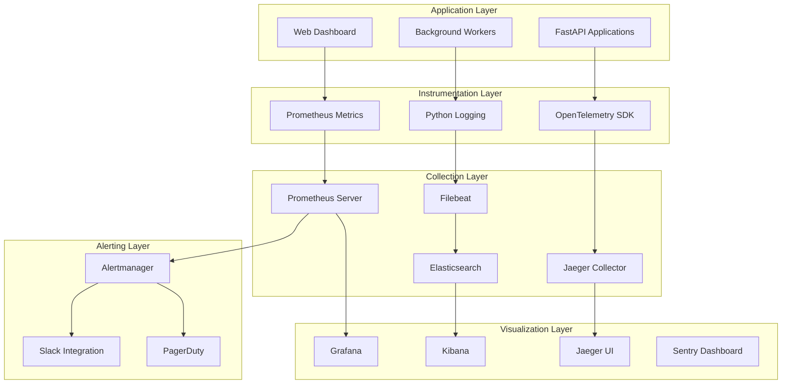
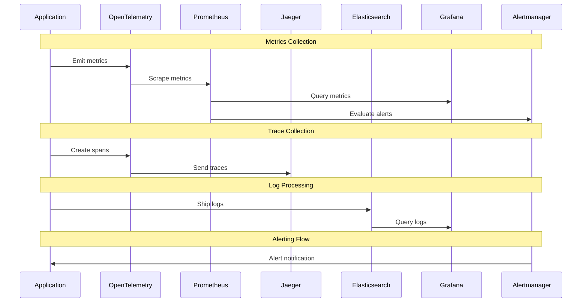

# ADR-017: Observability Stack

🍞 **Breadcrumb:** 🏠 [Home](../../../index.md) > 👨‍💻 [Developer Guides](../../README.md) > 🏗️ [Architecture](../README.md) > 📋 [ADR](README.md) > Observability Stack

## Status

PROPOSED

## Context

### Problem Statement

The Pynomaly system requires comprehensive observability to monitor system health, track performance metrics, debug issues, and ensure reliability in production. Current monitoring is limited to basic logging, making it difficult to identify performance bottlenecks, track user behavior, and proactively address system issues. We need a unified observability stack that provides metrics, logging, tracing, and alerting capabilities.

### Goals

- Implement comprehensive system monitoring and alerting
- Enable distributed tracing for complex anomaly detection workflows
- Provide centralized log aggregation and analysis
- Track business metrics and user behavior analytics
- Enable proactive issue detection and automated remediation
- Support performance optimization and capacity planning
- Ensure compliance with SLA monitoring and reporting requirements

### Constraints

- Must integrate with existing Python/FastAPI technology stack
- Cannot significantly impact application performance
- Must support both on-premises and cloud deployments
- Budget constraints limit use of premium monitoring services
- Team has limited experience with observability platform operations
- Must comply with data privacy and retention requirements

### Assumptions

- Observability data volumes will grow with system usage
- Teams will actively use monitoring data for decision making
- Automated alerting will reduce manual monitoring overhead
- Observability investment will improve system reliability
- Performance overhead of monitoring will be acceptable (< 5%)

## Decision

### Chosen Solution

Implement a **comprehensive observability stack** using open-source and cloud-native tools:

1. **Metrics Collection & Storage**
   - **Prometheus** - Time-series metrics collection
   - **Grafana** - Metrics visualization and dashboards
   - **Alertmanager** - Alert management and routing

2. **Distributed Tracing**
   - **Jaeger** - Distributed tracing system
   - **OpenTelemetry** - Instrumentation framework
   - **FastAPI Integration** - Automatic trace collection

3. **Log Management**
   - **ELK Stack** (Elasticsearch, Logstash, Kibana)
   - **Filebeat** - Log shipping and forwarding
   - **Structured Logging** - JSON log format

4. **Application Performance Monitoring**
   - **Python Instrumentation** - Custom metrics and traces
   - **Error Tracking** - Sentry for error monitoring
   - **Health Checks** - Service health monitoring

5. **Business Intelligence**
   - **PostgreSQL Analytics** - Business metrics storage
   - **Custom Dashboards** - Domain-specific monitoring
   - **Report Generation** - Automated reporting

### Rationale

This stack provides:

- **Complete Visibility**: Metrics, logs, and traces for full system observability
- **Open Standards**: OpenTelemetry ensures vendor neutrality and portability
- **Cost Effectiveness**: Open-source tools with optional managed services
- **Scalability**: Each component scales independently
- **Integration**: Strong Python ecosystem support
- **Future Flexibility**: Can migrate to cloud services when needed

## Architecture

### System Overview



### Data Flow Architecture



## Options Considered

### Pros and Cons Matrix

| Option | Pros | Cons | Score |
|--------|------|------|-------|
| **Open Source Stack** | ✅ Cost effective<br/>✅ Full control<br/>✅ No vendor lock-in<br/>✅ Customizable | ❌ Operational overhead<br/>❌ Setup complexity<br/>❌ Maintenance burden | **8/10** |
| Cloud Native (DataDog) | ✅ Managed service<br/>✅ Easy setup<br/>✅ Advanced features<br/>✅ No ops overhead | ❌ High cost<br/>❌ Vendor lock-in<br/>❌ Data privacy concerns | 7/10 |
| Hybrid Approach | ✅ Best of both worlds<br/>✅ Gradual migration<br/>✅ Cost optimization | ❌ Complex integration<br/>❌ Multiple vendors<br/>❌ Data silos | 6/10 |
| Minimal Monitoring | ✅ Simple setup<br/>✅ Low cost<br/>✅ Fast implementation | ❌ Limited visibility<br/>❌ No alerting<br/>❌ Poor debugging | 3/10 |
| New Relic | ✅ APM features<br/>✅ Good Python support<br/>✅ Easy integration | ❌ Expensive at scale<br/>❌ Vendor lock-in<br/>❌ Limited customization | 6/10 |

### Rejected Alternatives

- **Cloud Native Only**: Too expensive for current scale and creates vendor lock-in
- **Hybrid Approach**: Adds unnecessary complexity without clear benefits
- **Minimal Monitoring**: Insufficient for production system requirements
- **New Relic**: Cost becomes prohibitive at scale

## Implementation

### Technical Approach

#### 1. OpenTelemetry Instrumentation

```python
# observability/telemetry.py
from opentelemetry import trace, metrics
from opentelemetry.exporter.jaeger.thrift import JaegerExporter
from opentelemetry.exporter.prometheus import PrometheusMetricReader
from opentelemetry.instrumentation.fastapi import FastAPIInstrumentor
from opentelemetry.instrumentation.sqlalchemy import SQLAlchemyInstrumentor
from opentelemetry.instrumentation.redis import RedisInstrumentor
from opentelemetry.sdk.trace import TracerProvider
from opentelemetry.sdk.trace.export import BatchSpanProcessor
from opentelemetry.sdk.metrics import MeterProvider
from opentelemetry.sdk.resources import SERVICE_NAME, Resource

class TelemetrySetup:
    @staticmethod
    def configure_tracing(service_name: str):
        # Set up tracing
        resource = Resource(attributes={
            SERVICE_NAME: service_name
        })
        
        trace.set_tracer_provider(TracerProvider(resource=resource))
        tracer = trace.get_tracer(__name__)
        
        # Configure Jaeger exporter
        jaeger_exporter = JaegerExporter(
            agent_host_name="localhost",
            agent_port=6831,
        )
        
        span_processor = BatchSpanProcessor(jaeger_exporter)
        trace.get_tracer_provider().add_span_processor(span_processor)
        
        return tracer
    
    @staticmethod
    def configure_metrics(service_name: str):
        # Set up metrics
        reader = PrometheusMetricReader()
        metrics.set_meter_provider(MeterProvider(
            resource=Resource(attributes={SERVICE_NAME: service_name}),
            metric_readers=[reader]
        ))
        
        return metrics.get_meter(__name__)
    
    @staticmethod
    def instrument_fastapi(app, service_name: str):
        # Auto-instrument FastAPI
        FastAPIInstrumentor.instrument_app(app)
        SQLAlchemyInstrumentor().instrument()
        RedisInstrumentor().instrument()
        
        return app

# Custom metrics for business logic
class BusinessMetrics:
    def __init__(self, meter):
        self.meter = meter
        
        # Counters
        self.anomaly_detections_total = self.meter.create_counter(
            "anomaly_detections_total",
            description="Total number of anomaly detection jobs processed"
        )
        
        self.anomalies_found_total = self.meter.create_counter(
            "anomalies_found_total", 
            description="Total number of anomalies detected"
        )
        
        # Histograms
        self.detection_duration = self.meter.create_histogram(
            "detection_duration_seconds",
            description="Time taken to complete anomaly detection"
        )
        
        self.dataset_size = self.meter.create_histogram(
            "dataset_size_bytes",
            description="Size of datasets processed"
        )
        
        # Gauges
        self.active_jobs = self.meter.create_up_down_counter(
            "active_jobs_count",
            description="Number of currently active detection jobs"
        )
    
    def record_detection_completed(self, duration: float, anomalies_found: int):
        self.anomaly_detections_total.add(1)
        self.anomalies_found_total.add(anomalies_found)
        self.detection_duration.record(duration)
    
    def record_dataset_processed(self, size_bytes: int):
        self.dataset_size.record(size_bytes)
    
    def update_active_jobs(self, delta: int):
        self.active_jobs.add(delta)
```

#### 2. Structured Logging Configuration

```python
# observability/logging.py
import logging
import json
import sys
from datetime import datetime
from typing import Dict, Any

class StructuredFormatter(logging.Formatter):
    """Custom formatter for structured JSON logging."""
    
    def format(self, record: logging.LogRecord) -> str:
        log_entry = {
            "timestamp": datetime.utcnow().isoformat(),
            "level": record.levelname,
            "logger": record.name,
            "message": record.getMessage(),
            "module": record.module,
            "function": record.funcName,
            "line": record.lineno
        }
        
        # Add extra fields if present
        if hasattr(record, 'extra_fields'):
            log_entry.update(record.extra_fields)
        
        # Add exception info if present
        if record.exc_info:
            log_entry["exception"] = self.formatException(record.exc_info)
        
        # Add trace context if available
        if hasattr(record, 'trace_id'):
            log_entry["trace_id"] = record.trace_id
            log_entry["span_id"] = record.span_id
        
        return json.dumps(log_entry)

class ObservabilityLogger:
    @staticmethod
    def configure_logging(level: str = "INFO", log_file: str = None):
        """Configure structured logging."""
        
        # Create formatter
        formatter = StructuredFormatter()
        
        # Configure root logger
        root_logger = logging.getLogger()
        root_logger.setLevel(getattr(logging, level.upper()))
        
        # Console handler
        console_handler = logging.StreamHandler(sys.stdout)
        console_handler.setFormatter(formatter)
        root_logger.addHandler(console_handler)
        
        # File handler if specified
        if log_file:
            file_handler = logging.FileHandler(log_file)
            file_handler.setFormatter(formatter)
            root_logger.addHandler(file_handler)
        
        return root_logger
    
    @staticmethod
    def get_logger(name: str) -> logging.Logger:
        """Get a logger with trace context integration."""
        logger = logging.getLogger(name)
        
        # Add trace context to log records
        old_factory = logging.getLogRecordFactory()
        
        def record_factory(*args, **kwargs):
            record = old_factory(*args, **kwargs)
            
            # Add trace context if available
            current_span = trace.get_current_span()
            if current_span:
                span_context = current_span.get_span_context()
                record.trace_id = format(span_context.trace_id, '032x')
                record.span_id = format(span_context.span_id, '016x')
            
            return record
        
        logging.setLogRecordFactory(record_factory)
        return logger
```

#### 3. Prometheus Metrics Exposition

```python
# observability/metrics.py
from prometheus_client import Counter, Histogram, Gauge, Info, start_http_server
from functools import wraps
import time

class PrometheusMetrics:
    def __init__(self):
        # Application metrics
        self.http_requests_total = Counter(
            'http_requests_total',
            'Total HTTP requests',
            ['method', 'endpoint', 'status_code']
        )
        
        self.http_request_duration = Histogram(
            'http_request_duration_seconds',
            'HTTP request duration',
            ['method', 'endpoint']
        )
        
        self.anomaly_detection_jobs = Counter(
            'anomaly_detection_jobs_total',
            'Total anomaly detection jobs',
            ['status', 'algorithm']
        )
        
        self.anomaly_detection_duration = Histogram(
            'anomaly_detection_duration_seconds',
            'Anomaly detection job duration',
            ['algorithm']
        )
        
        self.active_connections = Gauge(
            'active_connections',
            'Number of active connections'
        )
        
        self.system_info = Info(
            'system_info',
            'System information'
        )
        
        # Business metrics
        self.datasets_processed = Counter(
            'datasets_processed_total',
            'Total datasets processed',
            ['data_source', 'format']
        )
        
        self.anomalies_detected = Counter(
            'anomalies_detected_total',
            'Total anomalies detected',
            ['severity', 'algorithm']
        )
        
        self.model_accuracy = Gauge(
            'model_accuracy_score',
            'Model accuracy score',
            ['algorithm', 'dataset_type']
        )
    
    def track_http_request(self, method: str, endpoint: str):
        """Decorator to track HTTP request metrics."""
        def decorator(func):
            @wraps(func)
            async def wrapper(*args, **kwargs):
                start_time = time.time()
                status_code = "200"
                
                try:
                    result = await func(*args, **kwargs)
                    return result
                except Exception as e:
                    status_code = "500"
                    raise
                finally:
                    duration = time.time() - start_time
                    self.http_requests_total.labels(
                        method=method,
                        endpoint=endpoint,
                        status_code=status_code
                    ).inc()
                    
                    self.http_request_duration.labels(
                        method=method,
                        endpoint=endpoint
                    ).observe(duration)
            
            return wrapper
        return decorator
    
    def track_anomaly_detection(self, algorithm: str):
        """Decorator to track anomaly detection metrics."""
        def decorator(func):
            @wraps(func)
            def wrapper(*args, **kwargs):
                start_time = time.time()
                status = "success"
                
                try:
                    result = func(*args, **kwargs)
                    return result
                except Exception:
                    status = "error"
                    raise
                finally:
                    duration = time.time() - start_time
                    self.anomaly_detection_jobs.labels(
                        status=status,
                        algorithm=algorithm
                    ).inc()
                    
                    self.anomaly_detection_duration.labels(
                        algorithm=algorithm
                    ).observe(duration)
            
            return wrapper
        return decorator

# Global metrics instance
metrics = PrometheusMetrics()

def start_metrics_server(port: int = 8000):
    """Start Prometheus metrics server."""
    start_http_server(port)
```

#### 4. Health Check Endpoints

```python
# observability/health.py
from fastapi import APIRouter, HTTPException
from typing import Dict, Any
import asyncio
import redis
import sqlalchemy
from datetime import datetime

class HealthChecker:
    def __init__(self, database_url: str, redis_url: str):
        self.database_url = database_url
        self.redis_url = redis_url
        self.router = APIRouter()
        self._setup_routes()
    
    def _setup_routes(self):
        @self.router.get("/health")
        async def health_check():
            return {"status": "healthy", "timestamp": datetime.utcnow().isoformat()}
        
        @self.router.get("/health/ready")
        async def readiness_check():
            checks = await self._perform_readiness_checks()
            if all(check["healthy"] for check in checks.values()):
                return {"status": "ready", "checks": checks}
            else:
                raise HTTPException(status_code=503, detail={
                    "status": "not ready",
                    "checks": checks
                })
        
        @self.router.get("/health/live")
        async def liveness_check():
            checks = await self._perform_liveness_checks()
            if all(check["healthy"] for check in checks.values()):
                return {"status": "alive", "checks": checks}
            else:
                raise HTTPException(status_code=503, detail={
                    "status": "not alive",
                    "checks": checks
                })
    
    async def _perform_readiness_checks(self) -> Dict[str, Any]:
        """Check if service is ready to accept traffic."""
        checks = {}
        
        # Database connectivity
        checks["database"] = await self._check_database()
        
        # Redis connectivity
        checks["redis"] = await self._check_redis()
        
        # External dependencies
        checks["dependencies"] = await self._check_dependencies()
        
        return checks
    
    async def _perform_liveness_checks(self) -> Dict[str, Any]:
        """Check if service is alive and functioning."""
        checks = {}
        
        # Basic health
        checks["application"] = {
            "healthy": True,
            "message": "Application is running"
        }
        
        # Memory usage
        checks["memory"] = await self._check_memory_usage()
        
        # Disk space
        checks["disk"] = await self._check_disk_space()
        
        return checks
    
    async def _check_database(self) -> Dict[str, Any]:
        try:
            # Simple database query
            engine = sqlalchemy.create_engine(self.database_url)
            with engine.connect() as conn:
                conn.execute(sqlalchemy.text("SELECT 1"))
            return {"healthy": True, "message": "Database connection successful"}
        except Exception as e:
            return {"healthy": False, "message": f"Database connection failed: {str(e)}"}
    
    async def _check_redis(self) -> Dict[str, Any]:
        try:
            r = redis.from_url(self.redis_url)
            r.ping()
            return {"healthy": True, "message": "Redis connection successful"}
        except Exception as e:
            return {"healthy": False, "message": f"Redis connection failed: {str(e)}"}
    
    async def _check_dependencies(self) -> Dict[str, Any]:
        # Check critical external dependencies
        return {"healthy": True, "message": "All dependencies available"}
    
    async def _check_memory_usage(self) -> Dict[str, Any]:
        # Monitor memory usage
        import psutil
        memory = psutil.virtual_memory()
        if memory.percent > 90:
            return {"healthy": False, "message": f"High memory usage: {memory.percent}%"}
        return {"healthy": True, "message": f"Memory usage: {memory.percent}%"}
    
    async def _check_disk_space(self) -> Dict[str, Any]:
        # Monitor disk space
        import psutil
        disk = psutil.disk_usage('/')
        if disk.percent > 90:
            return {"healthy": False, "message": f"Low disk space: {disk.percent}% used"}
        return {"healthy": True, "message": f"Disk usage: {disk.percent}%"}
```

#### 5. Alerting Configuration

```yaml
# alertmanager.yml
global:
  smtp_smarthost: 'localhost:587'
  smtp_from: 'alerts@pynomaly.com'

route:
  group_by: ['alertname']
  group_wait: 10s
  group_interval: 10s
  repeat_interval: 1h
  receiver: 'web.hook'
  routes:
  - match:
      severity: critical
    receiver: 'critical-alerts'
  - match:
      severity: warning
    receiver: 'warning-alerts'

receivers:
- name: 'web.hook'
  webhook_configs:
  - url: 'http://localhost:5001/alert'

- name: 'critical-alerts'
  slack_configs:
  - api_url: '${SLACK_API_URL}'
    channel: '#alerts-critical'
    title: 'Critical Alert: {{ .GroupLabels.alertname }}'
    text: '{{ range .Alerts }}{{ .Annotations.description }}{{ end }}'
  
  pagerduty_configs:
  - service_key: '${PAGERDUTY_SERVICE_KEY}'
    description: '{{ .GroupLabels.alertname }}'

- name: 'warning-alerts'
  slack_configs:
  - api_url: '${SLACK_API_URL}'
    channel: '#alerts-warning'
    title: 'Warning: {{ .GroupLabels.alertname }}'
    text: '{{ range .Alerts }}{{ .Annotations.description }}{{ end }}'
```

### Migration Strategy

1. **Phase 1 (Week 1)**: Set up basic Prometheus and Grafana infrastructure
2. **Phase 2 (Week 2)**: Implement OpenTelemetry instrumentation in FastAPI apps
3. **Phase 3 (Week 3)**: Deploy Jaeger for distributed tracing
4. **Phase 4 (Week 4)**: Configure ELK stack for centralized logging
5. **Phase 5 (Week 5)**: Implement custom business metrics and dashboards
6. **Phase 6 (Week 6)**: Set up alerting rules and notification channels
7. **Phase 7 (Week 7)**: Add health checks and automated monitoring

### Testing Strategy

- **Metrics Testing**: Verify metric collection and accuracy
- **Tracing Testing**: Test distributed trace generation and propagation
- **Log Testing**: Validate structured logging and log forwarding
- **Alert Testing**: Test alerting rules and notification delivery
- **Performance Testing**: Measure observability overhead impact
- **Chaos Testing**: Test monitoring during system failures

## Consequences

### Positive

- **Complete Visibility**: Full observability across metrics, logs, and traces
- **Proactive Monitoring**: Early detection of issues before user impact
- **Performance Optimization**: Data-driven performance improvements
- **Debugging Efficiency**: Faster issue identification and resolution
- **Operational Confidence**: Better understanding of system behavior
- **Compliance Support**: Audit trails and SLA monitoring capabilities

### Negative

- **Operational Complexity**: Multiple systems to deploy and maintain
- **Resource Overhead**: Additional CPU, memory, and storage requirements
- **Data Volume**: High volume of observability data requires storage management
- **Learning Curve**: Team needs to learn observability tools and practices
- **Alert Fatigue**: Risk of too many alerts reducing effectiveness

### Neutral

- **Vendor Independence**: Open-source stack vs. managed service trade-offs
- **Customization**: Flexibility vs. ease of use considerations
- **Cost Structure**: Infrastructure costs vs. observability benefits

## Compliance

### Security Impact

- **Data Privacy**: Observability data may contain sensitive information
- **Access Control**: Role-based access to monitoring dashboards and data
- **Data Retention**: Compliance with data retention policies
- **Audit Logging**: Complete audit trail of system access and changes
- **Network Security**: Secure communication between observability components

### Performance Impact

- **Application Overhead**: ~2-5% CPU overhead for instrumentation
- **Network Traffic**: Additional network bandwidth for telemetry data
- **Storage Requirements**: Significant storage for metrics, logs, and traces
- **Query Performance**: Impact on database queries for metric collection
- **Sampling**: Trace sampling to reduce overhead while maintaining visibility

### Monitoring Requirements

- **Self-Monitoring**: Monitor the observability stack itself
- **Data Quality**: Ensure accuracy and completeness of observability data
- **Alert Reliability**: Monitor alert delivery and response times
- **Storage Management**: Monitor disk usage and data retention
- **Performance Monitoring**: Track observability overhead and optimization

## Decision Log

| Date | Author | Action | Rationale |
|------|--------|--------|-----------|
| 2025-02-25 | Architecture Team | PROPOSED | Need for comprehensive observability in production |
| 2025-03-01 | DevOps Team | REVIEWED | Infrastructure requirements and operational feasibility validated |
| 2025-03-05 | Platform Team | EVALUATED | Performance impact and monitoring strategy confirmed |

## References

- [OpenTelemetry Documentation](https://opentelemetry.io/docs/)
- [Prometheus Documentation](https://prometheus.io/docs/)
- [Grafana Documentation](https://grafana.com/docs/)
- [Jaeger Documentation](https://www.jaegertracing.io/docs/)
- [Elastic Stack Documentation](https://www.elastic.co/guide/)
- [Observability Engineering by Honeycomb](https://www.oreilly.com/library/view/observability-engineering/9781492076438/)
- [ADR-016: Message Queue Choice](ADR-016-message-queue-choice.md)

---

## 🔗 **Related Documentation**

### **Architecture**

- **[Message Queue Choice](ADR-016-message-queue-choice.md)** - Event streaming and messaging
- **[Production Database Technology](ADR-015-production-database-technology-selection.md)** - Database monitoring
- **[ADR Index](README.md)** - All architectural decisions

### **Operations**

- **[Monitoring Setup Guide](../../operations/monitoring-setup.md)** - Deployment procedures
- **[Alert Management](../../operations/alert-management.md)** - Alert configuration and response
- **[Performance Tuning](../../operations/performance-tuning.md)** - System optimization

### **Development**

- **[Instrumentation Guide](../../development/instrumentation.md)** - Adding observability to code
- **[Logging Standards](../../development/logging-standards.md)** - Structured logging practices
- **[Metrics Guidelines](../../development/metrics-guidelines.md)** - Custom metrics implementation

---

**Authors:** Architecture Team  
**Last Updated:** 2025-07-11  
**Next Review:** 2025-10-11
