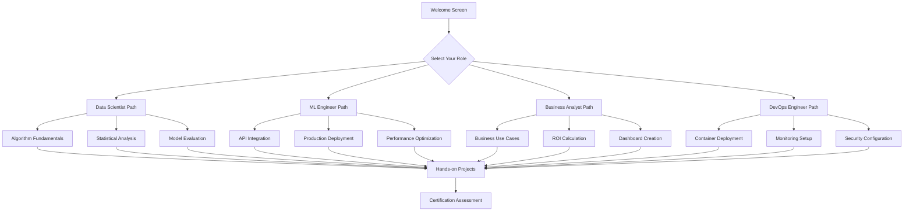

# Interactive Tutorial System

🍞 **Breadcrumb:** 🏠 [Home](../../index.md) > 📚 [User Guides](../README.md) > 🚀 [Onboarding](README.md) > 🎮 Interactive Tutorial

---

Welcome to Pynomaly's Interactive Tutorial System! This hands-on learning environment adapts to your pace and provides real-time feedback as you learn anomaly detection concepts and techniques.

## 🎯 Tutorial Overview

### What Makes Our Tutorials Interactive?

- **🏃‍♂️ Live Code Execution**: Run Python code directly in your browser
- **📊 Real-time Visualizations**: See results immediately with interactive charts
- **🎯 Personalized Learning**: Content adapts based on your role and experience
- **🏆 Achievement System**: Earn badges and track your progress
- **💡 Intelligent Hints**: Get contextual help when you need it

### Learning Pathways



## 🎮 Interactive Tutorial Engine

### Core Components

```python
import asyncio
import json
import uuid
from datetime import datetime
from typing import Dict, List, Any, Optional
from dataclasses import dataclass, field
from enum import Enum

class TutorialType(Enum):
    """Types of tutorial content."""
    CODE_EXERCISE = "code_exercise"
    CONCEPTUAL = "conceptual"
    VISUALIZATION = "visualization"
    PROJECT = "project"
    ASSESSMENT = "assessment"

class DifficultyLevel(Enum):
    """Tutorial difficulty levels."""
    BEGINNER = "beginner"
    INTERMEDIATE = "intermediate"
    ADVANCED = "advanced"
    EXPERT = "expert"

@dataclass
class LearningObjective:
    """Represents a learning objective."""
    id: str
    title: str
    description: str
    skills: List[str]
    estimated_minutes: int
    prerequisites: List[str] = field(default_factory=list)

@dataclass
class TutorialStep:
    """Represents a single tutorial step."""
    id: str
    title: str
    content: str
    tutorial_type: TutorialType
    difficulty: DifficultyLevel
    estimated_minutes: int
    learning_objectives: List[str]
    code_template: Optional[str] = None
    expected_output: Optional[str] = None
    hints: List[str] = field(default_factory=list)
    validation_criteria: Dict[str, Any] = field(default_factory=dict)

@dataclass
class UserProgress:
    """Tracks user progress through tutorials."""
    user_id: str
    role: str
    experience_level: str
    completed_steps: List[str] = field(default_factory=list)
    current_step: Optional[str] = None
    achievements: List[str] = field(default_factory=list)
    time_spent_minutes: int = 0
    last_activity: datetime = field(default_factory=datetime.now)
    skill_scores: Dict[str, float] = field(default_factory=dict)

class InteractiveTutorialEngine:
    """Main engine for interactive tutorials."""
    
    def __init__(self):
        self.tutorials: Dict[str, List[TutorialStep]] = {}
        self.user_progress: Dict[str, UserProgress] = {}
        self.learning_objectives: Dict[str, LearningObjective] = {}
        
        # Initialize tutorial content
        self._initialize_tutorials()
        
    def _initialize_tutorials(self):
        """Initialize tutorial content for different learning paths."""
        
        # Data Scientist Tutorial Path
        self.tutorials["data_scientist"] = [
            TutorialStep(
                id="ds_001",
                title="Understanding Anomaly Detection",
                content="""
# What is Anomaly Detection?

Anomaly detection is the process of identifying unusual patterns in data that differ significantly from the norm. These patterns, called anomalies or outliers, can indicate important insights such as:

- **Fraud** in financial transactions
- **Equipment failures** in industrial systems  
- **Network intrusions** in cybersecurity
- **Quality issues** in manufacturing
- **Medical conditions** in healthcare data

## Types of Anomalies

1. **Point Anomalies**: Individual data points that are anomalous
2. **Contextual Anomalies**: Data points that are anomalous in a specific context
3. **Collective Anomalies**: Collections of data points that together form an anomaly

Let's start with a simple example to identify point anomalies in financial data.
                """,
                tutorial_type=TutorialType.CODE_EXERCISE,
                difficulty=DifficultyLevel.BEGINNER,
                estimated_minutes=15,
                learning_objectives=["understand_anomaly_types", "identify_business_value"],
                code_template="""
import numpy as np
import matplotlib.pyplot as plt
from pynomaly import IsolationForest

# Generate sample financial transaction data
np.random.seed(42)
normal_transactions = np.random.normal(100, 20, 1000)  # Normal transactions around $100
fraud_transactions = np.random.normal(500, 50, 20)     # Fraudulent transactions around $500

# Combine the data
all_transactions = np.concatenate([normal_transactions, fraud_transactions])
np.random.shuffle(all_transactions)

# TODO: Create an Isolation Forest detector and fit it to the data
# Hint: Use contamination=0.02 (2% expected anomalies)
detector = # Your code here

# TODO: Predict anomalies (-1 for anomaly, 1 for normal)
predictions = # Your code here

# Visualize the results
plt.figure(figsize=(12, 6))
plt.subplot(1, 2, 1)
plt.hist(all_transactions, bins=50, alpha=0.7, label='All Transactions')
plt.xlabel('Transaction Amount ($)')
plt.ylabel('Frequency')
plt.title('Distribution of Transaction Amounts')
plt.legend()

plt.subplot(1, 2, 2)
normal_mask = predictions == 1
anomaly_mask = predictions == -1

plt.scatter(range(len(all_transactions))[normal_mask], 
           all_transactions[normal_mask], 
           c='blue', alpha=0.6, label='Normal', s=20)
plt.scatter(range(len(all_transactions))[anomaly_mask], 
           all_transactions[anomaly_mask], 
           c='red', alpha=0.8, label='Anomaly', s=40)
plt.xlabel('Transaction Index')
plt.ylabel('Transaction Amount ($)')
plt.title('Anomaly Detection Results')
plt.legend()
plt.tight_layout()
plt.show()

# Calculate detection statistics
num_anomalies = sum(predictions == -1)
print(f"Detected {num_anomalies} anomalies out of {len(all_transactions)} transactions")
print(f"Anomaly rate: {num_anomalies/len(all_transactions)*100:.2f}%")
                """,
                expected_output="Detected approximately 20-25 anomalies with visualization showing clear separation",
                hints=[
                    "Import IsolationForest from pynomaly",
                    "Set contamination parameter to expected anomaly rate (0.02)",
                    "Use fit_predict() method to train and predict in one step",
                    "Anomalies are marked with -1, normal points with 1"
                ],
                validation_criteria={
                    "num_anomalies_range": (15, 30),
                    "has_visualization": True,
                    "uses_isolation_forest": True
                }
            ),
            
            TutorialStep(
                id="ds_002", 
                title="Algorithm Comparison",
                content="""
# Comparing Anomaly Detection Algorithms

Different algorithms work better for different types of data and use cases. Let's compare the performance of several popular algorithms on the same dataset.

## Algorithms We'll Compare:

1. **Isolation Forest**: Tree-based, good for high-dimensional data
2. **Local Outlier Factor (LOF)**: Density-based, good for local anomalies
3. **One-Class SVM**: Support vector approach, good for complex boundaries
4. **Elliptic Envelope**: Statistical approach, assumes Gaussian distribution

Your task is to implement and compare these algorithms.
                """,
                tutorial_type=TutorialType.CODE_EXERCISE,
                difficulty=DifficultyLevel.INTERMEDIATE,
                estimated_minutes=25,
                learning_objectives=["compare_algorithms", "evaluate_performance"],
                code_template="""
import numpy as np
import matplotlib.pyplot as plt
from sklearn.metrics import classification_report, confusion_matrix
from pynomaly import IsolationForest, LocalOutlierFactor, OneClassSVM, EllipticEnvelope
from pynomaly.datasets import load_sample_data

# Load a dataset with known anomalies
data = load_sample_data('multivariate_normal', n_samples=1000, contamination=0.1)
X, y_true = data['features'], data['labels']

# TODO: Initialize the four algorithms
algorithms = {
    'Isolation Forest': # Your code here,
    'LOF': # Your code here,
    'One-Class SVM': # Your code here,
    'Elliptic Envelope': # Your code here
}

# Compare algorithm performance
results = {}
for name, detector in algorithms.items():
    # TODO: Fit and predict using the detector
    y_pred = # Your code here
    
    # Calculate performance metrics
    from sklearn.metrics import f1_score, precision_score, recall_score
    
    f1 = f1_score(y_true, y_pred)
    precision = precision_score(y_true, y_pred) 
    recall = recall_score(y_true, y_pred)
    
    results[name] = {
        'f1_score': f1,
        'precision': precision,
        'recall': recall,
        'predictions': y_pred
    }
    
    print(f"\\n{name} Performance:")
    print(f"  F1 Score: {f1:.3f}")
    print(f"  Precision: {precision:.3f}")
    print(f"  Recall: {recall:.3f}")

# TODO: Create a comparison visualization
# Show the performance metrics in a bar chart
metrics = ['f1_score', 'precision', 'recall']
x = np.arange(len(algorithms))
width = 0.25

fig, ax = plt.subplots(figsize=(12, 6))

for i, metric in enumerate(metrics):
    values = [results[name][metric] for name in algorithms.keys()]
    ax.bar(x + i*width, values, width, label=metric.replace('_', ' ').title())

ax.set_xlabel('Algorithms')
ax.set_ylabel('Score')
ax.set_title('Algorithm Performance Comparison')
ax.set_xticks(x + width)
ax.set_xticklabels(algorithms.keys(), rotation=45)
ax.legend()
plt.tight_layout()
plt.show()

# Find the best algorithm
best_algorithm = max(results.keys(), key=lambda k: results[k]['f1_score'])
print(f"\\nBest performing algorithm: {best_algorithm}")
print(f"F1 Score: {results[best_algorithm]['f1_score']:.3f}")
                """,
                hints=[
                    "All algorithms should use contamination=0.1",
                    "For LOF, you might need to use fit_predict() instead of separate fit() and predict()",
                    "Use the same contamination parameter for fair comparison",
                    "The best algorithm should have the highest F1 score"
                ],
                validation_criteria={
                    "compares_four_algorithms": True,
                    "calculates_metrics": ["f1_score", "precision", "recall"],
                    "creates_visualization": True,
                    "identifies_best_algorithm": True
                }
            )
        ]
        
        # ML Engineer Tutorial Path
        self.tutorials["ml_engineer"] = [
            TutorialStep(
                id="mle_001",
                title="API Integration Basics",
                content="""
# Building Production-Ready Anomaly Detection APIs

As an ML Engineer, you need to deploy models in production environments that can handle real-world traffic and requirements. Let's build a FastAPI service for anomaly detection.

## Key Requirements:
- **High throughput**: Handle thousands of requests per second
- **Low latency**: Respond within 100ms
- **Reliability**: 99.9% uptime
- **Monitoring**: Track performance and errors
- **Security**: Authenticate and authorize requests

Your task is to build a complete API service with proper error handling and monitoring.
                """,
                tutorial_type=TutorialType.CODE_EXERCISE,
                difficulty=DifficultyLevel.INTERMEDIATE,
                estimated_minutes=30,
                learning_objectives=["api_development", "production_deployment"],
                code_template="""
from fastapi import FastAPI, HTTPException, Depends, BackgroundTasks
from pydantic import BaseModel, Field
from typing import List, Optional
import asyncio
import time
import logging
from pynomaly import IsolationForest
import numpy as np

# Set up logging
logging.basicConfig(level=logging.INFO)
logger = logging.getLogger(__name__)

# TODO: Define request/response models using Pydantic
class DetectionRequest(BaseModel):
    # Your code here - define the input model
    pass

class DetectionResponse(BaseModel):
    # Your code here - define the output model  
    pass

# TODO: Create FastAPI app with proper configuration
app = # Your code here

# Global model instance (in production, use proper model management)
model = IsolationForest(contamination=0.1, n_estimators=100)

# TODO: Add middleware for request timing and logging
@app.middleware("http")
async def add_process_time_header(request, call_next):
    # Your code here - add timing middleware
    pass

# TODO: Implement health check endpoint
@app.get("/health")
async def health_check():
    # Your code here
    pass

# TODO: Implement training endpoint
@app.post("/train")
async def train_model(training_data: List[List[float]]):
    # Your code here - implement model training
    pass

# TODO: Implement prediction endpoint with proper error handling
@app.post("/predict", response_model=DetectionResponse)
async def predict_anomalies(request: DetectionRequest):
    try:
        # Your code here - implement prediction logic
        # Remember to:
        # 1. Validate input data
        # 2. Make predictions
        # 3. Handle errors gracefully
        # 4. Log requests for monitoring
        pass
    except Exception as e:
        # Your error handling code here
        pass

# TODO: Implement batch prediction endpoint
@app.post("/batch-predict")
async def batch_predict(
    request: DetectionRequest, 
    background_tasks: BackgroundTasks
):
    # Your code here - implement async batch processing
    pass

# TODO: Add metrics endpoint for monitoring
@app.get("/metrics")
async def get_metrics():
    # Your code here - return performance metrics
    pass

if __name__ == "__main__":
    import uvicorn
    uvicorn.run(app, host="0.0.0.0", port=8000)
                """,
                hints=[
                    "Use Pydantic models for request/response validation",
                    "Add proper error handling with try/catch blocks",
                    "Include request timing in middleware",
                    "Use background tasks for long-running batch operations",
                    "Add logging for debugging and monitoring"
                ],
                validation_criteria={
                    "has_pydantic_models": True,
                    "implements_endpoints": ["/health", "/train", "/predict"],
                    "has_error_handling": True,
                    "includes_logging": True
                }
            )
        ]
        
        # Business Analyst Tutorial Path  
        self.tutorials["business_analyst"] = [
            TutorialStep(
                id="ba_001",
                title="ROI Calculator for Fraud Detection",
                content="""
# Building a Business Case: Fraud Detection ROI Calculator

As a Business Analyst, you need to demonstrate the financial value of anomaly detection projects. Let's build an interactive ROI calculator for fraud detection in the financial services industry.

## Key Business Metrics:
- **Current fraud losses**: Annual financial impact
- **Detection improvement**: Expected reduction in losses
- **Implementation costs**: Technology, personnel, ongoing
- **Time to value**: Payback period and ROI timeline

Your task is to create a comprehensive business case calculator.
                """,
                tutorial_type=TutorialType.CODE_EXERCISE,
                difficulty=DifficultyLevel.BEGINNER,
                estimated_minutes=20,
                learning_objectives=["business_case_development", "roi_calculation"],
                code_template="""
import pandas as pd
import plotly.graph_objects as go
from plotly.subplots import make_subplots

class FraudDetectionROICalculator:
    def __init__(self):
        self.industry_benchmarks = {
            'baseline_fraud_rate': 0.0047,  # 47 basis points industry average
            'manual_detection_rate': 0.13,   # 13% manual detection rate
            'ai_detection_rate': 0.89,       # 89% AI detection rate
            'false_positive_reduction': 0.60  # 60% reduction in false positives
        }
    
    # TODO: Implement method to calculate current losses
    def calculate_current_losses(self, annual_volume, avg_transaction_value):
        \"\"\"Calculate current annual fraud losses.\"\"\"
        # Your code here
        # Hint: Use baseline_fraud_rate from benchmarks
        pass
    
    # TODO: Implement method to calculate implementation costs
    def calculate_implementation_costs(self, company_size="medium"):
        \"\"\"Calculate total implementation costs.\"\"\"
        cost_models = {
            'small': {'technology': 50000, 'personnel': 200000, 'training': 25000},
            'medium': {'technology': 150000, 'personnel': 500000, 'training': 50000},
            'large': {'technology': 500000, 'personnel': 1000000, 'training': 100000}
        }
        
        # Your code here
        # Return total implementation cost and breakdown
        pass
    
    # TODO: Implement method to calculate annual benefits
    def calculate_annual_benefits(self, current_losses, implementation_costs):
        \"\"\"Calculate expected annual benefits.\"\"\"
        # Your code here
        # Consider:
        # 1. Direct fraud loss reduction
        # 2. Operational efficiency gains
        # 3. False positive reduction savings
        # 4. Compliance cost avoidance
        pass
    
    # TODO: Implement ROI calculation
    def calculate_roi_scenarios(self, benefits, costs):
        \"\"\"Calculate ROI under different scenarios.\"\"\"
        scenarios = {
            'conservative': 0.70,  # 70% of expected benefits
            'realistic': 1.00,     # 100% of expected benefits  
            'optimistic': 1.30     # 130% of expected benefits
        }
        
        # Your code here
        # Calculate ROI for each scenario over 3 years
        pass
    
    # TODO: Create visualization dashboard
    def create_roi_dashboard(self, roi_data):
        \"\"\"Create executive dashboard showing ROI analysis.\"\"\"
        
        # Create subplots
        fig = make_subplots(
            rows=2, cols=2,
            subplot_titles=[
                "💰 3-Year ROI by Scenario",
                "📊 Cost vs Benefit Breakdown", 
                "📈 Cumulative Value Over Time",
                "⚖️ Risk-Adjusted Returns"
            ]
        )
        
        # Your code here - implement visualizations
        # 1. ROI bar chart by scenario
        # 2. Cost breakdown pie chart
        # 3. Cumulative value line chart
        # 4. Risk-adjusted returns
        
        fig.update_layout(
            height=800,
            title_text="🎯 Fraud Detection ROI Analysis Dashboard",
            showlegend=True
        )
        
        return fig

# TODO: Use the calculator with sample data
calculator = FraudDetectionROICalculator()

# Sample company data
company_data = {
    'annual_transaction_volume': 50_000_000,  # 50M transactions
    'avg_transaction_value': 125,            # $125 average
    'company_size': 'medium'
}

# Calculate business case
current_losses = calculator.calculate_current_losses(
    company_data['annual_transaction_volume'],
    company_data['avg_transaction_value']
)

implementation_costs = calculator.calculate_implementation_costs(
    company_data['company_size']
)

annual_benefits = calculator.calculate_annual_benefits(
    current_losses, 
    implementation_costs
)

roi_scenarios = calculator.calculate_roi_scenarios(
    annual_benefits,
    implementation_costs
)

# Create and display dashboard
dashboard = calculator.create_roi_dashboard(roi_scenarios)
dashboard.show()

# Print business summary
print("\\n📋 BUSINESS CASE SUMMARY")
print("="*50)
print(f"Current Annual Losses: ${current_losses:,.0f}")
print(f"Implementation Investment: ${implementation_costs['total']:,.0f}")
print(f"Expected Annual Benefits: ${annual_benefits:,.0f}")
print(f"3-Year ROI (Realistic): {roi_scenarios['realistic']['roi_3year']:.0f}%")
print(f"Payback Period: {roi_scenarios['realistic']['payback_months']:.1f} months")
                """,
                hints=[
                    "Calculate fraud losses as: volume × avg_value × fraud_rate",
                    "Benefits include both direct loss reduction and operational savings",
                    "ROI = (Benefits - Costs) / Costs × 100%",
                    "Include multiple scenarios for risk assessment",
                    "Use plotly for interactive visualizations"
                ],
                validation_criteria={
                    "calculates_current_losses": True,
                    "includes_implementation_costs": True,
                    "computes_roi_scenarios": True,
                    "creates_visualization": True,
                    "provides_business_summary": True
                }
            )
        ]
    
    def get_personalized_learning_path(
        self, 
        role: str, 
        experience_level: str,
        learning_goals: List[str]
    ) -> List[TutorialStep]:
        """Generate personalized learning path based on user profile."""
        
        base_tutorials = self.tutorials.get(role, [])
        
        # Filter based on experience level
        if experience_level == "beginner":
            difficulty_filter = [DifficultyLevel.BEGINNER, DifficultyLevel.INTERMEDIATE]
        elif experience_level == "intermediate":
            difficulty_filter = [DifficultyLevel.INTERMEDIATE, DifficultyLevel.ADVANCED]
        else:  # advanced
            difficulty_filter = [DifficultyLevel.ADVANCED, DifficultyLevel.EXPERT]
        
        # Filter tutorials by difficulty
        filtered_tutorials = [
            tutorial for tutorial in base_tutorials
            if tutorial.difficulty in difficulty_filter
        ]
        
        # Prioritize based on learning goals
        if learning_goals:
            scored_tutorials = []
            for tutorial in filtered_tutorials:
                score = sum(
                    1 for goal in learning_goals 
                    if goal in tutorial.learning_objectives
                )
                scored_tutorials.append((score, tutorial))
            
            # Sort by relevance score
            scored_tutorials.sort(key=lambda x: x[0], reverse=True)
            filtered_tutorials = [tutorial for _, tutorial in scored_tutorials]
        
        return filtered_tutorials
    
    def validate_step_completion(
        self, 
        step_id: str, 
        user_code: str, 
        user_output: str
    ) -> Dict[str, Any]:
        """Validate user's completion of a tutorial step."""
        
        # Find the tutorial step
        step = None
        for tutorial_list in self.tutorials.values():
            for tutorial_step in tutorial_list:
                if tutorial_step.id == step_id:
                    step = tutorial_step
                    break
        
        if not step:
            return {"error": "Tutorial step not found"}
        
        validation_results = {
            "passed": True,
            "feedback": [],
            "suggestions": [],
            "score": 0
        }
        
        # Check validation criteria
        for criterion, expected in step.validation_criteria.items():
            if criterion == "num_anomalies_range":
                # Extract number from output
                try:
                    import re
                    numbers = re.findall(r'Detected (\d+) anomalies', user_output)
                    if numbers:
                        num_anomalies = int(numbers[0])
                        if expected[0] <= num_anomalies <= expected[1]:
                            validation_results["score"] += 20
                            validation_results["feedback"].append("✅ Correct number of anomalies detected")
                        else:
                            validation_results["passed"] = False
                            validation_results["feedback"].append(f"❌ Expected {expected[0]}-{expected[1]} anomalies, got {num_anomalies}")
                except:
                    validation_results["passed"] = False
                    validation_results["feedback"].append("❌ Could not parse anomaly count from output")
            
            elif criterion == "uses_isolation_forest":
                if "IsolationForest" in user_code:
                    validation_results["score"] += 20
                    validation_results["feedback"].append("✅ Correctly used Isolation Forest algorithm")
                else:
                    validation_results["passed"] = False
                    validation_results["feedback"].append("❌ Please use the Isolation Forest algorithm")
            
            elif criterion == "has_visualization":
                if "plt.show()" in user_code or "fig.show()" in user_code:
                    validation_results["score"] += 20
                    validation_results["feedback"].append("✅ Created visualization")
                else:
                    validation_results["passed"] = False
                    validation_results["feedback"].append("❌ Please create a visualization of the results")
        
        # Provide hints if not passed
        if not validation_results["passed"]:
            validation_results["suggestions"] = step.hints[:2]  # Show first 2 hints
        
        return validation_results
    
    def update_user_progress(
        self, 
        user_id: str, 
        step_id: str, 
        completion_data: Dict[str, Any]
    ):
        """Update user progress and achievements."""
        
        if user_id not in self.user_progress:
            return
        
        progress = self.user_progress[user_id]
        
        # Mark step as completed
        if step_id not in progress.completed_steps:
            progress.completed_steps.append(step_id)
        
        # Update time spent
        progress.time_spent_minutes += completion_data.get('time_spent', 0)
        
        # Update skill scores
        step = self._find_step_by_id(step_id)
        if step:
            score = completion_data.get('score', 0) / 100.0  # Convert to 0-1 scale
            for objective in step.learning_objectives:
                current_score = progress.skill_scores.get(objective, 0)
                # Use exponential moving average to update skill score
                progress.skill_scores[objective] = 0.7 * current_score + 0.3 * score
        
        # Check for achievements
        self._check_achievements(user_id)
        
        progress.last_activity = datetime.now()
    
    def _find_step_by_id(self, step_id: str) -> Optional[TutorialStep]:
        """Find tutorial step by ID."""
        for tutorial_list in self.tutorials.values():
            for step in tutorial_list:
                if step.id == step_id:
                    return step
        return None
    
    def _check_achievements(self, user_id: str):
        """Check and award achievements based on user progress."""
        
        if user_id not in self.user_progress:
            return
        
        progress = self.user_progress[user_id]
        new_achievements = []
        
        # Check completion-based achievements
        if len(progress.completed_steps) >= 5 and "tutorial_novice" not in progress.achievements:
            new_achievements.append("tutorial_novice")
        
        if len(progress.completed_steps) >= 10 and "tutorial_adept" not in progress.achievements:
            new_achievements.append("tutorial_adept")
        
        if len(progress.completed_steps) >= 20 and "tutorial_master" not in progress.achievements:
            new_achievements.append("tutorial_master")
        
        # Check skill-based achievements
        avg_skill_score = sum(progress.skill_scores.values()) / len(progress.skill_scores) if progress.skill_scores else 0
        
        if avg_skill_score >= 0.8 and "high_performer" not in progress.achievements:
            new_achievements.append("high_performer")
        
        if progress.time_spent_minutes >= 120 and "dedicated_learner" not in progress.achievements:
            new_achievements.append("dedicated_learner")
        
        # Add new achievements
        progress.achievements.extend(new_achievements)
        
        return new_achievements

# Example usage and testing
if __name__ == "__main__":
    # Initialize tutorial engine
    engine = InteractiveTutorialEngine()
    
    # Create sample user
    user_id = "user_123"
    engine.user_progress[user_id] = UserProgress(
        user_id=user_id,
        role="data_scientist",
        experience_level="beginner"
    )
    
    # Get personalized learning path
    learning_path = engine.get_personalized_learning_path(
        role="data_scientist",
        experience_level="beginner", 
        learning_goals=["understand_anomaly_types", "evaluate_performance"]
    )
    
    print(f"Generated learning path with {len(learning_path)} steps:")
    for i, step in enumerate(learning_path):
        print(f"{i+1}. {step.title} ({step.estimated_minutes} min)")
    
    # Simulate step completion and validation
    sample_code = '''
detector = IsolationForest(contamination=0.02)
predictions = detector.fit_predict(all_transactions)
plt.show()
'''
    
    sample_output = "Detected 22 anomalies out of 1020 transactions"
    
    validation = engine.validate_step_completion("ds_001", sample_code, sample_output)
    print(f"\\nValidation results: {validation}")
```

## 🎮 Gamification Features

### Achievement System

```python
class AchievementSystem:
    """Gamification system for tutorial engagement."""
    
    def __init__(self):
        self.achievements = {
            # Beginner achievements
            "first_steps": {
                "name": "First Steps",
                "description": "Complete your first tutorial",
                "icon": "🎯",
                "points": 10,
                "criteria": {"completed_steps": 1}
            },
            "quick_learner": {
                "name": "Quick Learner", 
                "description": "Complete a tutorial in under 10 minutes",
                "icon": "⚡",
                "points": 25,
                "criteria": {"max_step_time": 10}
            },
            
            # Skill-based achievements
            "algorithm_explorer": {
                "name": "Algorithm Explorer",
                "description": "Try 3 different detection algorithms",
                "icon": "🔍",
                "points": 50,
                "criteria": {"algorithms_used": 3}
            },
            "data_scientist": {
                "name": "Data Scientist",
                "description": "Master statistical analysis techniques",
                "icon": "📊",
                "points": 100,
                "criteria": {"skill_statistical_analysis": 0.9}
            },
            
            # Completion achievements
            "tutorial_novice": {
                "name": "Tutorial Novice",
                "description": "Complete 5 tutorials",
                "icon": "🌱",
                "points": 75,
                "criteria": {"completed_steps": 5}
            },
            "tutorial_master": {
                "name": "Tutorial Master",
                "description": "Complete all tutorials in your path",
                "icon": "🏆",
                "points": 500,
                "criteria": {"completion_rate": 1.0}
            },
            
            # Special achievements
            "help_others": {
                "name": "Community Helper",
                "description": "Help other users in the forum",
                "icon": "🤝",
                "points": 200,
                "criteria": {"forum_contributions": 5}
            },
            "perfect_score": {
                "name": "Perfectionist",
                "description": "Score 100% on 5 assessments",
                "icon": "💎",
                "points": 300,
                "criteria": {"perfect_scores": 5}
            }
        }
    
    def check_achievement_eligibility(
        self, 
        user_progress: UserProgress,
        recent_activity: Dict[str, Any]
    ) -> List[str]:
        """Check which achievements the user has earned."""
        
        earned_achievements = []
        
        for achievement_id, achievement in self.achievements.items():
            if achievement_id in user_progress.achievements:
                continue  # Already earned
            
            criteria = achievement["criteria"]
            eligible = True
            
            for criterion, threshold in criteria.items():
                if criterion == "completed_steps":
                    if len(user_progress.completed_steps) < threshold:
                        eligible = False
                        break
                        
                elif criterion == "completion_rate":
                    # Calculate completion rate based on role
                    total_tutorials = len(self._get_tutorials_for_role(user_progress.role))
                    completion_rate = len(user_progress.completed_steps) / total_tutorials
                    if completion_rate < threshold:
                        eligible = False
                        break
                        
                elif criterion.startswith("skill_"):
                    skill_name = criterion.replace("skill_", "")
                    skill_score = user_progress.skill_scores.get(skill_name, 0)
                    if skill_score < threshold:
                        eligible = False
                        break
                        
                elif criterion == "max_step_time":
                    step_time = recent_activity.get("completion_time_minutes", float('inf'))
                    if step_time > threshold:
                        eligible = False
                        break
            
            if eligible:
                earned_achievements.append(achievement_id)
        
        return earned_achievements

# Example achievement tracking
achievement_system = AchievementSystem()

# Check achievements for user
new_achievements = achievement_system.check_achievement_eligibility(
    user_progress=engine.user_progress["user_123"],
    recent_activity={"completion_time_minutes": 8}
)

if new_achievements:
    print(f"🏆 New achievements earned: {new_achievements}")
```

## 📊 Progress Tracking Dashboard

### Learning Analytics

```python
def create_progress_dashboard(user_progress: UserProgress) -> go.Figure:
    """Create comprehensive progress tracking dashboard."""
    
    fig = make_subplots(
        rows=3, cols=2,
        subplot_titles=[
            "📈 Learning Progress",
            "🎯 Skill Development", 
            "⏱️ Time Investment",
            "🏆 Achievements Earned",
            "📊 Performance Trends",
            "🎮 Engagement Metrics"
        ],
        specs=[
            [{"type": "indicator"}, {"type": "radar"}],
            [{"type": "bar"}, {"type": "scatter"}],
            [{"type": "line"}, {"type": "pie"}]
        ]
    )
    
    # 1. Overall Progress Indicator
    total_tutorials = 20  # Example total
    completion_rate = len(user_progress.completed_steps) / total_tutorials * 100
    
    fig.add_trace(
        go.Indicator(
            mode="gauge+number+delta",
            value=completion_rate,
            domain={'x': [0, 1], 'y': [0, 1]},
            title={'text': "Completion Progress (%)"},
            gauge={
                'axis': {'range': [None, 100]},
                'bar': {'color': "lightgreen"},
                'steps': [
                    {'range': [0, 25], 'color': "lightgray"},
                    {'range': [25, 50], 'color': "yellow"},
                    {'range': [50, 75], 'color': "orange"},
                    {'range': [75, 100], 'color': "lightgreen"}
                ]
            }
        ),
        row=1, col=1
    )
    
    # 2. Skill Radar Chart
    skills = list(user_progress.skill_scores.keys()) or ["Algorithm Selection", "Data Analysis", "Visualization"]
    skill_values = [user_progress.skill_scores.get(skill, 0) * 100 for skill in skills]
    
    fig.add_trace(
        go.Scatterpolar(
            r=skill_values,
            theta=skills,
            fill='toself',
            name='Current Skills'
        ),
        row=1, col=2
    )
    
    # 3. Time Investment Bar Chart
    time_by_category = {
        "Tutorials": user_progress.time_spent_minutes * 0.7,
        "Practice": user_progress.time_spent_minutes * 0.2,
        "Assessment": user_progress.time_spent_minutes * 0.1
    }
    
    fig.add_trace(
        go.Bar(
            x=list(time_by_category.keys()),
            y=list(time_by_category.values()),
            marker_color=['blue', 'green', 'orange']
        ),
        row=2, col=1
    )
    
    # 4. Achievement Timeline (mock data)
    achievement_dates = ['2024-01-01', '2024-01-05', '2024-01-10']
    achievement_names = user_progress.achievements[:3] if user_progress.achievements else ['first_steps']
    
    fig.add_trace(
        go.Scatter(
            x=achievement_dates,
            y=list(range(len(achievement_dates))),
            mode='markers+text',
            text=achievement_names,
            textposition="top center",
            marker=dict(size=15, color='gold'),
            name='Achievements'
        ),
        row=2, col=2
    )
    
    # 5. Performance Trend (mock data)
    dates = pd.date_range(start='2024-01-01', periods=len(user_progress.completed_steps), freq='D')
    performance_scores = np.random.uniform(0.7, 1.0, len(user_progress.completed_steps))
    
    fig.add_trace(
        go.Scatter(
            x=dates,
            y=performance_scores,
            mode='lines+markers',
            name='Performance Score',
            line=dict(color='purple')
        ),
        row=3, col=1
    )
    
    # 6. Engagement Breakdown
    engagement_data = {
        'Active Learning': 60,
        'Practice Exercises': 25,
        'Community Participation': 10,
        'Help Seeking': 5
    }
    
    fig.add_trace(
        go.Pie(
            labels=list(engagement_data.keys()),
            values=list(engagement_data.values()),
            hole=0.3
        ),
        row=3, col=2
    )
    
    fig.update_layout(
        height=1000,
        title_text="🎓 Personal Learning Dashboard",
        showlegend=False
    )
    
    return fig

# Create sample dashboard
sample_progress = UserProgress(
    user_id="demo_user",
    role="data_scientist", 
    experience_level="intermediate",
    completed_steps=["ds_001", "ds_002", "ds_003"],
    achievements=["first_steps", "quick_learner"],
    time_spent_minutes=180,
    skill_scores={
        "Algorithm Selection": 0.85,
        "Data Analysis": 0.75,
        "Visualization": 0.90,
        "Statistical Analysis": 0.65
    }
)

dashboard = create_progress_dashboard(sample_progress)
dashboard.show()
```

## 🎯 Next Steps

### Integration with Main Platform

1. **Web Interface**: Embed tutorials in the main Pynomaly web application
2. **Progress Sync**: Connect with user accounts and learning management system
3. **Community Features**: Add discussion forums and peer learning
4. **Mobile Support**: Optimize for mobile and tablet devices

### Advanced Features

1. **Adaptive Learning**: AI-powered content recommendation
2. **Peer Learning**: Collaborative exercises and code review
3. **Live Mentoring**: Connect with expert mentors
4. **Certification**: Formal certification programs

### Content Expansion

1. **Industry Modules**: Specialized content for different industries
2. **Advanced Topics**: Deep learning, time series, streaming analytics
3. **Case Studies**: Real-world implementation examples
4. **Video Content**: Recorded lectures and demonstrations

---

**Ready to start your interactive learning journey?** 

🚀 **[Launch Interactive Tutorial](/tutorials/interactive)** - Begin with personalized content

📚 **[Browse All Tutorials](../README.md)** - Explore the complete catalog

🎯 **[Take Skills Assessment](../assessment.md)** - Find your starting point