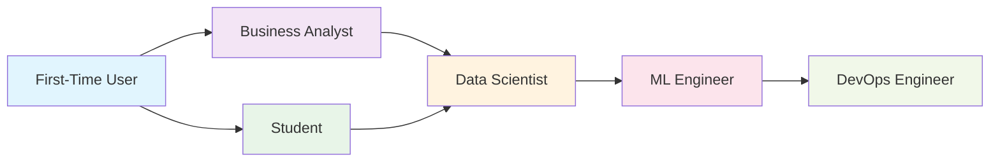

# Role-Specific Onboarding Guides

🍞 **Breadcrumb:** 🏠 [Home](../../../index.md) > 📚 [User Guides](../../README.md) > 🚀 [Onboarding](../README.md) > 🎯 Role-Specific Guides

---

Welcome to personalized onboarding! These guides are tailored to your specific role and experience level, ensuring you get the most relevant information and skills for your work with Pynomaly.

## 🎯 Choose Your Role

### 📊 [Data Scientist](data-scientist.md)

*Perfect for: Data analysts, ML researchers, quantitative analysts*

**Focus Areas:**

- Algorithm selection and tuning
- Feature engineering and preprocessing  
- Model evaluation and validation
- Statistical analysis and interpretation
- Advanced visualization techniques

**Learning Path (45-60 minutes):**

1. **Environment Setup** (10 min) - Python, Jupyter, libraries
2. **First Detection** (15 min) - Hands-on anomaly detection
3. **Algorithm Deep Dive** (20 min) - Compare different approaches
4. **Model Evaluation** (15 min) - Assess performance and tune parameters

---

### 🔧 [ML Engineer](ml-engineer.md)

*Perfect for: ML engineers, software engineers, platform engineers*

**Focus Areas:**

- Production deployment patterns
- API integration and scaling
- Model monitoring and observability
- Performance optimization
- MLOps best practices

**Learning Path (60-75 minutes):**

1. **Environment Setup** (10 min) - Development and production setup
2. **API Integration** (20 min) - RESTful API usage and SDK
3. **Production Deployment** (25 min) - Docker, Kubernetes, monitoring
4. **Performance Optimization** (20 min) - Scaling and efficiency

---

### 📈 [Business Analyst](business-analyst.md)

*Perfect for: Business analysts, product managers, domain experts*

**Focus Areas:**

- Business value and ROI
- Use case identification
- Dashboard creation
- Stakeholder communication
- Interpretation and insights

**Learning Path (30-45 minutes):**

1. **Anomaly Detection Basics** (10 min) - Concepts and business value
2. **Quick Detection** (15 min) - Simple, guided example
3. **Dashboard Creation** (15 min) - Build executive-friendly reports
4. **Business Use Cases** (10 min) - Industry-specific applications

---

### ⚙️ [DevOps Engineer](devops-engineer.md)

*Perfect for: DevOps engineers, SREs, infrastructure engineers*

**Focus Areas:**

- Container deployment
- Infrastructure management
- Security configuration  
- Monitoring and alerting
- Scaling strategies

**Learning Path (45-60 minutes):**

1. **Container Setup** (15 min) - Docker and Kubernetes deployment
2. **Infrastructure Management** (20 min) - Scaling and resource management
3. **Security Configuration** (15 min) - Security best practices
4. **Monitoring Setup** (15 min) - Observability and alerting

---

### 🎓 [Student/Researcher](student.md)

*Perfect for: Students, academics, researchers, PhD candidates*

**Focus Areas:**

- Theoretical foundations
- Academic resources
- Research applications
- Comparative analysis
- Deep learning approaches

**Learning Path (60-90 minutes):**

1. **Theory Foundation** (20 min) - Mathematical concepts and algorithms
2. **Implementation Practice** (25 min) - Code examples and experiments
3. **Research Applications** (20 min) - Academic use cases and papers
4. **Advanced Techniques** (25 min) - Cutting-edge methods

---

### 🆕 [First-Time User](first-time-user.md)

*Perfect for: Complete beginners, non-technical users, explorers*

**Focus Areas:**

- Basic concepts
- Simple examples
- Guided tutorials
- Common use cases
- No-code options

**Learning Path (30-45 minutes):**

1. **What is Anomaly Detection?** (10 min) - Fundamental concepts
2. **Web Interface Tutorial** (15 min) - Point-and-click experience
3. **Example Applications** (15 min) - Real-world use cases
4. **Next Steps** (5 min) - Where to go from here

---

## 🔄 Switching Roles

You can always switch between roles or explore multiple learning paths:

### Multi-Role Scenarios

**Data Scientist + ML Engineer**

- Start with Data Scientist path for theory
- Continue with ML Engineer path for deployment
- Combined duration: 90-120 minutes

**Business Analyst + DevOps Engineer**  

- Start with Business Analyst for use cases
- Add DevOps Engineer for infrastructure
- Combined duration: 75-105 minutes

**Student + Data Scientist**

- Begin with Student path for deep theory
- Progress to Data Scientist for practical skills
- Combined duration: 105-150 minutes

### Role Progression

As you grow in your career, your learning path can evolve:



## 🛠️ Customization Options

### Learning Style Preferences

**Visual Learners**

- Interactive diagrams and flowcharts
- Video demonstrations
- Infographics and visual comparisons

**Hands-On Learners**  

- Code playgrounds and notebooks
- Interactive tutorials
- Real-time feedback

**Documentation Readers**

- Comprehensive written guides
- Reference materials
- Step-by-step instructions

### Experience Level Adjustments

**Beginner**

- More explanations and context
- Guided examples with explanations
- Glossary and concept definitions

**Intermediate**

- Balanced theory and practice
- Best practices and tips
- Performance considerations

**Advanced**

- Cutting-edge techniques
- Research papers and latest developments
- Optimization and customization

**Expert**

- Advanced configuration options
- Integration with other systems
- Contributing to the project

## 📚 Cross-Role Resources

### Common Topics for All Roles

1. **[Security Best Practices](../../../deployment/SECURITY.md)**
   - Data privacy and protection
   - Authentication and authorization
   - Secure deployment practices

2. **[Performance Optimization](../../advanced-features/performance-optimization.md)**
   - Scaling considerations
   - Memory and compute optimization
   - Monitoring and profiling

3. **[Troubleshooting Guide](../../troubleshooting/README.md)**
   - Common issues and solutions
   - Debugging techniques
   - Getting help and support

### Industry-Specific Guides

**Financial Services**

- Fraud detection use cases
- Regulatory compliance
- Real-time processing

**Healthcare**

- Patient data privacy
- Clinical use cases  
- FDA/regulatory considerations

**E-commerce**

- Customer behavior analysis
- Inventory anomalies
- Revenue protection

**Manufacturing**

- Predictive maintenance
- Quality control
- IoT sensor monitoring

**Cybersecurity**

- Network intrusion detection
- Behavioral analysis
- Threat hunting

## 🎯 Quick Start by Role

### I'm a Data Scientist

```bash
# Quick start for data scientists
pip install "pynomaly[science]"
pynomaly tutorial --role data_scientist
```

### I'm an ML Engineer  

```bash
# Quick start for ML engineers
docker pull pynomaly/pynomaly:latest
pynomaly tutorial --role ml_engineer
```

### I'm a Business Analyst

```bash
# Quick start for business analysts
pip install pynomaly
pynomaly server start
# Visit http://localhost:8000/onboarding
```

### I'm a DevOps Engineer

```bash
# Quick start for DevOps engineers
git clone https://github.com/your-org/pynomaly.git
cd pynomaly
make docker-deploy
```

## 🆘 Getting Help

### Role-Specific Support

Each role has dedicated support channels:

- **Data Scientists**: [DS Community Forum](https://community.pynomaly.org/data-science)
- **ML Engineers**: [MLOps Discord](https://discord.gg/pynomaly-mlops)  
- **Business Analysts**: [Business Users Slack](https://pynomaly.slack.com/channels/business)
- **DevOps Engineers**: [Infrastructure GitHub](https://github.com/your-org/pynomaly/discussions/categories/infrastructure)

### Office Hours

Join our weekly office hours:

- **Data Science**: Wednesdays 2-3 PM PST
- **ML Engineering**: Thursdays 10-11 AM PST  
- **Business**: Fridays 1-2 PM PST
- **DevOps**: Tuesdays 11-12 AM PST

---

## 🎯 Ready to Start?

Click on your role above to begin your personalized onboarding journey, or start with our **[Interactive Onboarding](/onboarding/welcome)** for a guided experience.

**Not sure which role fits?** Take our **[2-minute Role Assessment Quiz](role-assessment.md)** to find your perfect learning path!

---

*Each role-specific guide is designed to get you productive with Pynomaly as quickly as possible while building the skills most relevant to your work.*
