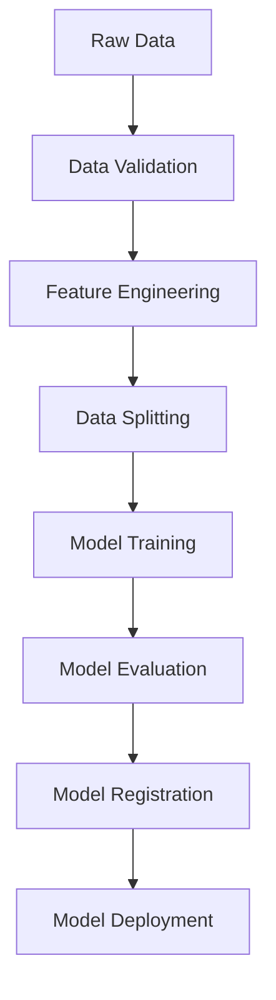
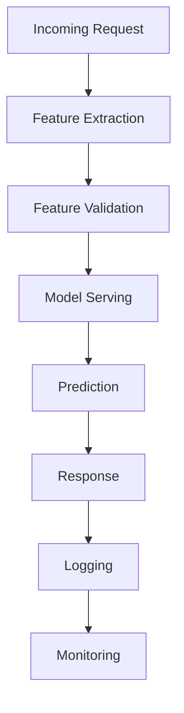
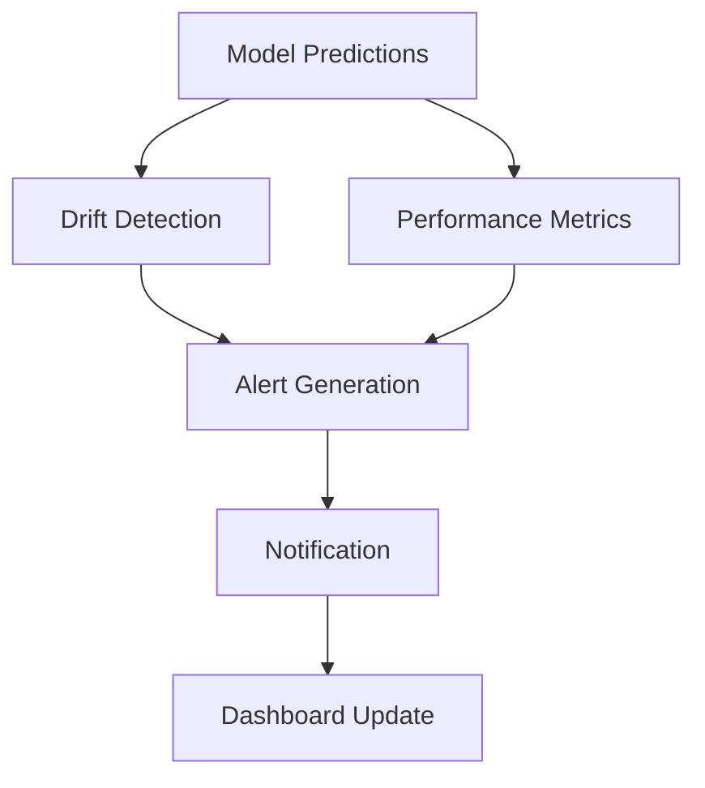

# MLOps Architecture

## Overview

The MLOps package is designed with a modular, scalable architecture that supports the full machine learning lifecycle from experimentation to production deployment. This document describes the architecture principles, components, and integration patterns.

## Architecture Principles

### 1. Clean Architecture

The package follows clean architecture principles with clear separation of concerns:

```
┌─────────────────────────────────────────────────────────────┐
│                    Presentation Layer                       │
│  ┌─────────────┐  ┌─────────────┐  ┌─────────────────────┐ │
│  │     CLI     │  │     API     │  │     Dashboard       │ │
│  └─────────────┘  └─────────────┘  └─────────────────────┘ │
└─────────────────────────────────────────────────────────────┘
┌─────────────────────────────────────────────────────────────┐
│                    Application Layer                        │
│  ┌─────────────┐  ┌─────────────┐  ┌─────────────────────┐ │
│  │ Use Cases   │  │  Services   │  │    Orchestrators    │ │
│  └─────────────┘  └─────────────┘  └─────────────────────┘ │
└─────────────────────────────────────────────────────────────┘
┌─────────────────────────────────────────────────────────────┐
│                      Domain Layer                           │
│  ┌─────────────┐  ┌─────────────┐  ┌─────────────────────┐ │
│  │  Entities   │  │   Services  │  │   Value Objects     │ │
│  └─────────────┘  └─────────────┘  └─────────────────────┘ │
└─────────────────────────────────────────────────────────────┘
┌─────────────────────────────────────────────────────────────┐
│                  Infrastructure Layer                       │
│  ┌─────────────┐  ┌─────────────┐  ┌─────────────────────┐ │
│  │ Repositories│  │   Adapters  │  │   External APIs     │ │
│  └─────────────┘  └─────────────┘  └─────────────────────┘ │
└─────────────────────────────────────────────────────────────┘
```

### 2. Microservices Architecture

The MLOps monorepo is designed as a collection of loosely coupled microservices:

```
┌─────────────┐    ┌─────────────┐    ┌─────────────┐
│ Experiment  │    │    Model    │    │ Monitoring  │
│  Tracking   │    │  Registry   │    │  Service    │
│   Service   │    │   Service   │    │             │
└─────────────┘    └─────────────┘    └─────────────┘
       │                   │                   │
       └───────────────────┼───────────────────┘
                           │
              ┌─────────────┴─────────────┐
              │     Message Bus           │
              │    (Event Streaming)      │
              └───────────────────────────┘
                           │
       ┌───────────────────┼───────────────────┐
       │                   │                   │
┌─────────────┐    ┌─────────────┐    ┌─────────────┐
│ Deployment  │    │  Feature    │    │ Governance  │
│  Service    │    │   Store     │    │  Service    │
│             │    │             │    │             │
└─────────────┘    └─────────────┘    └─────────────┘
```

### 3. Event-Driven Architecture

The system uses event-driven patterns for loose coupling and scalability:

```python
# Event flow example
Model Training → ModelTrainedEvent → Model Registry
Model Registry → ModelRegisteredEvent → Deployment Service
Deployment Service → ModelDeployedEvent → Monitoring Service
Monitoring Service → DriftDetectedEvent → Alert Service
```

## Core Components

### 1. Experiment Tracking

**Purpose**: Track ML experiments, parameters, metrics, and artifacts

**Architecture**:
```
┌─────────────────────────────────────────────────────────────┐
│                 Experiment Tracking                         │
├─────────────────────────────────────────────────────────────┤
│  ┌─────────────┐  ┌─────────────┐  ┌─────────────────────┐ │
│  │ Experiment  │  │   Metric    │  │     Artifact        │ │
│  │  Manager    │  │  Collector  │  │     Storage         │ │
│  └─────────────┘  └─────────────┘  └─────────────────────┘ │
├─────────────────────────────────────────────────────────────┤
│                  MLflow Backend                             │
│  ┌─────────────┐  ┌─────────────┐  ┌─────────────────────┐ │
│  │ Tracking    │  │   Metric    │  │     Artifact        │ │
│  │   Server    │  │    Store    │  │      Store          │ │
│  └─────────────┘  └─────────────┘  └─────────────────────┘ │
└─────────────────────────────────────────────────────────────┘
```

**Key Components**:
- `ExperimentTracker`: Main interface for experiment management
- `MetricCollector`: Collects and stores metrics
- `ArtifactManager`: Manages model artifacts and files
- `ExperimentComparison`: Compares experiment results

### 2. Model Registry

**Purpose**: Manage model versions, metadata, and lifecycle

**Architecture**:
```
┌─────────────────────────────────────────────────────────────┐
│                   Model Registry                            │
├─────────────────────────────────────────────────────────────┤
│  ┌─────────────┐  ┌─────────────┐  ┌─────────────────────┐ │
│  │   Model     │  │   Version   │  │     Metadata        │ │
│  │  Manager    │  │  Manager    │  │     Service         │ │
│  └─────────────┘  └─────────────┘  └─────────────────────┘ │
├─────────────────────────────────────────────────────────────┤
│                Storage Backend                              │
│  ┌─────────────┐  ┌─────────────┐  ┌─────────────────────┐ │
│  │   Model     │  │  Metadata   │  │     Approval        │ │
│  │  Storage    │  │  Database   │  │     Workflow        │ │
│  └─────────────┘  └─────────────┘  └─────────────────────┘ │
└─────────────────────────────────────────────────────────────┘
```

**Key Components**:
- `ModelRegistry`: Main registry interface
- `ModelVersionManager`: Handles model versioning
- `StageManager`: Manages model lifecycle stages
- `ApprovalWorkflow`: Handles model promotion approvals

### 3. Model Deployment

**Purpose**: Deploy models to various target environments

**Architecture**:
```
┌─────────────────────────────────────────────────────────────┐
│                 Model Deployment                            │
├─────────────────────────────────────────────────────────────┤
│  ┌─────────────┐  ┌─────────────┐  ┌─────────────────────┐ │
│  │ Deployment  │  │   Serving   │  │     Scaling         │ │
│  │  Manager    │  │  Runtime    │  │     Manager         │ │
│  └─────────────┘  └─────────────┘  └─────────────────────┘ │
├─────────────────────────────────────────────────────────────┤
│               Target Environments                           │
│  ┌─────────────┐  ┌─────────────┐  ┌─────────────────────┐ │
│  │ Kubernetes  │  │    Docker   │  │     Serverless      │ │
│  │  Cluster    │  │   Runtime   │  │      (AWS Lambda)   │ │
│  └─────────────┘  └─────────────┘  └─────────────────────┘ │
└─────────────────────────────────────────────────────────────┘
```

**Key Components**:
- `DeploymentManager`: Orchestrates deployments
- `KubernetesDeployment`: Kubernetes-specific deployment
- `DockerDeployment`: Docker-based deployment
- `ServingRuntime`: Model serving infrastructure

### 4. Monitoring System

**Purpose**: Monitor model performance, drift, and system health

**Architecture**:
```
┌─────────────────────────────────────────────────────────────┐
│                  Monitoring System                          │
├─────────────────────────────────────────────────────────────┤
│  ┌─────────────┐  ┌─────────────┐  ┌─────────────────────┐ │
│  │   Drift     │  │ Performance │  │     Alert           │ │
│  │  Detector   │  │  Monitor    │  │   Manager           │ │
│  └─────────────┘  └─────────────┘  └─────────────────────┘ │
├─────────────────────────────────────────────────────────────┤
│                Data Collection                              │
│  ┌─────────────┐  ┌─────────────┐  ┌─────────────────────┐ │
│  │   Metrics   │  │    Logs     │  │     Traces          │ │
│  │  Collector  │  │ Aggregator  │  │   Collector         │ │
│  └─────────────┘  └─────────────┘  └─────────────────────┘ │
└─────────────────────────────────────────────────────────────┘
```

**Key Components**:
- `DriftDetector`: Detects data and concept drift
- `PerformanceMonitor`: Monitors model performance metrics
- `AlertManager`: Manages alerts and notifications
- `MetricsCollector`: Collects system and business metrics

### 5. Pipeline Orchestration

**Purpose**: Orchestrate ML workflows and automation

**Architecture**:
```
┌─────────────────────────────────────────────────────────────┐
│                Pipeline Orchestration                       │
├─────────────────────────────────────────────────────────────┤
│  ┌─────────────┐  ┌─────────────┐  ┌─────────────────────┐ │
│  │  Pipeline   │  │   Task      │  │     Scheduler       │ │
│  │  Manager    │  │  Executor   │  │                     │ │
│  └─────────────┘  └─────────────┘  └─────────────────────┘ │
├─────────────────────────────────────────────────────────────┤
│                 Workflow Engine                             │
│  ┌─────────────┐  ┌─────────────┐  ┌─────────────────────┐ │
│  │   Apache    │  │  Kubeflow   │  │     Prefect         │ │
│  │   Airflow   │  │  Pipelines  │  │                     │ │
│  └─────────────┘  └─────────────┘  └─────────────────────┘ │
└─────────────────────────────────────────────────────────────┘
```

**Key Components**:
- `PipelineManager`: Manages pipeline definitions
- `TrainingPipeline`: Automated training workflows
- `DeploymentPipeline`: Automated deployment workflows
- `TaskExecutor`: Executes pipeline tasks

## Data Flow Architecture

### 1. Training Data Flow



### 2. Inference Data Flow



### 3. Monitoring Data Flow



## Integration Patterns

### 1. API Integration

The MLOps package provides RESTful APIs for integration:

```python
# REST API endpoints
GET    /api/v1/experiments
POST   /api/v1/experiments
GET    /api/v1/models
POST   /api/v1/models/{id}/deploy
GET    /api/v1/monitoring/drift
POST   /api/v1/alerts
```

### 2. Event-Driven Integration

Uses event streaming for real-time integration:

```python
# Event types
class ModelTrainedEvent:
    model_id: str
    experiment_id: str
    metrics: Dict[str, float]
    timestamp: datetime

class DriftDetectedEvent:
    model_id: str
    drift_type: str
    drift_score: float
    timestamp: datetime
```

### 3. SDK Integration

Provides Python SDK for programmatic access:

```python
from monorepo.mlops import MLOpsClient

client = MLOpsClient(base_url="http://mlops-api:8000")
models = client.models.list()
deployment = client.deployments.create(model_id="123")
```

## Security Architecture

### 1. Authentication & Authorization

```
┌─────────────────────────────────────────────────────────────┐
│                 Security Layer                              │
├─────────────────────────────────────────────────────────────┤
│  ┌─────────────┐  ┌─────────────┐  ┌─────────────────────┐ │
│  │    OAuth    │  │    RBAC     │  │       Audit         │ │
│  │    2.0      │  │   Manager   │  │     Logging         │ │
│  └─────────────┘  └─────────────┘  └─────────────────────┘ │
├─────────────────────────────────────────────────────────────┤
│                Identity Provider                            │
│  ┌─────────────┐  ┌─────────────┐  ┌─────────────────────┐ │
│  │   Active    │  │    LDAP     │  │       SAML          │ │
│  │ Directory   │  │             │  │                     │ │
│  └─────────────┘  └─────────────┘  └─────────────────────┘ │
└─────────────────────────────────────────────────────────────┘
```

### 2. Model Security

- **Model Signing**: Models are cryptographically signed
- **Artifact Encryption**: Model artifacts encrypted at rest
- **Access Control**: Fine-grained access control for models
- **Audit Trail**: Complete audit trail for model operations

### 3. Network Security

- **TLS Encryption**: All communications encrypted
- **Network Policies**: Kubernetes network policies
- **VPC Isolation**: Components isolated in VPCs
- **Firewall Rules**: Restrictive firewall configurations

## Scalability Architecture

### 1. Horizontal Scaling

```
┌─────────────────────────────────────────────────────────────┐
│                 Load Balancer                               │
└─────────────────────────────────────────────────────────────┘
┌─────────────┐  ┌─────────────┐  ┌─────────────────────┐
│   MLOps     │  │   MLOps     │  │       MLOps         │
│ Service 1   │  │ Service 2   │  │     Service N       │
└─────────────┘  └─────────────┘  └─────────────────────┘
┌─────────────────────────────────────────────────────────────┐
│                Shared Database                              │
└─────────────────────────────────────────────────────────────┘
```

### 2. Vertical Scaling

- **Resource Allocation**: Dynamic resource allocation
- **Auto-scaling**: Automatic scaling based on metrics
- **Resource Optimization**: Efficient resource usage
- **Performance Monitoring**: Real-time performance monitoring

### 3. Geographic Distribution

- **Multi-Region**: Deploy across multiple regions
- **Data Locality**: Keep data close to processing
- **Failover**: Automatic failover capabilities
- **Disaster Recovery**: Comprehensive disaster recovery

## Deployment Architecture

### 1. Development Environment

```
┌─────────────────────────────────────────────────────────────┐
│                Development Environment                      │
├─────────────────────────────────────────────────────────────┤
│  ┌─────────────┐  ┌─────────────┐  ┌─────────────────────┐ │
│  │   Local     │  │   Docker    │  │      Minikube       │ │
│  │Development  │  │  Compose    │  │                     │ │
│  └─────────────┘  └─────────────┘  └─────────────────────┘ │
└─────────────────────────────────────────────────────────────┘
```

### 2. Staging Environment

```
┌─────────────────────────────────────────────────────────────┐
│                 Staging Environment                         │
├─────────────────────────────────────────────────────────────┤
│  ┌─────────────┐  ┌─────────────┐  ┌─────────────────────┐ │
│  │ Kubernetes  │  │   Testing   │  │      Staging        │ │
│  │  Cluster    │  │   Data      │  │       MLOps         │ │
│  └─────────────┘  └─────────────┘  └─────────────────────┘ │
└─────────────────────────────────────────────────────────────┘
```

### 3. Production Environment

```
┌─────────────────────────────────────────────────────────────┐
│                Production Environment                       │
├─────────────────────────────────────────────────────────────┤
│  ┌─────────────┐  ┌─────────────┐  ┌─────────────────────┐ │
│  │ Kubernetes  │  │   Production│  │      Production     │ │
│  │  Cluster    │  │   Database  │  │       MLOps         │ │
│  └─────────────┘  └─────────────┘  └─────────────────────┘ │
└─────────────────────────────────────────────────────────────┘
```

## Technology Stack

### 1. Core Technologies

- **Language**: Python 3.11+
- **Framework**: FastAPI, Pydantic
- **Database**: PostgreSQL, Redis
- **Message Queue**: Apache Kafka, RabbitMQ
- **Container**: Docker, Kubernetes

### 2. ML Technologies

- **Experiment Tracking**: MLflow
- **Model Registry**: MLflow Model Registry
- **Feature Store**: Feast
- **Orchestration**: Kubeflow, Apache Airflow
- **Monitoring**: Prometheus, Grafana

### 3. Infrastructure

- **Cloud**: AWS, Azure, GCP
- **Container Orchestration**: Kubernetes
- **Service Mesh**: Istio
- **Monitoring**: Prometheus, Grafana, Jaeger
- **Storage**: S3, GCS, Azure Blob

## Extension Points

### 1. Custom Algorithms

```python
from monorepo.mlops.base import BaseAlgorithm

class CustomDetector(BaseAlgorithm):
    def fit(self, X):
        # Custom training logic
        pass
    
    def predict(self, X):
        # Custom prediction logic
        pass
```

### 2. Custom Deployments

```python
from monorepo.mlops.base import BaseDeployment

class CustomDeployment(BaseDeployment):
    def deploy(self, model_version):
        # Custom deployment logic
        pass
    
    def rollback(self):
        # Custom rollback logic
        pass
```

### 3. Custom Monitoring

```python
from monorepo.mlops.base import BaseMonitor

class CustomMonitor(BaseMonitor):
    def start_monitoring(self):
        # Custom monitoring logic
        pass
    
    def detect_drift(self, data):
        # Custom drift detection
        pass
```

## Configuration Management

### 1. Environment-Specific Configuration

```python
# config/development.yaml
mlops:
  experiment_tracking:
    backend: mlflow
    tracking_uri: http://localhost:5000
  
  model_registry:
    backend: mlflow
    stage_transitions: false
  
  monitoring:
    enabled: false
```

### 2. Feature Flags

```python
# Feature flags for gradual rollout
FEATURE_FLAGS = {
    "drift_detection": True,
    "auto_scaling": False,
    "canary_deployment": True,
    "explainability": True
}
```

### 3. Configuration Validation

```python
from pydantic import BaseModel

class MLOpsConfig(BaseModel):
    experiment_tracking: ExperimentTrackingConfig
    model_registry: ModelRegistryConfig
    monitoring: MonitoringConfig
    deployment: DeploymentConfig
```

## Performance Considerations

### 1. Caching Strategy

- **Model Caching**: Cache frequently accessed models
- **Metadata Caching**: Cache model metadata
- **Feature Caching**: Cache feature computations
- **Result Caching**: Cache prediction results

### 2. Optimization Techniques

- **Lazy Loading**: Load models on-demand
- **Batch Processing**: Process requests in batches
- **Async Operations**: Use async for I/O operations
- **Connection Pooling**: Pool database connections

### 3. Resource Management

- **Memory Management**: Efficient memory usage
- **CPU Optimization**: Optimize CPU-intensive operations
- **Storage Optimization**: Efficient storage usage
- **Network Optimization**: Minimize network calls

## Future Architecture Enhancements

### 1. Advanced Features

- **GraphQL API**: More flexible API queries
- **WebSocket Support**: Real-time updates
- **Streaming ML**: Real-time model training
- **Edge Deployment**: Deploy models to edge devices

### 2. AI/ML Enhancements

- **AutoML**: Automated machine learning
- **Neural Architecture Search**: Automated architecture design
- **Federated Learning**: Distributed learning
- **Explainable AI**: Enhanced model interpretability

### 3. Infrastructure Improvements

- **Service Mesh**: Advanced service communication
- **Serverless**: Serverless model serving
- **Multi-Cloud**: Multi-cloud deployment
- **GitOps**: GitOps-based deployment

This architecture provides a solid foundation for MLOps operations while maintaining flexibility for future enhancements and integrations.