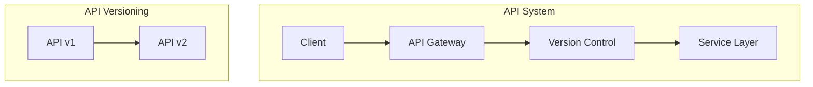

# ADR-004: API Design and Versioning

🍞 **Breadcrumb:** 🏠 [Home](../../../index.md) > 👨‍💻 [Developer Guides](../../README.md) > 🏗️ [Architecture](../README.md) > 📋 [ADR](README.md) > API Design and Versioning

## Status

PLANNED

## Context

### Problem Statement
The Pynomaly platform needs a consistent and scalable approach for API design and versioning to ensure backward compatibility and support evolving client needs.

### Goals
- Provide clear guidelines for API design standards
- Establish versioning strategies for backward compatibility
- Support multiple API versions concurrently
- Enable deprecation and evolution of APIs

### Constraints
- Must maintain backward compatibility
- Should minimize disruption to existing clients
- Must comply with RESTful principles
- Should support rapid evolution of API features

### Assumptions
- Clients will need to access multiple API versions
- API changes will occur frequently as the system evolves
- Consistent design principles will enhance developer experience

## Decision

### Chosen Solution
*[To be completed when ADR moves to PROPOSED status]*

### Rationale
*[To be completed when ADR moves to PROPOSED status]*

## Architecture

### System Overview

### Component Interactions
*[To be completed when ADR moves to PROPOSED status]*

## Options Considered

### Pros and Cons Matrix

| Option | Pros | Cons | Score |
|--------|------|------|-------|
| TBD | TBD | TBD | TBD |

### Rejected Alternatives
*[To be completed when ADR moves to PROPOSED status]*

## Implementation

### Technical Approach
*[To be completed when ADR moves to PROPOSED status]*

### Migration Strategy
*[To be completed when ADR moves to PROPOSED status]*

### Testing Strategy
*[To be completed when ADR moves to PROPOSED status]*

## Consequences

### Positive
- *[To be documented when decision is made]*

### Negative
- *[To be documented when decision is made]*

### Neutral
- *[To be documented when decision is made]*

## Compliance

### Security Impact
*[To be completed when ADR moves to PROPOSED status]*

### Performance Impact
*[To be completed when ADR moves to PROPOSED status]*

### Monitoring Requirements
*[To be completed when ADR moves to PROPOSED status]*

## Decision Log

| Date | Author | Action | Rationale |
|------|--------|--------|-----------|
| 2025-01-08 | API Team | PLANNED | Proposed need for API design and versioning strategy |

## References

- [RESTful API Guidelines](../restful-guidelines.md)
- [API Design Principles](../api-design.md)
- [ADR Index](README.md)

---

## 🔗 **Related Documentation**

### **Architecture**
- **[Architecture Overview](../README.md)** - System design principles
- **[API Architecture](../api-architecture.md)** - API system design
- **[ADR Index](README.md)** - All architectural decisions

### **Implementation**
- **[API Implementation Guide](../../api/implementation.md)** - Implementation standards
- **[Contributing Guidelines](../../contributing/CONTRIBUTING.md)** - Development process
- **[Security Guidelines](../../security/README.md)** - Security practices

### **Quality Assurance**
- **[Testing Strategy](../../testing/README.md)** - Testing approach
- **[Code Quality](../../quality/README.md)** - Quality standards
- **[Documentation Standards](../../contributing/documentation.md)** - Documentation requirements

---

**Authors:** API Team  
**Last Updated:** 2025-01-08  
**Next Review:** 2025-04-08
