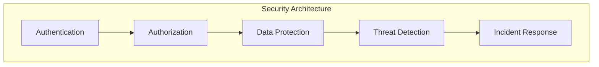

# ADR-005: Security Architecture

🍞 **Breadcrumb:** 🏠 [Home](../../../index.md) > 👨‍💻 [Developer Guides](../../README.md) > 🏗️ [Architecture](../README.md) > 📋 [ADR](README.md) > Security Architecture

## Status

PLANNED

## Context

### Problem Statement
Pynomaly requires a comprehensive security architecture that addresses authentication, authorization, data protection, and threat detection to ensure system integrity and user privacy.

### Goals
- Implement robust authentication and authorization mechanisms
- Ensure end-to-end data encryption and protection
- Establish security monitoring and incident response capabilities
- Comply with industry security standards and regulations

### Constraints
- Must meet regulatory compliance requirements
- Should minimize impact on system performance
- Must integrate with existing infrastructure
- Should support various deployment environments

### Assumptions
- Security threats will continue to evolve
- Compliance requirements will become more stringent
- Users will expect enterprise-grade security features
- Security measures must be transparent to end users

## Decision

### Chosen Solution
*[To be completed when ADR moves to PROPOSED status]*

### Rationale
*[To be completed when ADR moves to PROPOSED status]*

## Architecture

### System Overview

### Component Interactions
*[To be completed when ADR moves to PROPOSED status]*

## Options Considered

### Pros and Cons Matrix

| Option | Pros | Cons | Score |
|--------|------|------|-------|
| TBD | TBD | TBD | TBD |

### Rejected Alternatives
*[To be completed when ADR moves to PROPOSED status]*

## Implementation

### Technical Approach
*[To be completed when ADR moves to PROPOSED status]*

### Migration Strategy
*[To be completed when ADR moves to PROPOSED status]*

### Testing Strategy
*[To be completed when ADR moves to PROPOSED status]*

## Consequences

### Positive
- *[To be documented when decision is made]*

### Negative
- *[To be documented when decision is made]*

### Neutral
- *[To be documented when decision is made]*

## Compliance

### Security Impact
*[To be completed when ADR moves to PROPOSED status]*

### Performance Impact
*[To be completed when ADR moves to PROPOSED status]*

### Monitoring Requirements
*[To be completed when ADR moves to PROPOSED status]*

## Decision Log

| Date | Author | Action | Rationale |
|------|--------|--------|-----------|
| 2025-01-08 | Security Team | PLANNED | Identified need for comprehensive security architecture |

## References

- [Security Best Practices](../../security/README.md)
- [Compliance Requirements](../../security/compliance.md)
- [ADR Index](README.md)

---

## 🔗 **Related Documentation**

### **Architecture**
- **[Architecture Overview](../README.md)** - System design principles
- **[Security Architecture](../security-architecture.md)** - Security system design
- **[ADR Index](README.md)** - All architectural decisions

### **Security**
- **[Security Guidelines](../../security/README.md)** - Security practices
- **[Threat Modeling](../../security/threat-modeling.md)** - Threat analysis
- **[Incident Response](../../security/incident-response.md)** - Security incidents

### **Compliance**
- **[Compliance Guide](../../security/compliance.md)** - Regulatory compliance
- **[Audit Trail](../../security/audit-trail.md)** - Security auditing
- **[Data Protection](../../security/data-protection.md)** - Data privacy

---

**Authors:** Security Team  
**Last Updated:** 2025-01-08  
**Next Review:** 2025-04-08
