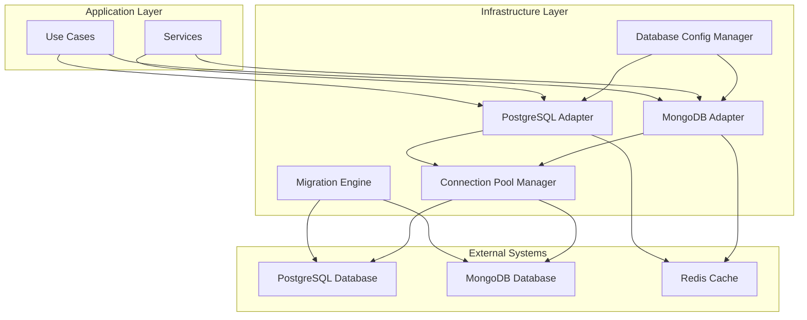
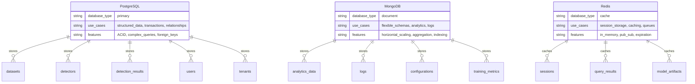
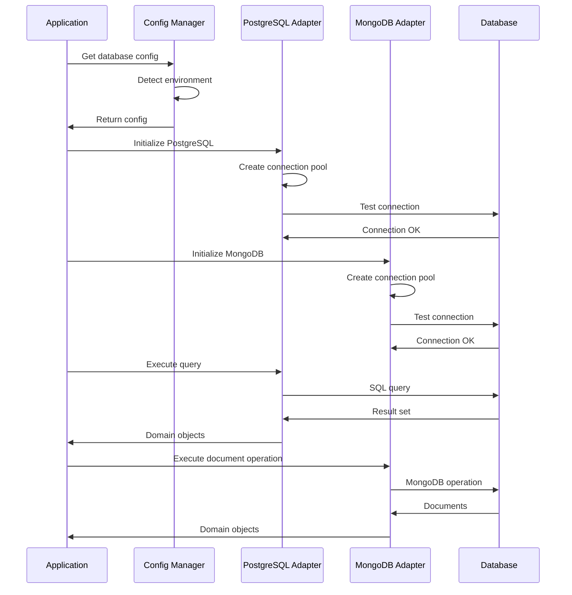

# ADR-012: Production Database Integration

🍞 **Breadcrumb:** 🏠 [Home](../../../index.md) > 👨‍💻 [Developer Guides](../../README.md) > 🏗️ [Architecture](../README.md) > 📋 [ADR](README.md) > Production Database Integration

## Status

PROPOSED

## Context

### Problem Statement
Issue #12 identifies the need to replace file-based storage with PostgreSQL/MongoDB for production scalability. The current system has database infrastructure in place but may still rely on file-based storage for certain operations, limiting production scalability and concurrent access.

### Goals
- Replace any remaining file-based storage with production-ready databases
- Ensure proper PostgreSQL integration with connection pooling
- Add MongoDB support for flexible document storage
- Implement database migration scripts for smooth transitions
- Optimize performance for production workloads

### Constraints
- Must maintain backward compatibility with existing data
- Must support both PostgreSQL and MongoDB depending on use case
- Must pass all existing tests
- Must follow TDD principles during implementation

### Assumptions
- PostgreSQL will be the primary relational database
- MongoDB will be used for document storage and flexible schema requirements
- Current SQLAlchemy-based infrastructure can be extended
- Database connection pooling is critical for production performance

## Decision

### Chosen Solution
**Enhanced Database Integration** - Extend the existing database infrastructure to ensure complete production readiness:

1. **PostgreSQL Integration Enhancement**:
   - Verify and enhance existing PostgreSQL adapter
   - Implement advanced connection pooling
   - Add PostgreSQL-specific optimizations
   - Create comprehensive migration system

2. **MongoDB Integration**:
   - Implement MongoDB adapter using Motor/PyMongo
   - Create document-based repositories
   - Add MongoDB-specific features (aggregation, indexing)
   - Implement schema validation

3. **Migration System**:
   - Create database migration scripts
   - Implement data migration utilities
   - Add rollback capabilities
   - Support for schema evolution

4. **Performance Optimizations**:
   - Advanced connection pooling
   - Query optimization
   - Caching strategies
   - Connection management

### Rationale
The existing infrastructure provides a solid foundation, but needs enhancement for production environments. Supporting both PostgreSQL and MongoDB gives flexibility for different data storage needs while maintaining the clean architecture pattern.

## Architecture

### System Overview


### Database Architecture


### Component Interactions


## Options Considered

### Pros and Cons Matrix

| Option | Pros | Cons | Score |
|--------|------|------|-------|
| **Enhanced Database Integration** | ✅ Builds on existing infrastructure<br/>✅ Supports multiple databases<br/>✅ Production-ready features | ❌ Complex implementation<br/>❌ Multiple database maintenance | **9/10** |
| PostgreSQL Only | ✅ Simpler implementation<br/>✅ Strong consistency | ❌ Less flexibility<br/>❌ No document storage | 7/10 |
| MongoDB Only | ✅ Flexible schema<br/>✅ Horizontal scaling | ❌ No ACID guarantees<br/>❌ Limited complex queries | 6/10 |
| Keep File-based | ✅ Simple deployment<br/>✅ No database setup | ❌ Poor concurrency<br/>❌ No production scalability | 3/10 |

### Rejected Alternatives
- **PostgreSQL Only**: Rejected due to lack of flexibility for document storage needs
- **MongoDB Only**: Rejected due to need for structured data and transactions
- **Keep File-based**: Rejected as it doesn't meet production scalability requirements

## Implementation

### Technical Approach

#### Phase 1: PostgreSQL Enhancement (Week 1-2)
```python
# Enhanced PostgreSQL adapter with connection pooling
class EnhancedPostgreSQLAdapter:
    def __init__(self, config: DatabaseConfig):
        self.config = config
        self.pool = self._create_connection_pool()
        self.query_optimizer = QueryOptimizer()
    
    def _create_connection_pool(self):
        return create_engine(
            self.config.get_connection_url(),
            **self.config.get_engine_kwargs()
        )
    
    async def execute_query(self, query: str, params: dict = None):
        async with self.pool.acquire() as conn:
            return await conn.execute(query, params)
```

#### Phase 2: MongoDB Integration (Week 3-4)
```python
# MongoDB adapter implementation
class MongoDBAdapter:
    def __init__(self, config: DatabaseConfig):
        self.config = config
        self.client = motor.motor_asyncio.AsyncIOMotorClient(
            config.get_connection_url()
        )
        self.db = self.client[config.database]
    
    async def insert_document(self, collection: str, document: dict):
        return await self.db[collection].insert_one(document)
    
    async def find_documents(self, collection: str, filter: dict = None):
        return await self.db[collection].find(filter).to_list(None)
```

#### Phase 3: Migration System (Week 5-6)
```python
# Database migration system
class DatabaseMigrator:
    def __init__(self, source_config: DatabaseConfig, target_config: DatabaseConfig):
        self.source = source_config
        self.target = target_config
        self.migration_log = MigrationLog()
    
    async def migrate_data(self):
        # Migrate datasets
        await self._migrate_table("datasets", DatasetMigration)
        
        # Migrate detectors
        await self._migrate_table("detectors", DetectorMigration)
        
        # Migrate results
        await self._migrate_table("detection_results", ResultMigration)
```

### Migration Strategy

#### Data Migration Steps
1. **Assessment Phase**:
   - Analyze current data structure
   - Identify migration requirements
   - Create migration plan

2. **Schema Migration**:
   - Create target database schemas
   - Set up indexes and constraints
   - Implement foreign keys

3. **Data Transfer**:
   - Batch data transfer with validation
   - Handle data type conversions
   - Maintain referential integrity

4. **Verification**:
   - Data integrity checks
   - Performance validation
   - Rollback testing

### Testing Strategy

#### Unit Tests
```python
class TestPostgreSQLAdapter:
    async def test_connection_pool(self):
        adapter = EnhancedPostgreSQLAdapter(config)
        assert adapter.pool.size == config.pool_size
        
    async def test_query_optimization(self):
        adapter = EnhancedPostgreSQLAdapter(config)
        result = await adapter.execute_optimized_query(test_query)
        assert result is not None

class TestMongoDBAdapter:
    async def test_document_operations(self):
        adapter = MongoDBAdapter(config)
        doc_id = await adapter.insert_document("test", {"key": "value"})
        assert doc_id is not None
```

#### Integration Tests
```python
class TestDatabaseIntegration:
    async def test_postgresql_mongodb_coordination(self):
        # Test coordinated operations between databases
        pg_adapter = EnhancedPostgreSQLAdapter(pg_config)
        mongo_adapter = MongoDBAdapter(mongo_config)
        
        # Test transaction coordination
        await self._test_distributed_transaction(pg_adapter, mongo_adapter)
```

#### Performance Tests
```python
class TestDatabasePerformance:
    async def test_connection_pool_performance(self):
        adapter = EnhancedPostgreSQLAdapter(config)
        
        # Test concurrent connections
        tasks = [adapter.execute_query(query) for _ in range(100)]
        results = await asyncio.gather(*tasks)
        
        assert len(results) == 100
        assert all(r is not None for r in results)
```

## Consequences

### Positive
- **Production Scalability**: Support for high-concurrency environments
- **Data Integrity**: Strong consistency guarantees with PostgreSQL
- **Flexibility**: Document storage capabilities with MongoDB
- **Performance**: Optimized connection pooling and query execution
- **Maintainability**: Clean separation of database concerns

### Negative
- **Complexity**: Multiple database systems require more maintenance
- **Learning Curve**: Team needs to understand both PostgreSQL and MongoDB
- **Infrastructure**: Additional operational overhead for database management
- **Testing**: More complex test scenarios with multiple databases

### Neutral
- **Configuration**: More configuration options may overwhelm users
- **Documentation**: Requires comprehensive database setup documentation
- **Deployment**: Database setup becomes part of deployment process

## Compliance

### Security Impact
- **Connection Security**: All database connections use SSL/TLS
- **Access Control**: Proper authentication and authorization
- **Data Encryption**: Encryption at rest and in transit
- **Audit Logging**: Database operation auditing

### Performance Impact
- **Connection Pooling**: Optimized for concurrent access
- **Query Optimization**: Automated query performance tuning
- **Caching**: Intelligent caching strategies
- **Monitoring**: Performance metrics collection

### Monitoring Requirements
- **Health Checks**: Database connectivity monitoring
- **Performance Metrics**: Query execution time, connection pool usage
- **Error Tracking**: Database error logging and alerting
- **Capacity Planning**: Storage and connection usage monitoring

## Decision Log

| Date | Author | Action | Rationale |
|------|--------|--------|-----------|
| 2025-01-08 | Agent | PROPOSED | Analysis of Issue #12 requirements and existing infrastructure assessment |

## References

- [Issue #12](https://github.com/elgerytme/Pynomaly/issues/12) - Original feature request
- [Current Database Config](../../../../src/pynomaly/infrastructure/config/database_config.py) - Existing configuration
- [Database Infrastructure](../../../../src/pynomaly/infrastructure/persistence/) - Current implementation
- [SQLAlchemy Documentation](https://docs.sqlalchemy.org/) - Database ORM
- [Motor Documentation](https://motor.readthedocs.io/) - MongoDB async driver

---

## 🔗 **Related Documentation**

### **Architecture**
- **[Architecture Overview](../overview.md)** - System design principles
- **[Clean Architecture](../overview.md)** - Architectural patterns
- **[ADR Index](README.md)** - All architectural decisions

### **Database**
- **[Database Configuration](../../../../src/pynomaly/infrastructure/config/database_config.py)** - Configuration system
- **[Database Repositories](../../../../src/pynomaly/infrastructure/persistence/database_repositories.py)** - Repository implementations
- **[Migration System](../../../../src/pynomaly/infrastructure/persistence/migrations.py)** - Database migrations

### **Deployment**
- **[Production Deployment](../../../deployment/README.md)** - Production setup
- **[Security](../../../deployment/SECURITY.md)** - Security configuration
- **[Monitoring](../../../user-guides/basic-usage/monitoring.md)** - System observability

---

## Next Steps

1. **Requirements Review**: Validate requirements with stakeholders
2. **Implementation Planning**: Create detailed implementation tasks
3. **Database Setup**: Prepare development and test environments
4. **Testing Strategy**: Implement comprehensive test suite
5. **Documentation**: Create database setup and migration guides

---

**Authors:** Agent<br/>
**Last Updated:** 2025-01-08<br/>
**Next Review:** Upon implementation completion
