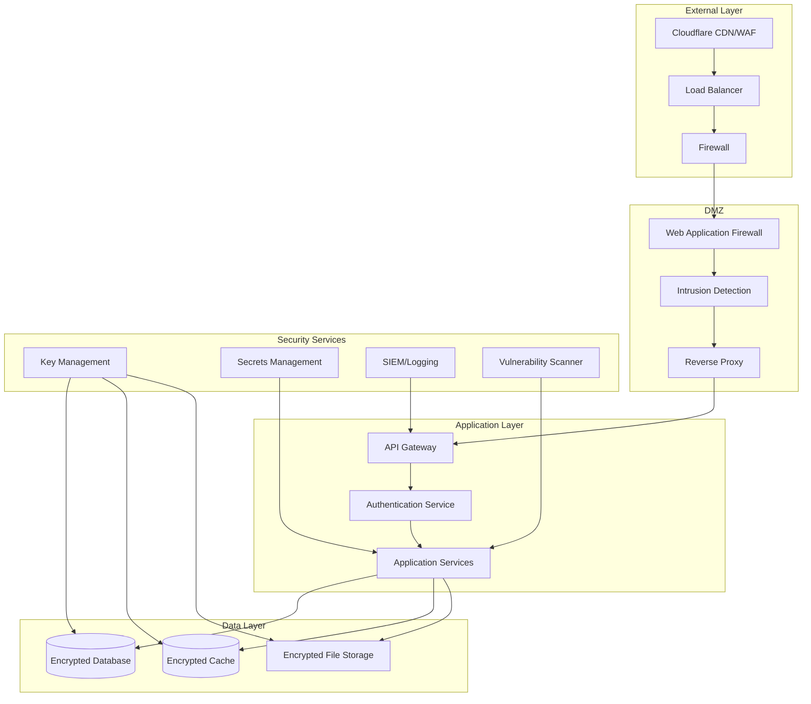
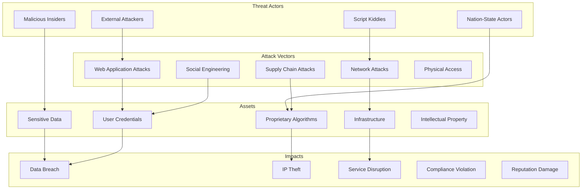

# ADR-019: Security Hardening & Threat Model

🍞 **Breadcrumb:** 🏠 [Home](../../../index.md) > 👨‍💻 [Developer Guides](../../README.md) > 🏗️ [Architecture](../README.md) > 📋 [ADR](README.md) > Security Hardening & Threat Model

## Status

PROPOSED

## Context

### Problem Statement

The Pynomaly system processes sensitive anomaly detection data and requires comprehensive security hardening to protect against various threat vectors. As an analytics platform handling potentially confidential datasets, user authentication data, and proprietary algorithms, we need a robust security framework that addresses authentication, authorization, data protection, infrastructure security, and compliance requirements. The system must be secure by design and implement defense-in-depth strategies.

### Goals

- Implement comprehensive threat modeling and risk assessment
- Establish robust authentication and authorization mechanisms
- Ensure data protection at rest and in transit
- Implement network security and infrastructure hardening
- Enable security monitoring and incident response capabilities
- Achieve compliance with relevant security standards and regulations
- Implement secure development lifecycle practices

### Constraints

- Must maintain system performance and user experience
- Cannot disrupt existing functionality during security implementation
- Must integrate with existing infrastructure and technology stack
- Budget constraints limit use of premium security services
- Team has varying levels of security expertise
- Must comply with data privacy regulations (GDPR, CCPA)

### Assumptions

- Security threats will evolve and require ongoing assessment
- Users will adopt secure practices with proper guidance
- Automated security monitoring will detect most threats
- Regular security updates and patches will be applied
- Security training will improve team security awareness

## Decision

### Chosen Solution

Implement a **comprehensive security framework** based on NIST Cybersecurity Framework and Zero Trust principles:

1. **Identity and Access Management (IAM)**
   - **Multi-Factor Authentication (MFA)** - Required for all user accounts
   - **Role-Based Access Control (RBAC)** - Granular permissions and roles
   - **OAuth 2.0/OpenID Connect** - Standardized authentication
   - **API Key Management** - Secure API access with rotation

2. **Data Protection**
   - **Encryption at Rest** - AES-256 for databases and file storage
   - **Encryption in Transit** - TLS 1.3 for all communications
   - **Data Classification** - Sensitive data identification and handling
   - **Key Management** - AWS KMS or HashiCorp Vault for key storage

3. **Network Security**
   - **Zero Trust Network** - Never trust, always verify approach
   - **Web Application Firewall (WAF)** - Protection against common attacks
   - **DDoS Protection** - Cloudflare or AWS Shield for availability
   - **Network Segmentation** - Isolated environments and microsegmentation

4. **Infrastructure Security**
   - **Container Security** - Image scanning and runtime protection
   - **Infrastructure as Code Security** - Secure Terraform configurations
   - **Secrets Management** - Centralized secret storage and rotation
   - **Hardened Operating Systems** - CIS benchmarks and security baselines

5. **Application Security**
   - **Secure Coding Practices** - OWASP guidelines implementation
   - **Input Validation** - Comprehensive input sanitization
   - **SQL Injection Prevention** - Parameterized queries and ORM usage
   - **Cross-Site Scripting (XSS) Protection** - Content Security Policy

6. **Monitoring and Incident Response**
   - **Security Information and Event Management (SIEM)** - Centralized logging
   - **Intrusion Detection System (IDS)** - Real-time threat detection
   - **Vulnerability Management** - Regular scanning and patching
   - **Incident Response Plan** - Defined procedures for security incidents

### Rationale

This approach provides:

- **Defense in Depth**: Multiple layers of security controls
- **Zero Trust**: Assume breach and verify everything
- **Compliance**: Meets regulatory and industry standards
- **Scalability**: Security controls that scale with the system
- **Automation**: Automated security monitoring and response
- **Cost Effectiveness**: Open-source and cloud-native security tools

## Architecture

### Security Architecture Overview



### Threat Model



## Options Considered

### Pros and Cons Matrix

| Option | Pros | Cons | Score |
|--------|------|------|-------|
| **Comprehensive Framework** | ✅ Complete security coverage<br/>✅ Industry best practices<br/>✅ Compliance ready<br/>✅ Defense in depth | ❌ High implementation cost<br/>❌ Complex to maintain<br/>❌ May impact performance | **9/10** |
| Cloud Security Services | ✅ Managed services<br/>✅ Expert support<br/>✅ Quick deployment<br/>✅ Automatic updates | ❌ Vendor lock-in<br/>❌ High ongoing costs<br/>❌ Limited customization | 7/10 |
| Basic Security Measures | ✅ Low cost<br/>✅ Simple implementation<br/>✅ Fast deployment | ❌ Limited protection<br/>❌ Not compliance ready<br/>❌ Single points of failure | 4/10 |
| Security by Obscurity | ✅ No additional costs<br/>✅ Simple approach | ❌ Not effective<br/>❌ False sense of security<br/>❌ Compliance issues | 2/10 |

### Rejected Alternatives

- **Cloud Security Services Only**: Creates vendor lock-in and high ongoing costs
- **Basic Security Measures**: Insufficient for handling sensitive data and compliance
- **Security by Obscurity**: Not a valid security strategy and provides false security

## Implementation

### Technical Approach

#### 1. Authentication and Authorization

```python
# auth/security.py
from fastapi import Depends, HTTPException, status
from fastapi.security import HTTPBearer, HTTPAuthorizationCredentials
from passlib.context import CryptContext
from jose import JWTError, jwt
from datetime import datetime, timedelta
import secrets
import hashlib

class SecurityManager:
    def __init__(self):
        self.pwd_context = CryptContext(schemes=["bcrypt"], deprecated="auto")
        self.secret_key = self._generate_secret_key()
        self.algorithm = "HS256"
        self.token_expire_minutes = 30
        self.refresh_token_expire_days = 7
    
    def _generate_secret_key(self) -> str:
        """Generate cryptographically secure secret key."""
        return secrets.token_urlsafe(32)
    
    def hash_password(self, password: str) -> str:
        """Hash password using bcrypt."""
        return self.pwd_context.hash(password)
    
    def verify_password(self, plain_password: str, hashed_password: str) -> bool:
        """Verify password against hash."""
        return self.pwd_context.verify(plain_password, hashed_password)
    
    def create_access_token(self, data: dict) -> str:
        """Create JWT access token."""
        to_encode = data.copy()
        expire = datetime.utcnow() + timedelta(minutes=self.token_expire_minutes)
        to_encode.update({"exp": expire, "type": "access"})
        return jwt.encode(to_encode, self.secret_key, algorithm=self.algorithm)
    
    def create_refresh_token(self, data: dict) -> str:
        """Create JWT refresh token."""
        to_encode = data.copy()
        expire = datetime.utcnow() + timedelta(days=self.refresh_token_expire_days)
        to_encode.update({"exp": expire, "type": "refresh"})
        return jwt.encode(to_encode, self.secret_key, algorithm=self.algorithm)
    
    def verify_token(self, token: str, token_type: str = "access") -> dict:
        """Verify and decode JWT token."""
        try:
            payload = jwt.decode(token, self.secret_key, algorithms=[self.algorithm])
            if payload.get("type") != token_type:
                raise JWTError("Invalid token type")
            return payload
        except JWTError:
            raise HTTPException(
                status_code=status.HTTP_401_UNAUTHORIZED,
                detail="Invalid token",
                headers={"WWW-Authenticate": "Bearer"},
            )

class RoleBasedAccessControl:
    def __init__(self):
        self.permissions = {
            "admin": [
                "users:read", "users:write", "users:delete",
                "jobs:read", "jobs:write", "jobs:delete",
                "algorithms:read", "algorithms:write", "algorithms:delete",
                "system:read", "system:write"
            ],
            "analyst": [
                "jobs:read", "jobs:write",
                "algorithms:read",
                "data:read", "data:write"
            ],
            "viewer": [
                "jobs:read",
                "algorithms:read",
                "data:read"
            ],
            "api_user": [
                "api:read", "api:write"
            ]
        }
    
    def has_permission(self, user_role: str, required_permission: str) -> bool:
        """Check if user role has required permission."""
        user_permissions = self.permissions.get(user_role, [])
        return required_permission in user_permissions
    
    def require_permission(self, permission: str):
        """Decorator to require specific permission."""
        def decorator(func):
            async def wrapper(*args, **kwargs):
                # Extract user from token (implementation depends on your auth system)
                user = self._get_current_user_from_context()
                if not self.has_permission(user.role, permission):
                    raise HTTPException(
                        status_code=status.HTTP_403_FORBIDDEN,
                        detail="Insufficient permissions"
                    )
                return await func(*args, **kwargs)
            return wrapper
        return decorator

# Multi-Factor Authentication
class MFAManager:
    def __init__(self):
        self.totp_issuer = "Pynomaly"
    
    def generate_secret(self) -> str:
        """Generate TOTP secret for user."""
        return secrets.token_urlsafe(20)
    
    def generate_qr_code(self, user_email: str, secret: str) -> str:
        """Generate QR code for TOTP setup."""
        import qrcode
        import io
        import base64
        
        totp_uri = f"otpauth://totp/{self.totp_issuer}:{user_email}?secret={secret}&issuer={self.totp_issuer}"
        
        qr = qrcode.QRCode(version=1, box_size=10, border=5)
        qr.add_data(totp_uri)
        qr.make(fit=True)
        
        img = qr.make_image(fill_color="black", back_color="white")
        buf = io.BytesIO()
        img.save(buf, format='PNG')
        
        return base64.b64encode(buf.getvalue()).decode()
    
    def verify_totp(self, secret: str, token: str) -> bool:
        """Verify TOTP token."""
        import pyotp
        totp = pyotp.TOTP(secret)
        return totp.verify(token, valid_window=1)
```

#### 2. Data Encryption and Protection

```python
# security/encryption.py
from cryptography.fernet import Fernet
from cryptography.hazmat.primitives import hashes
from cryptography.hazmat.primitives.kdf.pbkdf2 import PBKDF2HMAC
import base64
import os
import boto3
from typing import Union

class DataEncryption:
    def __init__(self, kms_key_id: str = None):
        self.kms_client = boto3.client('kms') if kms_key_id else None
        self.kms_key_id = kms_key_id
        self.local_key = self._generate_or_load_local_key()
    
    def _generate_or_load_local_key(self) -> bytes:
        """Generate or load encryption key for local encryption."""
        key_file = os.getenv('ENCRYPTION_KEY_FILE', '/etc/pynomaly/encryption.key')
        
        if os.path.exists(key_file):
            with open(key_file, 'rb') as f:
                return f.read()
        else:
            key = Fernet.generate_key()
            os.makedirs(os.path.dirname(key_file), exist_ok=True)
            with open(key_file, 'wb') as f:
                f.write(key)
            os.chmod(key_file, 0o600)  # Restrict permissions
            return key
    
    def encrypt_with_kms(self, plaintext: Union[str, bytes]) -> str:
        """Encrypt data using AWS KMS."""
        if isinstance(plaintext, str):
            plaintext = plaintext.encode('utf-8')
        
        response = self.kms_client.encrypt(
            KeyId=self.kms_key_id,
            Plaintext=plaintext
        )
        
        return base64.b64encode(response['CiphertextBlob']).decode('utf-8')
    
    def decrypt_with_kms(self, ciphertext: str) -> str:
        """Decrypt data using AWS KMS."""
        ciphertext_blob = base64.b64decode(ciphertext.encode('utf-8'))
        
        response = self.kms_client.decrypt(CiphertextBlob=ciphertext_blob)
        return response['Plaintext'].decode('utf-8')
    
    def encrypt_local(self, plaintext: Union[str, bytes]) -> str:
        """Encrypt data using local key."""
        if isinstance(plaintext, str):
            plaintext = plaintext.encode('utf-8')
        
        f = Fernet(self.local_key)
        encrypted = f.encrypt(plaintext)
        return base64.b64encode(encrypted).decode('utf-8')
    
    def decrypt_local(self, ciphertext: str) -> str:
        """Decrypt data using local key."""
        encrypted_data = base64.b64decode(ciphertext.encode('utf-8'))
        f = Fernet(self.local_key)
        decrypted = f.decrypt(encrypted_data)
        return decrypted.decode('utf-8')
    
    def encrypt_sensitive_field(self, value: str, field_type: str = "general") -> str:
        """Encrypt sensitive fields based on classification."""
        if field_type in ["pii", "sensitive"]:
            return self.encrypt_with_kms(value) if self.kms_client else self.encrypt_local(value)
        else:
            return self.encrypt_local(value)
    
    def decrypt_sensitive_field(self, encrypted_value: str, field_type: str = "general") -> str:
        """Decrypt sensitive fields based on classification."""
        if field_type in ["pii", "sensitive"]:
            return self.decrypt_with_kms(encrypted_value) if self.kms_client else self.decrypt_local(encrypted_value)
        else:
            return self.decrypt_local(encrypted_value)

class DataClassification:
    """Data classification and handling policies."""
    
    CLASSIFICATIONS = {
        "public": {
            "encryption_required": False,
            "access_level": "all",
            "retention_days": None
        },
        "internal": {
            "encryption_required": True,
            "access_level": "authenticated",
            "retention_days": 2555  # 7 years
        },
        "confidential": {
            "encryption_required": True,
            "access_level": "authorized",
            "retention_days": 1095  # 3 years
        },
        "restricted": {
            "encryption_required": True,
            "access_level": "need_to_know",
            "retention_days": 365   # 1 year
        }
    }
    
    @classmethod
    def get_policy(cls, classification: str) -> dict:
        """Get data handling policy for classification level."""
        return cls.CLASSIFICATIONS.get(classification, cls.CLASSIFICATIONS["internal"])
    
    @classmethod
    def classify_field(cls, field_name: str, field_value: str) -> str:
        """Automatically classify data field."""
        # PII detection patterns
        pii_patterns = {
            "email": r'\b[A-Za-z0-9._%+-]+@[A-Za-z0-9.-]+\.[A-Z|a-z]{2,}\b',
            "ssn": r'\b\d{3}-\d{2}-\d{4}\b',
            "credit_card": r'\b\d{4}[-\s]?\d{4}[-\s]?\d{4}[-\s]?\d{4}\b'
        }
        
        # Sensitive field names
        sensitive_fields = ["password", "token", "key", "secret", "credit_card", "ssn"]
        
        if any(sensitive in field_name.lower() for sensitive in sensitive_fields):
            return "restricted"
        
        # Check for PII patterns in value
        import re
        for pattern_name, pattern in pii_patterns.items():
            if re.search(pattern, field_value):
                return "confidential"
        
        return "internal"
```

#### 3. Input Validation and Sanitization

```python
# security/validation.py
from typing import Any, Dict, List, Optional
import re
import html
import bleach
from pydantic import BaseModel, validator, Field
import sqlparse

class SecurityValidator:
    """Comprehensive input validation and sanitization."""
    
    # SQL injection patterns
    SQL_INJECTION_PATTERNS = [
        r"(\b(SELECT|INSERT|UPDATE|DELETE|DROP|CREATE|ALTER|EXEC|UNION)\b)",
        r"(--|#|/\*|\*/)",
        r"(\bOR\b.*\b=\b.*\bOR\b)",
        r"(\bAND\b.*\b=\b.*\bAND\b)",
        r"(;|\bEND\b)"
    ]
    
    # XSS patterns
    XSS_PATTERNS = [
        r"<script[^>]*>.*?</script>",
        r"javascript:",
        r"on\w+\s*=",
        r"<iframe[^>]*>.*?</iframe>",
        r"<object[^>]*>.*?</object>"
    ]
    
    @classmethod
    def sanitize_html(cls, input_text: str) -> str:
        """Sanitize HTML input to prevent XSS."""
        if not input_text:
            return input_text
        
        # Allow only safe HTML tags
        allowed_tags = ['b', 'i', 'u', 'em', 'strong', 'p', 'br', 'ul', 'ol', 'li']
        allowed_attributes = {}
        
        cleaned = bleach.clean(
            input_text,
            tags=allowed_tags,
            attributes=allowed_attributes,
            strip=True
        )
        
        return html.escape(cleaned)
    
    @classmethod
    def validate_sql_input(cls, input_text: str) -> bool:
        """Validate input for SQL injection attempts."""
        if not input_text:
            return True
        
        input_upper = input_text.upper()
        
        for pattern in cls.SQL_INJECTION_PATTERNS:
            if re.search(pattern, input_upper, re.IGNORECASE):
                return False
        
        return True
    
    @classmethod
    def validate_xss_input(cls, input_text: str) -> bool:
        """Validate input for XSS attempts."""
        if not input_text:
            return True
        
        for pattern in cls.XSS_PATTERNS:
            if re.search(pattern, input_text, re.IGNORECASE):
                return False
        
        return True
    
    @classmethod
    def validate_file_upload(cls, filename: str, content: bytes) -> Dict[str, Any]:
        """Validate file upload for security threats."""
        validation_result = {
            "valid": True,
            "errors": [],
            "warnings": []
        }
        
        # Check file extension
        allowed_extensions = ['.csv', '.json', '.txt', '.xlsx', '.xls', '.parquet']
        file_ext = os.path.splitext(filename)[1].lower()
        
        if file_ext not in allowed_extensions:
            validation_result["valid"] = False
            validation_result["errors"].append(f"File extension {file_ext} not allowed")
        
        # Check file size (max 100MB)
        max_size = 100 * 1024 * 1024
        if len(content) > max_size:
            validation_result["valid"] = False
            validation_result["errors"].append("File size exceeds maximum allowed size")
        
        # Check for malicious content
        if cls._contains_malicious_content(content):
            validation_result["valid"] = False
            validation_result["errors"].append("File contains potentially malicious content")
        
        return validation_result
    
    @classmethod
    def _contains_malicious_content(cls, content: bytes) -> bool:
        """Check file content for malicious patterns."""
        # Convert to string for pattern matching
        try:
            content_str = content.decode('utf-8', errors='ignore')
        except:
            return True  # Suspicious if can't decode
        
        malicious_patterns = [
            rb'<script',
            rb'javascript:',
            rb'vbscript:',
            rb'<iframe',
            rb'<object',
            rb'<embed'
        ]
        
        content_lower = content.lower()
        for pattern in malicious_patterns:
            if pattern in content_lower:
                return True
        
        return False

# Secure API models with validation
class SecureJobRequest(BaseModel):
    dataset_name: str = Field(..., min_length=1, max_length=255)
    algorithm_name: str = Field(..., min_length=1, max_length=100)
    parameters: Dict[str, Any] = Field(default_factory=dict)
    description: Optional[str] = Field(None, max_length=1000)
    
    @validator('dataset_name')
    def validate_dataset_name(cls, v):
        if not SecurityValidator.validate_sql_input(v):
            raise ValueError('Dataset name contains invalid characters')
        if not SecurityValidator.validate_xss_input(v):
            raise ValueError('Dataset name contains potentially dangerous content')
        return v.strip()
    
    @validator('algorithm_name')
    def validate_algorithm_name(cls, v):
        # Only allow alphanumeric and underscore
        if not re.match(r'^[a-zA-Z0-9_]+$', v):
            raise ValueError('Algorithm name must contain only alphanumeric characters and underscores')
        return v
    
    @validator('description')
    def validate_description(cls, v):
        if v is not None:
            if not SecurityValidator.validate_xss_input(v):
                raise ValueError('Description contains potentially dangerous content')
            return SecurityValidator.sanitize_html(v)
        return v
```

#### 4. Security Monitoring and Incident Response

```python
# security/monitoring.py
import logging
import json
from datetime import datetime
from typing import Dict, Any, List
from enum import Enum

class SecurityEventType(Enum):
    AUTHENTICATION_FAILURE = "auth_failure"
    AUTHORIZATION_FAILURE = "authz_failure"
    SUSPICIOUS_ACTIVITY = "suspicious_activity"
    DATA_ACCESS = "data_access"
    PRIVILEGE_ESCALATION = "privilege_escalation"
    INJECTION_ATTEMPT = "injection_attempt"
    BRUTE_FORCE = "brute_force"
    ANOMALOUS_BEHAVIOR = "anomalous_behavior"

class SecurityEventSeverity(Enum):
    LOW = "low"
    MEDIUM = "medium"
    HIGH = "high"
    CRITICAL = "critical"

class SecurityMonitor:
    def __init__(self):
        self.logger = logging.getLogger("security")
        self.alert_thresholds = {
            SecurityEventType.AUTHENTICATION_FAILURE: 5,  # 5 failures in 10 minutes
            SecurityEventType.BRUTE_FORCE: 10,  # 10 attempts in 5 minutes
            SecurityEventType.INJECTION_ATTEMPT: 1,  # Immediate alert
            SecurityEventType.PRIVILEGE_ESCALATION: 1  # Immediate alert
        }
        self.event_counts = {}
    
    def log_security_event(
        self,
        event_type: SecurityEventType,
        severity: SecurityEventSeverity,
        user_id: str = None,
        ip_address: str = None,
        details: Dict[str, Any] = None
    ):
        """Log security event with structured format."""
        event_data = {
            "timestamp": datetime.utcnow().isoformat(),
            "event_type": event_type.value,
            "severity": severity.value,
            "user_id": user_id,
            "ip_address": ip_address,
            "details": details or {}
        }
        
        # Log to security log
        self.logger.warning(json.dumps(event_data))
        
        # Check for alert conditions
        self._check_alert_conditions(event_type, event_data)
    
    def _check_alert_conditions(self, event_type: SecurityEventType, event_data: Dict[str, Any]):
        """Check if event should trigger an alert."""
        current_time = datetime.utcnow()
        
        # Initialize tracking for this event type
        if event_type not in self.event_counts:
            self.event_counts[event_type] = []
        
        # Add current event
        self.event_counts[event_type].append(current_time)
        
        # Remove old events (older than 10 minutes)
        threshold_time = current_time.timestamp() - 600  # 10 minutes
        self.event_counts[event_type] = [
            event_time for event_time in self.event_counts[event_type]
            if event_time.timestamp() > threshold_time
        ]
        
        # Check if threshold exceeded
        threshold = self.alert_thresholds.get(event_type, 999)
        if len(self.event_counts[event_type]) >= threshold:
            self._trigger_security_alert(event_type, event_data)
    
    def _trigger_security_alert(self, event_type: SecurityEventType, event_data: Dict[str, Any]):
        """Trigger security alert for suspicious activity."""
        alert_data = {
            "alert_type": "security_threshold_exceeded",
            "event_type": event_type.value,
            "threshold_exceeded": True,
            "event_count": len(self.event_counts[event_type]),
            "details": event_data
        }
        
        # Log critical alert
        self.logger.critical(json.dumps(alert_data))
        
        # Send to incident response system
        self._send_to_incident_response(alert_data)
    
    def _send_to_incident_response(self, alert_data: Dict[str, Any]):
        """Send alert to incident response system."""
        # Integration with incident response tools (PagerDuty, Slack, etc.)
        # This would be implemented based on your IR tools
        pass

class IncidentResponseManager:
    """Manage security incident response procedures."""
    
    def __init__(self):
        self.active_incidents = {}
        self.response_procedures = {
            SecurityEventType.INJECTION_ATTEMPT: self._handle_injection_attempt,
            SecurityEventType.BRUTE_FORCE: self._handle_brute_force,
            SecurityEventType.PRIVILEGE_ESCALATION: self._handle_privilege_escalation
        }
    
    def handle_security_incident(self, incident_data: Dict[str, Any]):
        """Handle security incident based on type."""
        event_type = SecurityEventType(incident_data.get("event_type"))
        
        if event_type in self.response_procedures:
            self.response_procedures[event_type](incident_data)
    
    def _handle_injection_attempt(self, incident_data: Dict[str, Any]):
        """Handle SQL/XSS injection attempts."""
        # Immediate actions:
        # 1. Block IP address temporarily
        # 2. Alert security team
        # 3. Log detailed information for forensics
        pass
    
    def _handle_brute_force(self, incident_data: Dict[str, Any]):
        """Handle brute force attacks."""
        # Actions:
        # 1. Rate limit or block IP
        # 2. Lock user account if applicable
        # 3. Require additional authentication
        pass
    
    def _handle_privilege_escalation(self, incident_data: Dict[str, Any]):
        """Handle privilege escalation attempts."""
        # Critical actions:
        # 1. Immediately suspend user account
        # 2. Alert security team urgently
        # 3. Begin forensic investigation
        pass

# Security middleware for FastAPI
class SecurityMiddleware:
    def __init__(self, app):
        self.app = app
        self.security_monitor = SecurityMonitor()
    
    async def __call__(self, scope, receive, send):
        if scope["type"] == "http":
            # Extract request information
            request_info = {
                "method": scope.get("method"),
                "path": scope.get("path"),
                "client_ip": scope.get("client")[0] if scope.get("client") else None,
                "headers": dict(scope.get("headers", []))
            }
            
            # Check for suspicious patterns
            await self._check_request_security(request_info)
        
        await self.app(scope, receive, send)
    
    async def _check_request_security(self, request_info: Dict[str, Any]):
        """Check request for security threats."""
        path = request_info.get("path", "")
        
        # Check for common attack patterns in URL
        suspicious_patterns = [
            "../", "..\\", "%2e%2e", "union", "select", "drop",
            "<script", "javascript:", "vbscript:"
        ]
        
        for pattern in suspicious_patterns:
            if pattern.lower() in path.lower():
                self.security_monitor.log_security_event(
                    SecurityEventType.INJECTION_ATTEMPT,
                    SecurityEventSeverity.HIGH,
                    ip_address=request_info.get("client_ip"),
                    details={"path": path, "pattern": pattern}
                )
                break
```

### Migration Strategy

1. **Phase 1 (Week 1)**: Implement basic authentication and authorization
2. **Phase 2 (Week 2)**: Add input validation and sanitization
3. **Phase 3 (Week 3)**: Implement encryption for data at rest and in transit
4. **Phase 4 (Week 4)**: Set up network security and infrastructure hardening
5. **Phase 5 (Week 5)**: Deploy security monitoring and logging
6. **Phase 6 (Week 6)**: Implement incident response procedures
7. **Phase 7 (Week 7)**: Conduct security testing and vulnerability assessment
8. **Phase 8 (Week 8)**: Complete compliance review and documentation

### Testing Strategy

- **Penetration Testing**: External security assessment by qualified professionals
- **Vulnerability Scanning**: Automated scanning for known vulnerabilities
- **Security Unit Tests**: Test security functions and validation logic
- **Red Team Exercises**: Simulated attacks to test detection and response
- **Compliance Testing**: Verify adherence to security standards and regulations
- **Social Engineering Tests**: Test user awareness and response to phishing

## Consequences

### Positive

- **Comprehensive Protection**: Defense-in-depth strategy addresses multiple threat vectors
- **Compliance Ready**: Meets regulatory requirements for data protection
- **Incident Response**: Automated detection and response to security threats
- **Data Protection**: Strong encryption and access controls protect sensitive data
- **Monitoring**: Real-time security monitoring and alerting capabilities
- **Trust**: Enhanced security builds user and customer confidence

### Negative

- **Implementation Complexity**: Comprehensive security requires significant effort
- **Performance Impact**: Security controls may introduce latency (2-5%)
- **User Experience**: Additional authentication steps may impact usability
- **Operational Overhead**: Security monitoring and maintenance requires resources
- **Cost**: Security tools and services increase infrastructure costs

### Neutral

- **Development Process**: Security review adds time but improves code quality
- **Team Training**: Security training investment improves overall capabilities
- **Compliance**: Regulatory compliance vs. operational flexibility trade-offs

## Compliance

### Security Standards Compliance

- **NIST Cybersecurity Framework**: Comprehensive security implementation
- **OWASP Top 10**: Protection against common web application vulnerabilities
- **ISO 27001**: Information security management system
- **SOC 2 Type II**: Security and availability controls
- **GDPR/CCPA**: Data privacy and protection compliance

### Audit and Compliance Requirements

- **Regular Security Assessments**: Quarterly vulnerability scans and annual penetration tests
- **Compliance Monitoring**: Continuous monitoring of security controls
- **Incident Documentation**: Complete documentation of security incidents
- **Access Reviews**: Regular review of user access and permissions
- **Security Training**: Annual security awareness training for all team members

### Data Protection Compliance

- **Data Classification**: Proper classification and handling of sensitive data
- **Encryption Standards**: AES-256 encryption for data at rest, TLS 1.3 for data in transit
- **Key Management**: Secure key storage and rotation procedures
- **Data Retention**: Automated data retention and deletion policies
- **Privacy Controls**: User consent and data subject rights implementation

## Decision Log

| Date | Author | Action | Rationale |
|------|--------|--------|-----------|
| 2025-03-10 | Security Team | PROPOSED | Comprehensive security framework needed for production |
| 2025-03-15 | CISO | REVIEWED | Security approach and threat model validated |
| 2025-03-20 | Compliance Team | EVALUATED | Regulatory compliance requirements confirmed |
| 2025-03-25 | Architecture Team | APPROVED | Integration with existing architecture approved |

## References

- [NIST Cybersecurity Framework](https://www.nist.gov/cyberframework)
- [OWASP Security Guidelines](https://owasp.org/www-project-top-ten/)
- [Zero Trust Architecture (NIST SP 800-207)](https://csrc.nist.gov/publications/detail/sp/800-207/final)
- [SANS Security Controls](https://www.sans.org/critical-security-controls/)
- [ISO 27001 Standard](https://www.iso.org/isoiec-27001-information-security.html)
- [GDPR Compliance Guide](https://gdpr.eu/)
- [AWS Security Best Practices](https://aws.amazon.com/security/security-resources/)
- [ADR-018: CI/CD Strategy](ADR-018-cicd-strategy.md)

---

## 🔗 **Related Documentation**

### **Architecture**

- **[CI/CD Strategy](ADR-018-cicd-strategy.md)** - Security integration in deployment pipeline
- **[Observability Stack](ADR-017-observability-stack.md)** - Security monitoring and logging
- **[ADR Index](README.md)** - All architectural decisions

### **Security**

- **[Security Procedures](../../operations/security-procedures.md)** - Operational security practices
- **[Incident Response Plan](../../operations/incident-response.md)** - Security incident procedures
- **[Access Control Guide](../../security/access-control.md)** - User access management

### **Compliance**

- **[Data Privacy Guide](../../compliance/data-privacy.md)** - Privacy compliance procedures
- **[Security Audit Checklist](../../compliance/security-audit.md)** - Security assessment procedures
- **[Regulatory Compliance](../../compliance/regulatory-compliance.md)** - Compliance requirements

---

**Authors:** Security Team  
**Last Updated:** 2025-07-11  
**Next Review:** 2025-10-11
