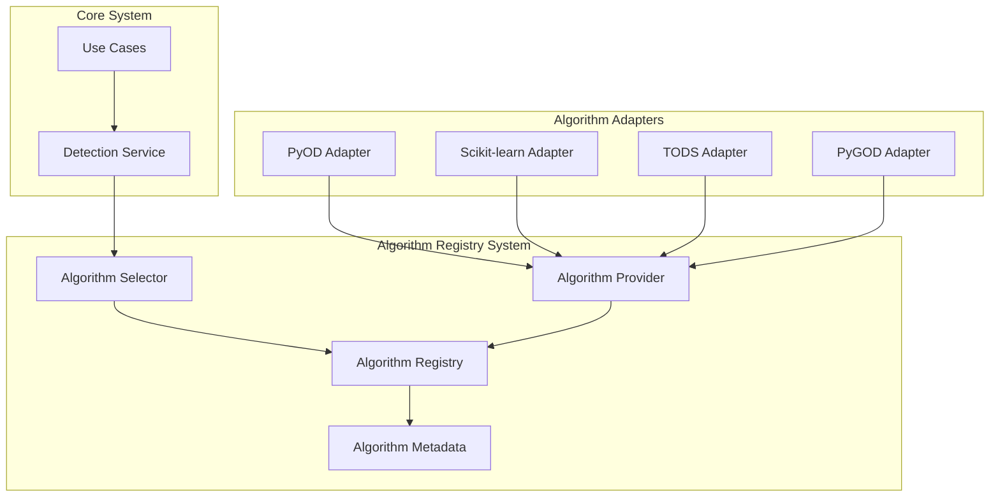
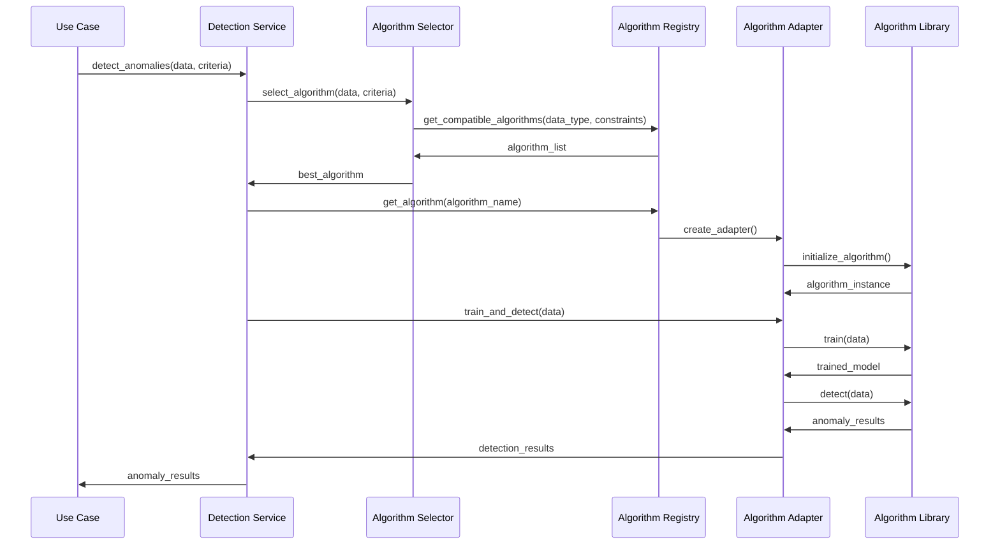

# ADR-003: Algorithm Selection and Registry Pattern

🍞 **Breadcrumb:** 🏠 [Home](../../../index.md) > 👨‍💻 [Developer Guides](../../README.md) > 🏗️ [Architecture](../README.md) > 📋 [ADR](README.md) > Algorithm Selection and Registry Pattern

## Status

PROPOSED

## Context

### Problem Statement
Pynomaly needs to support multiple anomaly detection algorithms from different libraries (PyOD, scikit-learn, TODS, PyGOD) while maintaining a consistent interface for algorithm selection, configuration, and execution. The current approach lacks standardization and makes it difficult to add new algorithms or compare their performance systematically.

### Goals
- Create a unified interface for all anomaly detection algorithms
- Enable dynamic algorithm selection based on data characteristics
- Support algorithm comparison and benchmarking
- Maintain loose coupling between algorithms and the core system
- Enable easy addition of new algorithms and algorithm providers

### Constraints
- Must support existing PyOD, scikit-learn, TODS, and PyGOD algorithms
- Performance overhead must be minimal
- Must work with both batch and streaming data
- Must support different parameter schemas across algorithms
- Memory usage must be optimized for large datasets

### Assumptions
- Algorithm implementations will have different parameter requirements
- New algorithms will be added regularly
- Performance characteristics vary significantly between algorithms
- Some algorithms may require GPU acceleration

## Decision

### Chosen Solution
Implement a **Registry Pattern** with **Strategy Pattern** for algorithm selection and execution. The solution includes:

1. **Algorithm Registry** - Central registry for all available algorithms
2. **Algorithm Adapters** - Uniform interface for different algorithm implementations
3. **Algorithm Metadata** - Standardized metadata for algorithm capabilities
4. **Dynamic Selection** - Runtime algorithm selection based on data characteristics
5. **Performance Tracking** - Built-in performance monitoring and comparison

### Rationale
The Registry Pattern provides a centralized, discoverable way to manage algorithms while the Strategy Pattern allows for runtime algorithm selection. This combination enables:
- Easy addition of new algorithms without modifying core code
- Consistent interface across all algorithm implementations
- Performance comparison and benchmarking capabilities
- Metadata-driven algorithm selection
- Separation of concerns between algorithm implementation and usage

## Architecture

### System Overview


### Component Interactions


## Options Considered

### Pros and Cons Matrix

| Option | Pros | Cons | Score |
|--------|------|------|-------|
| **Registry + Strategy** | ✅ Extensible<br/>✅ Discoverable<br/>✅ Testable<br/>✅ Metadata-driven | ❌ Initial complexity<br/>❌ Performance overhead | **9/10** |
| Factory Pattern Only | ✅ Simple<br/>✅ Fast | ❌ Not extensible<br/>❌ Hard to discover<br/>❌ Tight coupling | 6/10 |
| Plugin System | ✅ Very extensible<br/>✅ Runtime loading | ❌ Complex<br/>❌ Security concerns<br/>❌ Performance impact | 7/10 |
| Direct Implementation | ✅ Fastest<br/>✅ Simple | ❌ Not extensible<br/>❌ Maintenance burden<br/>❌ Code duplication | 4/10 |

### Rejected Alternatives
- **Factory Pattern Only**: Rejected due to limited extensibility and difficulty in algorithm discovery
- **Plugin System**: Too complex for current needs and introduces security and performance concerns
- **Direct Implementation**: Would create maintenance burden and code duplication

## Implementation

### Technical Approach

#### 1. Algorithm Registry
```python
class AlgorithmRegistry:
    _algorithms: Dict[str, AlgorithmMetadata] = {}

    @classmethod
    def register(cls, metadata: AlgorithmMetadata, adapter_class: Type[AlgorithmAdapter]):
        cls._algorithms[metadata.name] = {
            'metadata': metadata,
            'adapter_class': adapter_class
        }

    @classmethod
    def get_compatible_algorithms(cls, data_characteristics: DataCharacteristics) -> List[AlgorithmMetadata]:
        return [meta for meta in cls._algorithms.values()
                if meta['metadata'].is_compatible(data_characteristics)]
```

#### 2. Algorithm Adapter Interface
```python
class AlgorithmAdapter(Protocol):
    async def initialize(self, parameters: Dict[str, Any]) -> None:
        """Initialize the algorithm with given parameters"""

    async def train(self, data: Dataset) -> TrainingResult:
        """Train the algorithm on provided data"""

    async def detect(self, data: Any) -> DetectionResult:
        """Detect anomalies in the data"""

    def get_metadata(self) -> AlgorithmMetadata:
        """Get algorithm metadata"""
```

#### 3. Algorithm Selection Strategy
```python
class AlgorithmSelector:
    def __init__(self, registry: AlgorithmRegistry):
        self.registry = registry

    async def select_best_algorithm(
        self,
        data_characteristics: DataCharacteristics,
        constraints: SelectionConstraints
    ) -> str:
        compatible = self.registry.get_compatible_algorithms(data_characteristics)
        return self._rank_algorithms(compatible, constraints)[0].name
```

### Migration Strategy
1. **Phase 1**: Implement base registry and adapter interfaces
2. **Phase 2**: Create adapters for existing PyOD algorithms
3. **Phase 3**: Add scikit-learn algorithm adapters
4. **Phase 4**: Implement TODS and PyGOD adapters
5. **Phase 5**: Add algorithm selection logic
6. **Phase 6**: Integrate with existing detection services

### Testing Strategy
- **Unit Tests**: Test each adapter independently
- **Integration Tests**: Test registry and selection logic
- **Performance Tests**: Benchmark algorithm selection overhead
- **Contract Tests**: Verify adapter interface compliance
- **End-to-End Tests**: Test complete algorithm selection workflow

## Consequences

### Positive
- **Extensibility**: Easy to add new algorithms and algorithm providers
- **Consistency**: Unified interface across all algorithms
- **Discoverability**: Algorithms can be discovered and compared systematically
- **Performance**: Built-in performance tracking and comparison
- **Maintenance**: Easier to maintain and update individual algorithms
- **Testing**: Each algorithm can be tested independently

### Negative
- **Initial Complexity**: More complex initial implementation
- **Performance Overhead**: Small overhead from abstraction layer
- **Memory Usage**: Registry holds metadata for all algorithms
- **Learning Curve**: Developers need to understand registry pattern

### Neutral
- **Code Organization**: More structured but requires adherence to patterns
- **Configuration**: Standardized but requires metadata definition
- **Documentation**: More comprehensive but requires maintenance

## Compliance

### Security Impact
- **Algorithm Isolation**: Each algorithm runs in isolated adapter
- **Parameter Validation**: Centralized parameter validation
- **Access Control**: Registry can implement access controls
- **Audit Trail**: All algorithm usage can be logged

### Performance Impact
- **Selection Overhead**: ~1-5ms for algorithm selection
- **Memory Overhead**: ~10-50MB for registry metadata
- **Initialization**: One-time cost for adapter creation
- **Runtime**: Minimal impact on algorithm execution

### Monitoring Requirements
- **Algorithm Usage**: Track which algorithms are used most
- **Performance Metrics**: Monitor algorithm execution times
- **Error Rates**: Track algorithm failure rates
- **Selection Accuracy**: Monitor algorithm selection effectiveness

## Decision Log

| Date | Author | Action | Rationale |
|------|--------|--------|-----------|
| 2024-01-15 | Architecture Team | PROPOSED | Initial proposal for algorithm management |
| 2024-01-20 | Tech Lead | REVIEWED | Technical feasibility confirmed |
| 2024-01-25 | Architecture Council | UNDER_REVIEW | Pending final approval |

## References

- [Algorithm Comparison Document](../../reference/algorithms/algorithm-comparison.md)
- [PyOD Documentation](https://pyod.readthedocs.io/)
- [Scikit-learn Documentation](https://scikit-learn.org/)
- [Strategy Pattern](https://refactoring.guru/design-patterns/strategy)
- [Registry Pattern](https://martinfowler.com/eaaCatalog/registry.html)

---

## 🔗 **Related Documentation**

### **Architecture**
- **[Architecture Overview](../overview.md)** - System design principles
- **[Clean Architecture](../overview.md)** - Architectural patterns
- **[ADR Index](README.md)** - All architectural decisions

### **Implementation**
- **[Algorithm Reference](../../../reference/algorithms/README.md)** - Algorithm documentation
- **[Implementation Guide](../../contributing/IMPLEMENTATION_GUIDE.md)** - Coding standards
- **[Contributing Guidelines](../../contributing/CONTRIBUTING.md)** - Development process

### **User Guides**
- **[Algorithm Selection Guide](../../../reference/CLASSIFIER_SELECTION_GUIDE.md)** - Algorithm selection
- **[Advanced Features](../../../user-guides/advanced-features/performance-tuning.md)** - Performance tuning
- **[Examples](../../../examples/README.md)** - Usage examples

---

**Authors:** Architecture Team<br/>
**Last Updated:** 2024-01-25<br/>
**Next Review:** 2024-04-25
