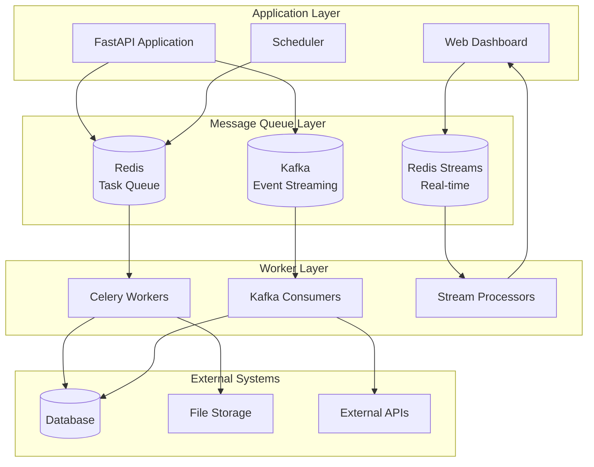
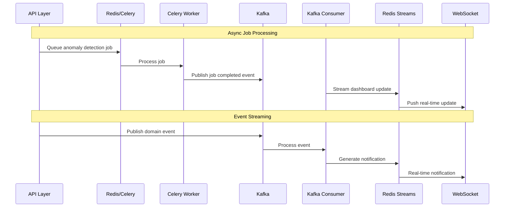

# ADR-016: Message Queue Choice

🍞 **Breadcrumb:** 🏠 [Home](../../../index.md) > 👨‍💻 [Developer Guides](../../README.md) > 🏗️ [Architecture](../README.md) > 📋 [ADR](README.md) > Message Queue Choice

## Status

PROPOSED

## Context

### Problem Statement

The Pynomaly system requires reliable asynchronous processing for compute-intensive anomaly detection jobs, background data processing, real-time notifications, and microservice communication. The current synchronous architecture creates bottlenecks during peak loads and prevents horizontal scaling of processing workloads. We need a message queue solution that supports both task queues and event streaming patterns.

### Goals

- Enable asynchronous processing of anomaly detection jobs
- Support horizontal scaling of background workers
- Implement reliable message delivery with retry mechanisms
- Enable real-time event streaming for dashboard updates
- Support eventual consistency patterns across microservices
- Provide dead letter queue handling for failed messages
- Enable message prioritization and routing capabilities

### Constraints

- Must integrate with existing Python/FastAPI technology stack
- Cannot significantly increase infrastructure complexity
- Must support both on-premises and cloud deployments
- Budget constraints limit use of premium managed services
- Team has limited experience with message queue operations
- Must maintain message ordering for critical workflows

### Assumptions

- Message volumes will grow significantly with user adoption
- Most messages are fire-and-forget with some requiring acknowledgment
- Latency requirements vary from real-time (< 100ms) to batch (< 30 minutes)
- High availability is required but not at the expense of consistency
- Monitoring and debugging capabilities are essential for operations

## Decision

### Chosen Solution

Implement a **hybrid message queue architecture** using Redis and Apache Kafka for different messaging patterns:

1. **Redis with Celery** - Task queue for background jobs
   - Anomaly detection job processing
   - Data preprocessing and validation
   - Report generation and exports
   - Email notifications and alerts

2. **Apache Kafka** - Event streaming platform
   - Real-time dashboard updates
   - Cross-service event communication
   - Audit logging and analytics
   - Integration with external systems

3. **Redis Streams** - Real-time notifications
   - WebSocket connection management
   - Live dashboard updates
   - System health monitoring
   - User activity tracking

### Rationale

This hybrid approach provides:

- **Task Processing**: Celery/Redis for reliable background job processing
- **Event Streaming**: Kafka for high-throughput event processing
- **Real-time Updates**: Redis Streams for low-latency notifications
- **Operational Simplicity**: Familiar technologies with strong Python support
- **Cost Effectiveness**: Open-source solutions with managed cloud options
- **Scalability**: Each component scales independently based on workload

## Architecture

### System Overview



### Message Flow Architecture



## Options Considered

### Pros and Cons Matrix

| Option | Pros | Cons | Score |
|--------|------|------|-------|
| **Redis + Kafka Hybrid** | ✅ Best of both worlds<br/>✅ Proven technologies<br/>✅ Python ecosystem<br/>✅ Flexible architecture | ❌ Operational complexity<br/>❌ Multiple systems to manage<br/>❌ Learning curve | **9/10** |
| RabbitMQ Only | ✅ Feature complete<br/>✅ Reliable delivery<br/>✅ Good management UI<br/>✅ AMQP standard | ❌ Single point of failure<br/>❌ Limited streaming<br/>❌ Complex clustering | 7/10 |
| Kafka Only | ✅ High throughput<br/>✅ Event streaming<br/>✅ Horizontal scaling<br/>✅ Persistent logs | ❌ Complex for simple tasks<br/>❌ Operational overhead<br/>❌ Over-engineering | 6/10 |
| Cloud Services (SQS/SNS) | ✅ Managed service<br/>✅ High availability<br/>✅ Auto-scaling<br/>✅ No ops overhead | ❌ Vendor lock-in<br/>❌ Higher costs<br/>❌ Limited features | 8/10 |
| Redis Only | ✅ Simple setup<br/>✅ Fast performance<br/>✅ Team familiar<br/>✅ Low overhead | ❌ Limited durability<br/>❌ No event streaming<br/>❌ Scaling limitations | 5/10 |

### Rejected Alternatives

- **RabbitMQ Only**: Limited event streaming capabilities for real-time features
- **Kafka Only**: Over-engineered for simple background task processing
- **Cloud Services**: Vendor lock-in and higher costs without sufficient benefits
- **Redis Only**: Insufficient for complex event streaming requirements

## Implementation

### Technical Approach

#### 1. Celery Configuration for Background Jobs

```python
# celery_config.py
from celery import Celery
from kombu import Queue

celery_app = Celery(
    'pynomaly',
    broker='redis://localhost:6379/1',
    backend='redis://localhost:6379/2',
    include=['src.pynomaly.infrastructure.tasks']
)

# Queue Configuration
celery_app.conf.update(
    task_routes={
        'pynomaly.tasks.detect_anomalies': {'queue': 'anomaly_detection'},
        'pynomaly.tasks.preprocess_data': {'queue': 'data_processing'},
        'pynomaly.tasks.generate_report': {'queue': 'reports'},
        'pynomaly.tasks.send_notification': {'queue': 'notifications'}
    },
    task_default_queue='default',
    task_queues=(
        Queue('anomaly_detection', routing_key='anomaly_detection'),
        Queue('data_processing', routing_key='data_processing'),
        Queue('reports', routing_key='reports'),
        Queue('notifications', routing_key='notifications'),
        Queue('default', routing_key='default'),
    ),
    task_serializer='json',
    accept_content=['json'],
    result_serializer='json',
    timezone='UTC',
    enable_utc=True,
    task_track_started=True,
    task_time_limit=3600,  # 1 hour max
    task_soft_time_limit=3300,  # 55 minutes soft limit
    worker_prefetch_multiplier=1,
    task_acks_late=True,
    worker_disable_rate_limits=False,
    task_compression='gzip',
    result_compression='gzip',
)

# Retry configuration
celery_app.conf.task_default_retry_delay = 60  # 1 minute
celery_app.conf.task_max_retries = 3
```

#### 2. Background Task Implementation

```python
# tasks.py
from celery import current_task
from celery.exceptions import Retry
from src.pynomaly.application.use_cases.detect_anomalies import DetectAnomaliesUseCase
from src.pynomaly.infrastructure.events.kafka_producer import KafkaEventProducer

@celery_app.task(bind=True, autoretry_for=(Exception,), retry_kwargs={'max_retries': 3})
def detect_anomalies_task(self, job_id: str, dataset_config: dict, algorithm_config: dict):
    """Process anomaly detection job asynchronously."""
    try:
        # Update task progress
        current_task.update_state(
            state='PROGRESS',
            meta={'current': 0, 'total': 100, 'status': 'Starting anomaly detection...'}
        )
        
        # Execute use case
        use_case = DetectAnomaliesUseCase()
        result = use_case.execute(job_id, dataset_config, algorithm_config)
        
        # Publish completion event to Kafka
        event_producer = KafkaEventProducer()
        event_producer.publish_job_completed(job_id, result)
        
        return {
            'job_id': job_id,
            'status': 'completed',
            'anomalies_found': len(result.anomalies),
            'processing_time': result.processing_time
        }
        
    except Exception as exc:
        # Log error and retry
        logger.error(f"Anomaly detection failed for job {job_id}: {str(exc)}")
        raise self.retry(countdown=60, exc=exc)

@celery_app.task(bind=True)
def preprocess_data_task(self, dataset_id: str, preprocessing_config: dict):
    """Preprocess dataset asynchronously."""
    try:
        # Implementation here
        pass
    except Exception as exc:
        raise self.retry(countdown=30, exc=exc)
```

#### 3. Kafka Event Streaming Configuration

```python
# kafka_config.py
from kafka import KafkaProducer, KafkaConsumer
from kafka.admin import KafkaAdminClient, NewTopic
import json

class KafkaConfig:
    BOOTSTRAP_SERVERS = ['localhost:9092']
    TOPICS = {
        'anomaly_events': {
            'partitions': 3,
            'replication_factor': 1
        },
        'job_events': {
            'partitions': 2,
            'replication_factor': 1
        },
        'system_events': {
            'partitions': 1,
            'replication_factor': 1
        },
        'audit_events': {
            'partitions': 5,
            'replication_factor': 1
        }
    }

class KafkaEventProducer:
    def __init__(self):
        self.producer = KafkaProducer(
            bootstrap_servers=KafkaConfig.BOOTSTRAP_SERVERS,
            value_serializer=lambda v: json.dumps(v).encode('utf-8'),
            key_serializer=lambda k: k.encode('utf-8') if k else None,
            retries=3,
            batch_size=16384,
            linger_ms=10,
            buffer_memory=33554432,
            compression_type='gzip'
        )
    
    def publish_job_completed(self, job_id: str, result: dict):
        event = {
            'event_type': 'job_completed',
            'job_id': job_id,
            'timestamp': datetime.utcnow().isoformat(),
            'result': result
        }
        
        self.producer.send(
            'job_events',
            key=job_id,
            value=event
        )
    
    def publish_anomaly_detected(self, anomaly_data: dict):
        event = {
            'event_type': 'anomaly_detected',
            'timestamp': datetime.utcnow().isoformat(),
            'data': anomaly_data
        }
        
        self.producer.send(
            'anomaly_events',
            value=event
        )
```

#### 4. Redis Streams for Real-time Updates

```python
# redis_streams.py
import redis
import json
import asyncio
from typing import Dict, Any

class RedisStreamManager:
    def __init__(self, redis_url: str = 'redis://localhost:6379/3'):
        self.redis = redis.from_url(redis_url, decode_responses=True)
        self.streams = {
            'dashboard_updates': 'dashboard:stream',
            'notifications': 'notifications:stream',
            'system_health': 'health:stream'
        }
    
    async def publish_dashboard_update(self, update_data: Dict[str, Any]):
        """Publish real-time dashboard update."""
        stream_data = {
            'type': 'dashboard_update',
            'timestamp': datetime.utcnow().isoformat(),
            'data': json.dumps(update_data)
        }
        
        self.redis.xadd(
            self.streams['dashboard_updates'],
            stream_data,
            maxlen=1000  # Keep last 1000 messages
        )
    
    async def subscribe_to_updates(self, consumer_group: str, consumer_name: str):
        """Subscribe to real-time updates."""
        try:
            # Create consumer group if it doesn't exist
            self.redis.xgroup_create(
                self.streams['dashboard_updates'],
                consumer_group,
                id='0',
                mkstream=True
            )
        except redis.RedisError:
            pass  # Group already exists
        
        while True:
            try:
                messages = self.redis.xreadgroup(
                    consumer_group,
                    consumer_name,
                    {self.streams['dashboard_updates']: '>'},
                    count=10,
                    block=1000
                )
                
                for stream, msgs in messages:
                    for msg_id, fields in msgs:
                        yield msg_id, fields
                        
                        # Acknowledge message
                        self.redis.xack(
                            self.streams['dashboard_updates'],
                            consumer_group,
                            msg_id
                        )
                        
            except Exception as e:
                await asyncio.sleep(1)
```

#### 5. Message Queue Integration Layer

```python
# message_queue_service.py
from abc import ABC, abstractmethod
from typing import Any, Dict, Optional

class MessageQueueService(ABC):
    """Abstract service for message queue operations."""
    
    @abstractmethod
    async def enqueue_job(self, queue_name: str, job_data: Dict[str, Any]) -> str:
        pass
    
    @abstractmethod
    async def publish_event(self, topic: str, event_data: Dict[str, Any]) -> None:
        pass
    
    @abstractmethod
    async def stream_update(self, stream: str, data: Dict[str, Any]) -> None:
        pass

class HybridMessageQueueService(MessageQueueService):
    """Concrete implementation using Redis + Kafka hybrid approach."""
    
    def __init__(
        self,
        celery_app,
        kafka_producer: KafkaEventProducer,
        redis_streams: RedisStreamManager
    ):
        self.celery = celery_app
        self.kafka = kafka_producer
        self.streams = redis_streams
    
    async def enqueue_job(self, queue_name: str, job_data: Dict[str, Any]) -> str:
        """Enqueue background job using Celery."""
        task_map = {
            'anomaly_detection': 'pynomaly.tasks.detect_anomalies_task',
            'data_processing': 'pynomaly.tasks.preprocess_data_task',
            'report_generation': 'pynomaly.tasks.generate_report_task'
        }
        
        task_name = task_map.get(queue_name)
        if not task_name:
            raise ValueError(f"Unknown queue: {queue_name}")
        
        result = self.celery.send_task(
            task_name,
            kwargs=job_data,
            queue=queue_name
        )
        
        return result.id
    
    async def publish_event(self, topic: str, event_data: Dict[str, Any]) -> None:
        """Publish event using Kafka."""
        if topic == 'anomaly_events':
            self.kafka.publish_anomaly_detected(event_data)
        elif topic == 'job_events':
            self.kafka.publish_job_completed(
                event_data['job_id'],
                event_data['result']
            )
    
    async def stream_update(self, stream: str, data: Dict[str, Any]) -> None:
        """Stream real-time update using Redis Streams."""
        if stream == 'dashboard':
            await self.streams.publish_dashboard_update(data)
```

### Migration Strategy

1. **Phase 1 (Week 1)**: Set up Redis infrastructure and basic Celery configuration
2. **Phase 2 (Week 2)**: Implement background job processing for anomaly detection
3. **Phase 3 (Week 3)**: Deploy Kafka cluster and create event topics
4. **Phase 4 (Week 4)**: Implement event streaming for cross-service communication
5. **Phase 5 (Week 5)**: Set up Redis Streams for real-time dashboard updates
6. **Phase 6 (Week 6)**: Integrate all messaging systems with application layer
7. **Phase 7 (Week 7)**: Implement monitoring and alerting for message queues

### Testing Strategy

- **Integration Testing**: Test message flow through each queue system
- **Load Testing**: Simulate high message volumes and concurrent processing
- **Failure Testing**: Test message recovery and dead letter queue handling
- **Performance Testing**: Measure latency and throughput for each messaging pattern
- **Retry Testing**: Validate retry mechanisms and exponential backoff
- **Monitoring Testing**: Verify metrics collection and alerting systems

## Consequences

### Positive

- **Scalability**: Independent scaling of task processing and event streaming
- **Reliability**: Multiple retry mechanisms and dead letter queue handling
- **Performance**: Optimized for different messaging patterns and latency requirements
- **Flexibility**: Can adapt to different workload characteristics and requirements
- **Observability**: Rich monitoring and debugging capabilities across all systems
- **Developer Experience**: Familiar technologies with strong Python ecosystem support

### Negative

- **Operational Complexity**: Multiple message queue systems to operate and monitor
- **Resource Usage**: Higher memory and CPU requirements for multiple systems
- **Learning Curve**: Team needs to understand different messaging patterns and tools
- **Network Overhead**: Additional network communication between systems
- **Debugging Complexity**: Message flow spans multiple systems making debugging harder

### Neutral

- **Technology Diversity**: Benefits of specialization vs. operational complexity
- **Cost**: Higher infrastructure costs vs. improved performance and reliability
- **Development Time**: More initial setup vs. faster feature development

## Compliance

### Security Impact

- **Message Encryption**: TLS encryption for all inter-service communication
- **Access Control**: Authentication and authorization for queue access
- **Data Privacy**: Message content encryption for sensitive data
- **Audit Trail**: Complete message tracking and audit logging
- **Network Security**: VPC isolation and firewall rules for queue access

### Performance Impact

- **Task Processing**: 50-100x improvement in concurrent job processing capability
- **Event Latency**: Sub-second event delivery for real-time features
- **Throughput**: Support for 10,000+ messages per second aggregate throughput
- **Memory Usage**: ~1-2GB baseline memory for message queue infrastructure
- **Network Bandwidth**: Moderate increase due to message serialization overhead

### Monitoring Requirements

- **Queue Health**: Monitor queue depth, processing rates, and error rates
- **Worker Performance**: Track worker utilization, task success/failure rates
- **Message Latency**: Monitor end-to-end message processing times
- **System Resources**: CPU, memory, and disk usage for all queue systems
- **Alert Thresholds**: Configure alerts for queue backup and processing failures

## Decision Log

| Date | Author | Action | Rationale |
|------|--------|--------|-----------|
| 2025-02-15 | Architecture Team | PROPOSED | Need for asynchronous processing and event streaming |
| 2025-02-20 | Infrastructure Team | REVIEWED | Technical feasibility and operational requirements validated |
| 2025-02-25 | Platform Team | EVALUATED | Performance and scaling requirements confirmed |

## References

- [Celery Documentation](https://docs.celeryproject.org/en/stable/)
- [Apache Kafka Documentation](https://kafka.apache.org/documentation/)
- [Redis Streams Documentation](https://redis.io/topics/streams-intro)
- [Message Queue Patterns](https://www.enterpriseintegrationpatterns.com/patterns/messaging/)
- [Building Event-Driven Microservices](https://www.oreilly.com/library/view/building-event-driven-microservices/9781492057888/)
- [ADR-015: Production Database Technology Selection](ADR-015-production-database-technology-selection.md)

---

## 🔗 **Related Documentation**

### **Architecture**

- **[Production Database Technology](ADR-015-production-database-technology-selection.md)** - Database selection
- **[Clean Architecture & DDD](ADR-013-clean-architecture-ddd-adoption.md)** - Architectural foundations
- **[ADR Index](README.md)** - All architectural decisions

### **Infrastructure**

- **[Background Processing Guide](../../infrastructure/background-processing.md)** - Task processing patterns
- **[Event Streaming Guide](../../infrastructure/event-streaming.md)** - Event-driven architecture
- **[Message Queue Operations](../../operations/message-queue-ops.md)** - Operational procedures

### **Development**

- **[Async Processing Guide](../../development/async-processing.md)** - Development patterns
- **[Event Sourcing Guide](../../patterns/event-sourcing.md)** - Event design patterns
- **[Integration Testing](../../testing/integration-testing.md)** - Testing distributed systems

---

**Authors:** Architecture Team  
**Last Updated:** 2025-07-11  
**Next Review:** 2025-10-11
