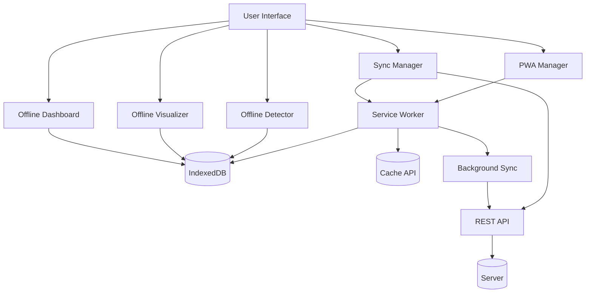

# Progressive Web App Architecture

🍞 **Breadcrumb:** 🏠 [Home](../../index.md) > 👨‍💻 [Developer Guides](../README.md) > 🏗️ [Architecture](README.md) > 📄 Pwa Architecture

---


Comprehensive architectural overview of Pynomaly's Progressive Web App implementation, including offline capabilities, synchronization strategies, and advanced visualization components.

## 📋 Table of Contents

- [Overview](#overview)
- [Core Architecture](#core-architecture)
- [Service Worker Design](#service-worker-design)
- [Offline Data Management](#offline-data-management)
- [Synchronization Strategy](#synchronization-strategy)
- [Visualization Architecture](#visualization-architecture)
- [Performance Optimization](#performance-optimization)
- [Security Considerations](#security-considerations)
- [Development Guidelines](#development-guidelines)

---

## 🎯 Overview

Pynomaly's Progressive Web App provides a native app-like experience with full offline capabilities, advanced data synchronization, and enterprise-grade visualization components. The architecture follows modern PWA patterns while maintaining integration with the main anomaly detection platform.

### Key Features

- **Offline-First Design** - Full functionality without internet connectivity
- **Background Synchronization** - Intelligent data sync with conflict resolution
- **Native App Experience** - Installable with platform integration
- **Advanced Visualization** - Interactive charts with D3.js and ECharts
- **Real-time Analytics** - Live dashboard with cached data
- **Enterprise Security** - Encrypted storage and secure sync

### Technology Stack

```
Frontend Layer:
├── HTMX - Dynamic behavior without JavaScript complexity
├── Tailwind CSS - Utility-first styling
├── Alpine.js - Reactive components
└── Vanilla JavaScript - PWA core functionality

Visualization Layer:
├── D3.js - Custom interactive visualizations
├── Apache ECharts - Statistical charts and dashboards
└── Canvas API - High-performance rendering

Offline Layer:
├── Service Worker - Background processing and caching
├── IndexedDB - Client-side database
├── Cache API - Resource caching
└── Background Sync - Queue management

Integration Layer:
├── REST API - Server communication
├── WebSocket - Real-time updates
└── Push API - Notifications
```

---

## 🏗️ Core Architecture

### Component Hierarchy

```
PWA Application
├── PWA Manager (Core Controller)
│   ├── Installation Management
│   ├── Update Handling
│   └── Status Monitoring
├── Service Worker (Background Layer)
│   ├── Caching Strategies
│   ├── Background Sync
│   ├── Push Notifications
│   └── IndexedDB Operations
├── Sync Manager (Data Synchronization)
│   ├── Queue Management
│   ├── Conflict Resolution
│   └── Strategy Configuration
├── Offline Components (Client-side Logic)
│   ├── Offline Detector
│   ├── Offline Visualizer
│   └── Offline Dashboard
└── UI Layer (Presentation)
    ├── Dashboard Components
    ├── Visualization Components
    └── Control Interfaces
```

### Data Flow Architecture



### Component Responsibilities

#### **PWA Manager**
- Application lifecycle management
- Installation and update coordination
- Cross-component communication
- Status monitoring and reporting

#### **Service Worker**
- Network request interception
- Caching strategy implementation
- Background synchronization
- Push notification handling
- IndexedDB operations

#### **Sync Manager**
- Data synchronization orchestration
- Conflict detection and resolution
- Queue management and prioritization
- Strategy-based sync execution

#### **Offline Components**
- Client-side anomaly detection
- Data visualization without server
- Dashboard functionality with cached data
- Real-time analytics with local data

---

## ⚙️ Service Worker Design

### Caching Strategies

#### **Static Assets - Cache First**
```javascript
// High-priority static resources
const STATIC_ASSETS = [
  '/',
  '/static/css/design-system.css',
  '/static/js/app.js',
  '/static/icons/icon-512x512.png'
];

// Cache first with network fallback
async function cacheFirstStrategy(request, cacheName) {
  const cache = await caches.open(cacheName);
  const cachedResponse = await cache.match(request);

  if (cachedResponse) {
    return cachedResponse;
  }

  const networkResponse = await fetch(request);
  if (networkResponse.status === 200) {
    cache.put(request, networkResponse.clone());
  }

  return networkResponse;
}
```

#### **API Endpoints - Network First**
```javascript
// Critical API endpoints
const NETWORK_FIRST_APIS = [
  '/api/detection',
  '/api/analysis',
  '/api/train'
];

// Network first with cache fallback
async function networkFirstStrategy(request, cacheName) {
  try {
    const networkResponse = await fetch(request);
    if (networkResponse.status === 200) {
      const cache = await caches.open(cacheName);
      cache.put(request, networkResponse.clone());
    }
    return networkResponse;
  } catch (error) {
    const cache = await caches.open(cacheName);
    return await cache.match(request);
  }
}
```

#### **Dynamic Content - Stale While Revalidate**
```javascript
// Dashboard and configuration data
async function staleWhileRevalidateStrategy(request, cacheName) {
  const cache = await caches.open(cacheName);
  const cachedResponse = await cache.match(request);

  // Background update
  const fetchPromise = fetch(request).then((networkResponse) => {
    if (networkResponse.status === 200) {
      cache.put(request, networkResponse.clone());
    }
    return networkResponse;
  });

  return cachedResponse || fetchPromise;
}
```

### Background Sync Implementation

#### **Sync Queue Management**
```javascript
// Sync queue processing
async function processDetectionQueue() {
  const db = await openIndexedDB();
  const requests = await getQueuedRequests(SYNC_TAGS.DETECTION_QUEUE);

  for (const queuedRequest of requests) {
    try {
      const response = await fetch(queuedRequest.url, {
        method: queuedRequest.method,
        headers: queuedRequest.headers,
        body: queuedRequest.body
      });

      if (response.ok) {
        await removeFromSyncQueue(queuedRequest.id);
        await saveDetectionResult(await response.json());
        notifyClients('DETECTION_COMPLETE', {
          requestId: queuedRequest.id,
          result: await response.json()
        });
      }
    } catch (error) {
      console.error('Sync failed:', error);
      await updateRetryCount(queuedRequest.id);
    }
  }
}
```

#### **Message Handling**
```javascript
// Enhanced message handling for PWA components
self.addEventListener('message', (event) => {
  const { type, payload } = event.data;

  switch (type) {
    case 'GET_OFFLINE_DASHBOARD_DATA':
      event.waitUntil(getOfflineDashboardData().then(data => {
        notifyClients('OFFLINE_DASHBOARD_DATA', { data });
      }));
      break;
    case 'QUEUE_REQUEST':
      event.waitUntil(queueRequest(payload.request, payload.tag));
      break;
    case 'SYNC_ALL_QUEUES':
      event.waitUntil(triggerBackgroundSyncAll());
      break;
  }
});
```

---

## 💾 Offline Data Management

### IndexedDB Schema

#### **Database Structure**
```javascript
const DB_SCHEMA = {
  name: 'PynomaolyOfflineDB',
  version: 1,
  stores: {
    datasets: {
      keyPath: 'id',
      autoIncrement: true,
      indexes: {
        name: 'name',
        type: 'type',
        timestamp: 'timestamp'
      }
    },
    results: {
      keyPath: 'id',
      autoIncrement: true,
      indexes: {
        datasetId: 'datasetId',
        algorithmId: 'algorithmId',
        timestamp: 'timestamp',
        status: 'status'
      }
    },
    syncQueue: {
      keyPath: 'id',
      autoIncrement: true,
      indexes: {
        tag: 'tag',
        status: 'status',
        priority: 'priority',
        timestamp: 'timestamp'
      }
    },
    userPreferences: {
      keyPath: 'id',
      autoIncrement: false
    }
  }
};
```

#### **Data Models**

##### **Dataset Model**
```javascript
interface OfflineDataset {
  id: string;
  name: string;
  type: 'tabular' | 'time_series' | 'graph' | 'text' | 'image';
  data: any[];
  metadata: {
    columns: string[];
    rowCount: number;
    dataTypes: Record<string, string>;
    size: number;
    checksum: string;
  };
  timestamp: number;
  version: string;
  synced: boolean;
  lastModified: number;
}
```

##### **Result Model**
```javascript
interface OfflineResult {
  id: string;
  datasetId: string;
  algorithmId: string;
  parameters: Record<string, any>;
  result: {
    anomalies: AnomalyPoint[];
    scores: number[];
    statistics: DetectionStatistics;
    processingTimeMs: number;
  };
  timestamp: number;
  status: 'completed' | 'failed' | 'pending';
  isOffline: boolean;
  synced: boolean;
}
```

### Storage Optimization

#### **Data Compression**
```javascript
// Compress large datasets for storage efficiency
async function compressData(data) {
  const jsonString = JSON.stringify(data);
  const encoder = new TextEncoder();
  const stream = new CompressionStream('gzip');
  const writer = stream.writable.getWriter();
  const reader = stream.readable.getReader();

  writer.write(encoder.encode(jsonString));
  writer.close();

  const chunks = [];
  let done = false;

  while (!done) {
    const { value, done: readerDone } = await reader.read();
    done = readerDone;
    if (value) chunks.push(value);
  }

  return new Uint8Array(chunks.reduce((acc, chunk) => [...acc, ...chunk], []));
}
```

#### **Cache Lifecycle Management**
```javascript
// Intelligent cache cleanup
async function cleanupStorage() {
  const usage = await navigator.storage.estimate();
  const usageRatio = usage.usage / usage.quota;

  if (usageRatio > 0.8) {
    // Remove old completed results
    await removeOldResults(30); // 30 days

    // Compress large datasets
    await compressLargeDatasets();

    // Remove unused cached assets
    await cleanupUnusedCaches();
  }
}
```

---

## 🔄 Synchronization Strategy

### Conflict Resolution Framework

#### **Conflict Detection**
```javascript
async function detectConflicts(localItem, serverItem) {
  const conflicts = [];

  // Version-based conflict
  if (localItem.version !== serverItem.version) {
    conflicts.push({
      type: 'version_mismatch',
      field: 'version',
      localValue: localItem.version,
      serverValue: serverItem.version
    });
  }

  // Timestamp-based conflict
  if (localItem.lastModified > serverItem.lastModified) {
    conflicts.push({
      type: 'timestamp_conflict',
      field: 'lastModified',
      localValue: localItem.lastModified,
      serverValue: serverItem.lastModified
    });
  }

  // Data integrity conflict
  if (localItem.checksum !== serverItem.checksum) {
    conflicts.push({
      type: 'data_integrity',
      field: 'data',
      message: 'Data checksums do not match'
    });
  }

  return conflicts;
}
```

#### **Resolution Strategies**
```javascript
const RESOLUTION_STRATEGIES = {
  SERVER_WINS: 'server_wins',
  CLIENT_WINS: 'client_wins',
  MERGE: 'merge',
  MANUAL: 'manual'
};

async function resolveConflict(conflict, strategy, customResolution = null) {
  switch (strategy) {
    case RESOLUTION_STRATEGIES.SERVER_WINS:
      return await fetchServerVersion(conflict.entityId);

    case RESOLUTION_STRATEGIES.CLIENT_WINS:
      return await forceSyncLocalVersion(conflict);

    case RESOLUTION_STRATEGIES.MERGE:
      return await mergeVersions(conflict, customResolution);

    case RESOLUTION_STRATEGIES.MANUAL:
      return await presentManualResolution(conflict);
  }
}
```

### Sync Priority Management

#### **Priority Queue System**
```javascript
class SyncPriorityQueue {
  constructor() {
    this.queues = {
      high: [],
      normal: [],
      low: []
    };
  }

  enqueue(item, priority = 'normal') {
    this.queues[priority].push(item);
    this.sort(priority);
  }

  dequeue() {
    // Process high priority first
    for (const priority of ['high', 'normal', 'low']) {
      if (this.queues[priority].length > 0) {
        return this.queues[priority].shift();
      }
    }
    return null;
  }

  sort(priority) {
    this.queues[priority].sort((a, b) => a.timestamp - b.timestamp);
  }
}
```

#### **Sync Scheduling**
```javascript
class SyncScheduler {
  constructor() {
    this.strategy = 'smart';
    this.intervals = {
      immediate: 30000,  // 30 seconds
      smart: 300000,     // 5 minutes
      manual: null       // No automatic sync
    };
  }

  start() {
    if (this.strategy === 'manual') return;

    const interval = this.intervals[this.strategy];
    setInterval(() => {
      if (navigator.onLine && this.hasPendingItems()) {
        this.processSyncQueue();
      }
    }, interval);
  }

  async processSyncQueue() {
    const queue = new SyncPriorityQueue();
    await queue.loadFromStorage();

    while (queue.hasItems()) {
      const item = queue.dequeue();
      await this.syncItem(item);
    }
  }
}
```

---

## 📊 Visualization Architecture

### Component-Based Design

#### **Base Visualization Component**
```javascript
class BaseVisualization {
  constructor(containerId, options = {}) {
    this.container = document.getElementById(containerId);
    this.options = { ...this.defaultOptions, ...options };
    this.chart = null;
    this.data = null;
  }

  get defaultOptions() {
    return {
      theme: 'light',
      responsive: true,
      animation: true,
      exportable: true
    };
  }

  async render(data) {
    this.data = data;
    await this.preprocess();
    this.createChart();
    this.bindEvents();
  }

  async preprocess() {
    // Data preprocessing logic
  }

  createChart() {
    // Chart creation logic
  }

  bindEvents() {
    // Event binding logic
  }

  export(format = 'png') {
    // Export functionality
  }
}
```

#### **Anomaly Scatter Plot**
```javascript
class AnomalyScatterPlot extends BaseVisualization {
  createChart() {
    const option = {
      title: { text: 'Anomaly Detection Results' },
      tooltip: {
        trigger: 'item',
        formatter: (params) => {
          const point = this.data[params.dataIndex];
          return `
            <div>Index: ${point.index}</div>
            <div>Score: ${point.score.toFixed(3)}</div>
            <div>Type: ${point.isAnomaly ? 'Anomaly' : 'Normal'}</div>
          `;
        }
      },
      xAxis: { name: 'Feature 1' },
      yAxis: { name: 'Feature 2' },
      series: [{
        type: 'scatter',
        data: this.preprocessScatterData(),
        itemStyle: {
          color: (params) => params.data.isAnomaly ? '#ef4444' : '#10b981'
        }
      }]
    };

    this.chart = echarts.init(this.container);
    this.chart.setOption(option);
  }

  preprocessScatterData() {
    return this.data.map(point => ({
      value: [point.features[0], point.features[1]],
      isAnomaly: point.isAnomaly,
      index: point.index,
      score: point.score
    }));
  }
}
```

### Performance Optimization

#### **Data Sampling**
```javascript
class DataSampler {
  static sample(data, maxPoints = 5000) {
    if (data.length <= maxPoints) return data;

    const step = Math.ceil(data.length / maxPoints);
    const sampled = [];

    for (let i = 0; i < data.length; i += step) {
      sampled.push(data[i]);
    }

    return sampled;
  }

  static stratifiedSample(data, maxPoints = 5000, stratifyBy = 'isAnomaly') {
    const groups = this.groupBy(data, stratifyBy);
    const sampledGroups = {};

    const totalGroups = Object.keys(groups).length;
    const pointsPerGroup = Math.floor(maxPoints / totalGroups);

    for (const [key, group] of Object.entries(groups)) {
      sampledGroups[key] = this.sample(group, pointsPerGroup);
    }

    return Object.values(sampledGroups).flat();
  }

  static groupBy(data, key) {
    return data.reduce((groups, item) => {
      const group = item[key];
      groups[group] = groups[group] || [];
      groups[group].push(item);
      return groups;
    }, {});
  }
}
```

#### **Virtualization for Large Datasets**
```javascript
class VirtualizedTable {
  constructor(containerId, options = {}) {
    this.container = document.getElementById(containerId);
    this.rowHeight = options.rowHeight || 40;
    this.visibleRows = Math.ceil(this.container.clientHeight / this.rowHeight);
    this.scrollTop = 0;
    this.data = [];
  }

  setData(data) {
    this.data = data;
    this.render();
  }

  render() {
    const startIndex = Math.floor(this.scrollTop / this.rowHeight);
    const endIndex = Math.min(startIndex + this.visibleRows, this.data.length);

    const visibleData = this.data.slice(startIndex, endIndex);
    const totalHeight = this.data.length * this.rowHeight;

    this.container.innerHTML = `
      <div style="height: ${totalHeight}px; position: relative;">
        <div style="transform: translateY(${startIndex * this.rowHeight}px);">
          ${visibleData.map(row => this.renderRow(row)).join('')}
        </div>
      </div>
    `;

    this.bindScrollEvents();
  }

  renderRow(rowData) {
    return `
      <div class="table-row" style="height: ${this.rowHeight}px;">
        ${Object.values(rowData).map(cell => `<span>${cell}</span>`).join('')}
      </div>
    `;
  }

  bindScrollEvents() {
    this.container.addEventListener('scroll', (e) => {
      this.scrollTop = e.target.scrollTop;
      this.render();
    });
  }
}
```

---

## ⚡ Performance Optimization

### Memory Management

#### **Component Lifecycle**
```javascript
class ComponentManager {
  constructor() {
    this.activeComponents = new Map();
    this.componentPool = new Map();
  }

  createComponent(type, id, options) {
    // Check if component can be reused from pool
    const pooled = this.componentPool.get(type)?.pop();

    if (pooled) {
      pooled.reset(options);
      this.activeComponents.set(id, pooled);
      return pooled;
    }

    // Create new component
    const component = new ComponentTypes[type](options);
    this.activeComponents.set(id, component);
    return component;
  }

  destroyComponent(id) {
    const component = this.activeComponents.get(id);
    if (component) {
      component.cleanup();

      // Return to pool for reuse
      const type = component.constructor.name;
      if (!this.componentPool.has(type)) {
        this.componentPool.set(type, []);
      }
      this.componentPool.get(type).push(component);

      this.activeComponents.delete(id);
    }
  }

  cleanup() {
    // Clean up all components on page unload
    for (const component of this.activeComponents.values()) {
      component.cleanup();
    }
    this.activeComponents.clear();
    this.componentPool.clear();
  }
}
```

#### **Memory Monitoring**
```javascript
class MemoryMonitor {
  constructor() {
    this.thresholds = {
      warning: 0.75,  // 75% of heap limit
      critical: 0.9   // 90% of heap limit
    };
  }

  checkMemoryUsage() {
    if (!performance.memory) return null;

    const used = performance.memory.usedJSHeapSize;
    const limit = performance.memory.jsHeapSizeLimit;
    const ratio = used / limit;

    if (ratio > this.thresholds.critical) {
      this.handleCriticalMemory();
    } else if (ratio > this.thresholds.warning) {
      this.handleWarningMemory();
    }

    return { used, limit, ratio };
  }

  handleWarningMemory() {
    // Trigger garbage collection hints
    this.requestIdleGarbageCollection();

    // Clean up old visualization instances
    this.cleanupOldVisualizations();
  }

  handleCriticalMemory() {
    // Aggressive cleanup
    this.clearNonEssentialCaches();
    this.destroyInactiveComponents();

    // Notify user
    this.showMemoryWarning();
  }
}
```

### Network Optimization

#### **Request Batching**
```javascript
class RequestBatcher {
  constructor(options = {}) {
    this.batchSize = options.batchSize || 10;
    this.flushInterval = options.flushInterval || 1000;
    this.pending = [];
    this.timer = null;
  }

  add(request) {
    this.pending.push(request);

    if (this.pending.length >= this.batchSize) {
      this.flush();
    } else {
      this.scheduleFlush();
    }
  }

  scheduleFlush() {
    if (this.timer) return;

    this.timer = setTimeout(() => {
      this.flush();
    }, this.flushInterval);
  }

  async flush() {
    if (this.pending.length === 0) return;

    clearTimeout(this.timer);
    this.timer = null;

    const batch = this.pending.splice(0);

    try {
      const response = await fetch('/api/batch', {
        method: 'POST',
        headers: { 'Content-Type': 'application/json' },
        body: JSON.stringify({ requests: batch })
      });

      const results = await response.json();
      this.processBatchResults(batch, results);
    } catch (error) {
      this.handleBatchError(batch, error);
    }
  }
}
```

---

## 🔒 Security Considerations

### Data Encryption

#### **Client-Side Encryption**
```javascript
class OfflineEncryption {
  constructor() {
    this.algorithm = 'AES-GCM';
    this.keyLength = 256;
  }

  async generateKey() {
    return await crypto.subtle.generateKey(
      { name: this.algorithm, length: this.keyLength },
      true,
      ['encrypt', 'decrypt']
    );
  }

  async encrypt(data, key) {
    const encoder = new TextEncoder();
    const encodedData = encoder.encode(JSON.stringify(data));

    const iv = crypto.getRandomValues(new Uint8Array(12));
    const encrypted = await crypto.subtle.encrypt(
      { name: this.algorithm, iv },
      key,
      encodedData
    );

    return {
      encrypted: Array.from(new Uint8Array(encrypted)),
      iv: Array.from(iv)
    };
  }

  async decrypt(encryptedData, key) {
    const { encrypted, iv } = encryptedData;

    const decrypted = await crypto.subtle.decrypt(
      { name: this.algorithm, iv: new Uint8Array(iv) },
      key,
      new Uint8Array(encrypted)
    );

    const decoder = new TextDecoder();
    return JSON.parse(decoder.decode(decrypted));
  }
}
```

### Secure Storage

#### **Sensitive Data Handling**
```javascript
class SecureStorage {
  constructor() {
    this.encryption = new OfflineEncryption();
    this.keyStore = new Map();
  }

  async storeSecure(key, data, classification = 'sensitive') {
    const encryptionKey = await this.getOrCreateKey(classification);
    const encrypted = await this.encryption.encrypt(data, encryptionKey);

    await this.store(key, {
      data: encrypted,
      classification,
      timestamp: Date.now()
    });
  }

  async retrieveSecure(key) {
    const stored = await this.retrieve(key);
    if (!stored) return null;

    const encryptionKey = await this.getOrCreateKey(stored.classification);
    return await this.encryption.decrypt(stored.data, encryptionKey);
  }

  async getOrCreateKey(classification) {
    if (this.keyStore.has(classification)) {
      return this.keyStore.get(classification);
    }

    const key = await this.encryption.generateKey();
    this.keyStore.set(classification, key);
    return key;
  }
}
```

---

## 🛠️ Development Guidelines

### Component Development

#### **PWA Component Template**
```javascript
class PWAComponent {
  constructor(containerId, options = {}) {
    this.container = document.getElementById(containerId);
    this.options = { ...this.defaultOptions, ...options };
    this.state = this.initialState;
    this.isInitialized = false;

    this.init();
  }

  get defaultOptions() {
    return {
      autoRender: true,
      cacheData: true,
      enableOffline: true
    };
  }

  get initialState() {
    return {
      loading: false,
      error: null,
      data: null
    };
  }

  async init() {
    try {
      await this.setupEventListeners();
      await this.loadInitialData();

      if (this.options.autoRender) {
        await this.render();
      }

      this.isInitialized = true;
      this.emit('initialized');
    } catch (error) {
      this.handleError(error);
    }
  }

  async loadInitialData() {
    this.setState({ loading: true });

    try {
      const data = await this.fetchData();
      this.setState({ data, loading: false });
    } catch (error) {
      this.setState({ error, loading: false });
      throw error;
    }
  }

  async fetchData() {
    // Try offline first if enabled
    if (this.options.enableOffline) {
      const cachedData = await this.getCachedData();
      if (cachedData) return cachedData;
    }

    // Fetch from server
    return await this.fetchFromServer();
  }

  setState(newState) {
    this.state = { ...this.state, ...newState };
    this.emit('stateChange', this.state);
  }

  emit(event, data) {
    this.container.dispatchEvent(new CustomEvent(event, { detail: data }));
  }

  cleanup() {
    this.removeEventListeners();
    this.clearCache();
    this.isInitialized = false;
  }
}
```

### Testing Strategy

#### **PWA-Specific Tests**
```javascript
describe('PWA Functionality', () => {
  let pwaManager;

  beforeEach(() => {
    pwaManager = new PWAManager();
  });

  afterEach(() => {
    pwaManager.cleanup();
  });

  describe('Offline Capabilities', () => {
    it('should work without network connection', async () => {
      // Simulate offline
      Object.defineProperty(navigator, 'onLine', {
        writable: true,
        value: false
      });

      const detector = new OfflineDetector();
      const result = await detector.detectAnomalies('cached_dataset', 'zscore');

      expect(result).toBeDefined();
      expect(result.isOffline).toBe(true);
    });

    it('should cache data for offline use', async () => {
      const dataset = { id: 'test', data: [1, 2, 3, 4, 5] };
      await pwaManager.saveDataOffline('dataset', dataset);

      const cached = await pwaManager.getCachedData('dataset', 'test');
      expect(cached).toEqual(dataset);
    });
  });

  describe('Synchronization', () => {
    it('should queue operations when offline', async () => {
      const syncManager = new SyncManager();

      // Simulate offline
      Object.defineProperty(navigator, 'onLine', {
        writable: true,
        value: false
      });

      const syncId = await syncManager.queueForSync('create', {
        entityType: 'dataset',
        entityId: 'test',
        payload: { name: 'Test Dataset' }
      });

      expect(syncId).toBeDefined();

      const status = syncManager.getSyncStatus();
      expect(status.pending).toBe(1);
    });
  });
});
```

### Performance Testing

#### **PWA Performance Metrics**
```javascript
class PWAPerformanceMonitor {
  constructor() {
    this.metrics = new Map();
    this.observers = new Map();
  }

  startMonitoring() {
    this.monitorServiceWorker();
    this.monitorCachePerformance();
    this.monitorOfflineOperations();
    this.monitorMemoryUsage();
  }

  monitorServiceWorker() {
    const observer = new PerformanceObserver((list) => {
      for (const entry of list.getEntries()) {
        if (entry.name.includes('service-worker')) {
          this.recordMetric('sw_response_time', entry.duration);
        }
      }
    });

    observer.observe({ entryTypes: ['navigation', 'resource'] });
    this.observers.set('service_worker', observer);
  }

  monitorCachePerformance() {
    const originalFetch = window.fetch;
    window.fetch = async (...args) => {
      const start = performance.now();
      const response = await originalFetch(...args);
      const duration = performance.now() - start;

      const fromCache = response.headers.get('cache-control')?.includes('from-cache');
      this.recordMetric(fromCache ? 'cache_hit' : 'cache_miss', duration);

      return response;
    };
  }

  recordMetric(name, value) {
    if (!this.metrics.has(name)) {
      this.metrics.set(name, []);
    }
    this.metrics.get(name).push({
      value,
      timestamp: Date.now()
    });
  }

  getMetrics() {
    const summary = {};
    for (const [name, values] of this.metrics.entries()) {
      const nums = values.map(v => v.value);
      summary[name] = {
        count: nums.length,
        avg: nums.reduce((a, b) => a + b, 0) / nums.length,
        min: Math.min(...nums),
        max: Math.max(...nums),
        p95: this.percentile(nums, 0.95)
      };
    }
    return summary;
  }

  percentile(arr, p) {
    const sorted = arr.sort((a, b) => a - b);
    const index = Math.ceil(sorted.length * p) - 1;
    return sorted[index];
  }
}
```

---

## 🔗 Related Documentation

- **[Progressive Web App User Guide](../../user-guides/progressive-web-app.md)** - User-facing PWA documentation
- **[PWA API Reference](../../reference/api/pwa-api-reference.md)** - Complete API documentation
- **[Web Interface Quickstart](../../getting-started/web-interface-quickstart.md)** - Getting started guide
- **[System Architecture](./overview.md)** - Overall system architecture
- **[Security Guidelines](../security/overview.md)** - Security best practices

---

*This architecture documentation provides the technical foundation for understanding and extending Pynomaly's Progressive Web App capabilities. For implementation details, refer to the source code and API documentation.*
