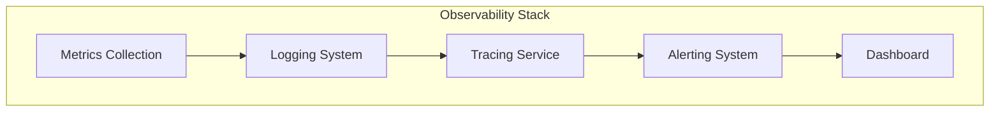

# ADR-008: Monitoring and Observability

🍞 **Breadcrumb:** 🏠 [Home](../../../index.md) > 👨‍💻 [Developer Guides](../../README.md) > 🏗️ [Architecture](../README.md) > 📋 [ADR](README.md) > Monitoring and Observability

## Status

PLANNED

## Context

### Problem Statement
Pynomaly requires comprehensive monitoring and observability capabilities to ensure system health, performance tracking, and rapid incident response in production environments.

### Goals
- Implement comprehensive system monitoring and alerting
- Provide detailed performance and health metrics
- Enable rapid incident detection and response
- Support distributed tracing and debugging capabilities

### Constraints
- Must scale with system growth
- Should minimize performance impact
- Must integrate with existing infrastructure
- Should support multiple deployment environments

### Assumptions
- System complexity will continue to increase
- Performance monitoring will be critical for operations
- Incident response time will be crucial for user experience
- Observability data will need long-term retention

## Decision

### Chosen Solution
*[To be completed when ADR moves to PROPOSED status]*

### Rationale
*[To be completed when ADR moves to PROPOSED status]*

## Architecture

### System Overview

### Component Interactions
*[To be completed when ADR moves to PROPOSED status]*

## Options Considered

### Pros and Cons Matrix

| Option | Pros | Cons | Score |
|--------|------|------|-------|
| TBD | TBD | TBD | TBD |

### Rejected Alternatives
*[To be completed when ADR moves to PROPOSED status]*

## Implementation

### Technical Approach
*[To be completed when ADR moves to PROPOSED status]*

### Migration Strategy
*[To be completed when ADR moves to PROPOSED status]*

### Testing Strategy
*[To be completed when ADR moves to PROPOSED status]*

## Consequences

### Positive
- *[To be documented when decision is made]*

### Negative
- *[To be documented when decision is made]*

### Neutral
- *[To be documented when decision is made]*

## Compliance

### Security Impact
*[To be completed when ADR moves to PROPOSED status]*

### Performance Impact
*[To be completed when ADR moves to PROPOSED status]*

### Monitoring Requirements
*[To be completed when ADR moves to PROPOSED status]*

## Decision Log

| Date | Author | Action | Rationale |
|------|--------|--------|-----------|
| 2025-01-08 | SRE Team | PLANNED | Identified need for comprehensive monitoring and observability |

## References

- [Monitoring Best Practices](../../operations/monitoring.md)
- [Observability Guidelines](../../operations/observability.md)
- [ADR Index](README.md)

---

## 🔗 **Related Documentation**

### **Architecture**
- **[Architecture Overview](../README.md)** - System design principles
- **[Monitoring Architecture](../monitoring-architecture.md)** - Monitoring system design
- **[ADR Index](README.md)** - All architectural decisions

### **Operations**
- **[Monitoring Guide](../../operations/monitoring.md)** - Monitoring procedures
- **[Alerting Guide](../../operations/alerting.md)** - Alerting configuration
- **[Incident Response](../../operations/incident-response.md)** - Incident procedures

### **SRE**
- **[SRE Practices](../../sre/README.md)** - Site reliability engineering
- **[Performance Monitoring](../../sre/performance.md)** - Performance tracking
- **[Troubleshooting](../../sre/troubleshooting.md)** - Issue resolution

---

**Authors:** SRE Team  
**Last Updated:** 2025-01-08  
**Next Review:** 2025-04-08
