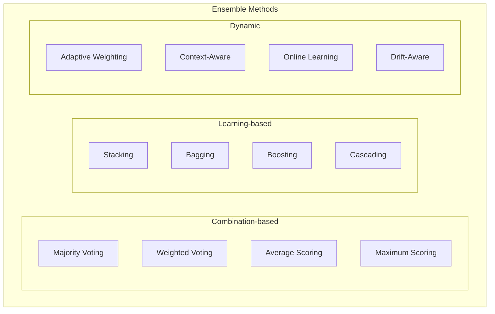

# Ensemble Methods Guide

This comprehensive guide covers ensemble anomaly detection methods, including combination strategies, optimization techniques, and advanced ensemble architectures.

## Table of Contents

1. [Overview](#overview)
2. [Ensemble Fundamentals](#ensemble-fundamentals)
3. [Combination Methods](#combination-methods)
4. [Base Algorithm Selection](#base-algorithm-selection)
5. [Advanced Ensemble Architectures](#advanced-ensemble-architectures)
6. [Dynamic Ensembles](#dynamic-ensembles)
7. [Ensemble Optimization](#ensemble-optimization)
8. [Performance Analysis](#performance-analysis)
9. [Production Deployment](#production-deployment)
10. [Best Practices](#best-practices)

## Overview

Ensemble methods combine multiple anomaly detection algorithms to achieve better performance than individual algorithms. By leveraging the strengths of different approaches, ensembles can provide more robust and accurate anomaly detection.

### Key Benefits

- **Improved Accuracy**: Combining complementary algorithms reduces individual weaknesses
- **Robustness**: Less sensitive to algorithm-specific failures or data issues
- **Confidence Estimation**: Multiple predictions provide better uncertainty quantification
- **Adaptability**: Can handle diverse data patterns and anomaly types

### Ensemble Types



## Ensemble Fundamentals

### Basic Ensemble Architecture

```python
from anomaly_detection.domain.services import EnsembleService
from anomaly_detection.infrastructure.adapters.algorithms import (
    SklearnAdapter, PyODAdapter, DeepLearningAdapter
)

class BasicEnsemble:
    def __init__(self, algorithms=None, combination_method='majority'):
        self.algorithms = algorithms or ['iforest', 'lof', 'ocsvm']
        self.combination_method = combination_method
        self.detectors = []
        self.is_fitted = False
        
    async def fit(self, X):
        """Train all base detectors."""
        
        self.detectors = []
        
        for algorithm in self.algorithms:
            # Create detector based on algorithm type
            if algorithm in ['iforest', 'lof', 'ocsvm', 'elliptic']:
                detector = SklearnAdapter(algorithm)
            elif algorithm in ['knn', 'copod', 'ecod', 'hbos']:
                detector = PyODAdapter(algorithm)
            elif algorithm in ['autoencoder', 'vae']:
                detector = DeepLearningAdapter(algorithm)
            else:
                raise ValueError(f"Unknown algorithm: {algorithm}")
            
            # Fit detector
            await detector.fit(X)
            self.detectors.append(detector)
        
        self.is_fitted = True
        
    async def predict(self, X):
        """Generate ensemble predictions."""
        
        if not self.is_fitted:
            raise ValueError("Ensemble must be fitted before prediction")
        
        # Get predictions from all detectors
        predictions = []
        scores = []
        
        for detector in self.detectors:
            result = await detector.predict(X)
            predictions.append(result.predictions)
            scores.append(result.anomaly_scores)
        
        # Convert to arrays
        predictions = np.array(predictions)  # shape: (n_detectors, n_samples)
        scores = np.array(scores)
        
        # Combine predictions
        if self.combination_method == 'majority':
            final_predictions = self._majority_vote(predictions)
        elif self.combination_method == 'average':
            final_predictions = self._average_scores(scores)
        elif self.combination_method == 'maximum':
            final_predictions = self._maximum_scores(scores)
        else:
            raise ValueError(f"Unknown combination method: {self.combination_method}")
        
        return final_predictions
    
    def _majority_vote(self, predictions):
        """Majority voting combination."""
        # Count votes for anomaly (-1) vs normal (1)
        anomaly_votes = np.sum(predictions == -1, axis=0)
        normal_votes = np.sum(predictions == 1, axis=0)
        
        # Majority decision
        final_predictions = np.where(anomaly_votes > normal_votes, -1, 1)
        
        # Calculate confidence as vote ratio
        total_votes = len(self.detectors)
        confidence = np.maximum(anomaly_votes, normal_votes) / total_votes
        
        return {
            'predictions': final_predictions,
            'confidence': confidence,
            'anomaly_votes': anomaly_votes,
            'normal_votes': normal_votes
        }
    
    def _average_scores(self, scores):
        """Average scoring combination."""
        avg_scores = np.mean(scores, axis=0)
        
        # Use average score for classification
        threshold = np.percentile(avg_scores, 90)  # Top 10% as anomalies
        final_predictions = np.where(avg_scores > threshold, -1, 1)
        
        return {
            'predictions': final_predictions,
            'anomaly_scores': avg_scores,
            'individual_scores': scores
        }
    
    def _maximum_scores(self, scores):
        """Maximum scoring combination."""
        max_scores = np.max(scores, axis=0)
        
        # Use maximum score for classification
        threshold = np.percentile(max_scores, 90)
        final_predictions = np.where(max_scores > threshold, -1, 1)
        
        return {
            'predictions': final_predictions,
            'anomaly_scores': max_scores,
            'individual_scores': scores
        }

# Usage example
ensemble = BasicEnsemble(
    algorithms=['iforest', 'lof', 'copod'],
    combination_method='majority'
)

await ensemble.fit(training_data)
results = await ensemble.predict(test_data)

print(f"Detected {np.sum(results['predictions'] == -1)} anomalies")
print(f"Average confidence: {np.mean(results['confidence']):.3f}")
```

### Weighted Ensemble

```python
class WeightedEnsemble:
    def __init__(self, 
                 algorithms_config,
                 weight_optimization='uniform'):
        """
        algorithms_config: List of dicts with 'algorithm', 'params', 'weight'
        weight_optimization: 'uniform', 'performance', 'adaptive'
        """
        self.algorithms_config = algorithms_config
        self.weight_optimization = weight_optimization
        self.detectors = []
        self.weights = []
        
    async def fit(self, X, validation_data=None):
        """Train weighted ensemble."""
        
        self.detectors = []
        performance_scores = []
        
        for config in self.algorithms_config:
            # Create and train detector
            detector = self._create_detector(
                config['algorithm'], 
                config.get('params', {})
            )
            await detector.fit(X)
            self.detectors.append(detector)
            
            # Calculate performance if validation data provided
            if validation_data is not None:
                score = await self._evaluate_detector(detector, validation_data)
                performance_scores.append(score)
        
        # Set weights based on optimization strategy
        if self.weight_optimization == 'uniform':
            self.weights = [1.0 / len(self.detectors)] * len(self.detectors)
        elif self.weight_optimization == 'performance' and performance_scores:
            # Weight by performance (higher is better)
            total_score = sum(performance_scores)
            self.weights = [score / total_score for score in performance_scores]
        elif self.weight_optimization == 'manual':
            # Use manually specified weights
            self.weights = [config.get('weight', 1.0) for config in self.algorithms_config]
            # Normalize weights
            total_weight = sum(self.weights)
            self.weights = [w / total_weight for w in self.weights]
        else:
            # Default to uniform
            self.weights = [1.0 / len(self.detectors)] * len(self.detectors)
        
        print(f"Ensemble weights: {dict(zip([c['algorithm'] for c in self.algorithms_config], self.weights))}")
    
    async def predict(self, X):
        """Generate weighted ensemble predictions."""
        
        # Get predictions and scores from all detectors
        all_predictions = []
        all_scores = []
        
        for detector in self.detectors:
            result = await detector.predict(X)
            all_predictions.append(result.predictions)
            all_scores.append(result.anomaly_scores)
        
        # Convert to arrays
        predictions_array = np.array(all_predictions)
        scores_array = np.array(all_scores)
        
        # Weighted score combination
        weighted_scores = np.zeros(len(X))
        for i, (scores, weight) in enumerate(zip(scores_array, self.weights)):
            weighted_scores += scores * weight
        
        # Weighted voting for predictions
        weighted_votes = np.zeros(len(X))
        for i, (predictions, weight) in enumerate(zip(predictions_array, self.weights)):
            # Convert predictions to votes (-1 -> 1, 1 -> 0)
            votes = (predictions == -1).astype(float)
            weighted_votes += votes * weight
        
        # Final predictions based on weighted votes
        final_predictions = np.where(weighted_votes > 0.5, -1, 1)
        
        return {
            'predictions': final_predictions,
            'anomaly_scores': weighted_scores,
            'weighted_votes': weighted_votes,
            'individual_predictions': predictions_array,
            'individual_scores': scores_array,
            'weights': self.weights
        }
    
    def _create_detector(self, algorithm, params):
        """Create detector instance."""
        if algorithm in ['iforest', 'lof', 'ocsvm']:
            return SklearnAdapter(algorithm, **params)
        elif algorithm in ['knn', 'copod', 'ecod']:
            return PyODAdapter(algorithm, **params)
        else:
            raise ValueError(f"Unknown algorithm: {algorithm}")
    
    async def _evaluate_detector(self, detector, validation_data):
        """Evaluate detector performance."""
        # Simple evaluation using silhouette score
        from sklearn.metrics import silhouette_score
        
        result = await detector.predict(validation_data)
        
        try:
            score = silhouette_score(validation_data, result.predictions)
            return max(0, score)  # Ensure non-negative
        except:
            return 0.1  # Default low score for failed evaluation

# Usage example
algorithms_config = [
    {
        'algorithm': 'iforest',
        'params': {'n_estimators': 100, 'contamination': 0.1},
        'weight': 0.4
    },
    {
        'algorithm': 'lof',
        'params': {'n_neighbors': 20, 'contamination': 0.1},
        'weight': 0.3
    },
    {
        'algorithm': 'copod',
        'params': {'contamination': 0.1},
        'weight': 0.3
    }
]

weighted_ensemble = WeightedEnsemble(
    algorithms_config=algorithms_config,
    weight_optimization='performance'
)

await weighted_ensemble.fit(training_data, validation_data)
results = await weighted_ensemble.predict(test_data)
```

## Combination Methods

### Advanced Voting Strategies

```python
class AdvancedVotingEnsemble:
    def __init__(self, algorithms, voting_strategy='qualified_majority'):
        self.algorithms = algorithms
        self.voting_strategy = voting_strategy
        self.detectors = []
        self.detector_reliabilities = []
        
    async def fit(self, X, reliability_data=None):
        """Train ensemble with reliability estimation."""
        
        self.detectors = []
        self.detector_reliabilities = []
        
        for algorithm in self.algorithms:
            detector = self._create_detector(algorithm)
            await detector.fit(X)
            self.detectors.append(detector)
            
            # Estimate reliability
            if reliability_data is not None:
                reliability = await self._estimate_reliability(detector, reliability_data)
            else:
                reliability = 1.0  # Default reliability
            
            self.detector_reliabilities.append(reliability)
        
        print(f"Detector reliabilities: {dict(zip(self.algorithms, self.detector_reliabilities))}")
    
    async def predict(self, X):
        """Advanced voting prediction."""
        
        # Get predictions from all detectors
        all_predictions = []
        all_scores = []
        all_confidences = []
        
        for detector in self.detectors:
            result = await detector.predict(X)
            all_predictions.append(result.predictions)
            all_scores.append(result.anomaly_scores)
            
            # Estimate confidence based on score distribution
            confidence = self._estimate_confidence(result.anomaly_scores)
            all_confidences.append(confidence)
        
        predictions_array = np.array(all_predictions)
        scores_array = np.array(all_scores)
        confidences_array = np.array(all_confidences)
        
        # Apply voting strategy
        if self.voting_strategy == 'simple_majority':
            final_predictions = self._simple_majority(predictions_array)
        elif self.voting_strategy == 'qualified_majority':
            final_predictions = self._qualified_majority(predictions_array, threshold=0.6)
        elif self.voting_strategy == 'confidence_weighted':
            final_predictions = self._confidence_weighted_voting(
                predictions_array, confidences_array
            )
        elif self.voting_strategy == 'reliability_weighted':
            final_predictions = self._reliability_weighted_voting(
                predictions_array, self.detector_reliabilities
            )
        elif self.voting_strategy == 'unanimous':
            final_predictions = self._unanimous_voting(predictions_array)
        else:
            raise ValueError(f"Unknown voting strategy: {self.voting_strategy}")
        
        return final_predictions
    
    def _simple_majority(self, predictions):
        """Simple majority voting."""
        anomaly_votes = np.sum(predictions == -1, axis=0)
        total_detectors = len(self.detectors)
        
        final_predictions = np.where(anomaly_votes > total_detectors / 2, -1, 1)
        confidence = np.abs(anomaly_votes - total_detectors / 2) / (total_detectors / 2)
        
        return {
            'predictions': final_predictions,
            'confidence': confidence,
            'vote_counts': anomaly_votes
        }
    
    def _qualified_majority(self, predictions, threshold=0.6):
        """Qualified majority voting with higher threshold."""
        anomaly_votes = np.sum(predictions == -1, axis=0)
        total_detectors = len(self.detectors)
        
        required_votes = int(total_detectors * threshold)
        final_predictions = np.where(anomaly_votes >= required_votes, -1, 1)
        
        # Confidence based on how much the vote exceeds threshold
        vote_ratio = anomaly_votes / total_detectors
        confidence = np.where(
            vote_ratio >= threshold,
            (vote_ratio - threshold) / (1 - threshold),
            (threshold - vote_ratio) / threshold
        )
        
        return {
            'predictions': final_predictions,
            'confidence': confidence,
            'vote_ratio': vote_ratio,
            'threshold': threshold
        }
    
    def _confidence_weighted_voting(self, predictions, confidences):
        """Weight votes by detector confidence."""
        weighted_votes = np.zeros(predictions.shape[1])
        total_weight = np.zeros(predictions.shape[1])
        
        for i, (preds, confs) in enumerate(zip(predictions, confidences)):
            # Weight anomaly votes by confidence
            anomaly_mask = (preds == -1)
            weighted_votes += anomaly_mask * confs
            total_weight += confs
        
        # Normalize by total weight
        vote_ratio = weighted_votes / total_weight
        final_predictions = np.where(vote_ratio > 0.5, -1, 1)
        
        return {
            'predictions': final_predictions,
            'confidence': np.abs(vote_ratio - 0.5) * 2,  # Scale to [0, 1]
            'weighted_vote_ratio': vote_ratio
        }
    
    def _reliability_weighted_voting(self, predictions, reliabilities):
        """Weight votes by detector reliability."""
        weighted_votes = np.zeros(predictions.shape[1])
        total_reliability = sum(reliabilities)
        
        for i, (preds, reliability) in enumerate(zip(predictions, reliabilities)):
            anomaly_mask = (preds == -1)
            weighted_votes += anomaly_mask * reliability
        
        vote_ratio = weighted_votes / total_reliability
        final_predictions = np.where(vote_ratio > 0.5, -1, 1)
        
        return {
            'predictions': final_predictions,
            'confidence': np.abs(vote_ratio - 0.5) * 2,
            'reliability_weighted_ratio': vote_ratio
        }
    
    def _unanimous_voting(self, predictions):
        """Require unanimous agreement for anomaly detection."""
        # All detectors must agree for anomaly classification
        unanimous_anomaly = np.all(predictions == -1, axis=0)
        unanimous_normal = np.all(predictions == 1, axis=0)
        
        final_predictions = np.where(
            unanimous_anomaly, -1,
            np.where(unanimous_normal, 1, 0)  # 0 for uncertain
        )
        
        # Confidence is 1 for unanimous, 0 for uncertain
        confidence = (unanimous_anomaly | unanimous_normal).astype(float)
        
        return {
            'predictions': final_predictions,
            'confidence': confidence,
            'unanimous_anomaly': unanimous_anomaly,
            'unanimous_normal': unanimous_normal
        }
    
    def _estimate_confidence(self, scores):
        """Estimate prediction confidence from scores."""
        # Use score spread as confidence indicator
        score_std = np.std(scores)
        score_range = np.max(scores) - np.min(scores)
        
        # Higher spread = lower confidence
        confidence = 1.0 / (1.0 + score_std + score_range)
        
        return np.full(len(scores), confidence)
    
    async def _estimate_reliability(self, detector, reliability_data):
        """Estimate detector reliability on known data."""
        # Simple reliability based on consistency
        results = await detector.predict(reliability_data)
        
        # Use inverse of prediction variance as reliability
        prediction_variance = np.var(results.anomaly_scores)
        reliability = 1.0 / (1.0 + prediction_variance)
        
        return reliability

# Usage example
advanced_voting = AdvancedVotingEnsemble(
    algorithms=['iforest', 'lof', 'copod', 'ecod'],
    voting_strategy='confidence_weighted'
)

await advanced_voting.fit(training_data, reliability_data)
results = await advanced_voting.predict(test_data)

print(f"Predictions: {results['predictions'][:10]}")
print(f"Confidence: {results['confidence'][:10]}")
```

### Score-based Combination

```python
class ScoreBasedEnsemble:
    def __init__(self, algorithms, combination_method='weighted_average'):
        self.algorithms = algorithms
        self.combination_method = combination_method
        self.detectors = []
        self.score_weights = []
        self.score_normalizers = []
        
    async def fit(self, X):
        """Train ensemble with score normalization."""
        
        self.detectors = []
        all_scores = []
        
        # Train all detectors and collect scores
        for algorithm in self.algorithms:
            detector = self._create_detector(algorithm)
            await detector.fit(X)
            self.detectors.append(detector)
            
            # Get training scores for normalization
            result = await detector.predict(X)
            all_scores.append(result.anomaly_scores)
        
        # Calculate score normalizers and weights
        self.score_normalizers = []
        self.score_weights = []
        
        for scores in all_scores:
            # Normalizer: mean and std for z-score normalization
            normalizer = {
                'mean': np.mean(scores),
                'std': np.std(scores)
            }
            self.score_normalizers.append(normalizer)
            
            # Weight: inverse of score variance (more consistent = higher weight)
            weight = 1.0 / (np.var(scores) + 1e-8)  # Add small epsilon
            self.score_weights.append(weight)
        
        # Normalize weights
        total_weight = sum(self.score_weights)
        self.score_weights = [w / total_weight for w in self.score_weights]
        
        print(f"Score weights: {dict(zip(self.algorithms, self.score_weights))}")
    
    async def predict(self, X):
        """Score-based ensemble prediction."""
        
        # Get scores from all detectors
        all_scores = []
        all_predictions = []
        
        for detector in self.detectors:
            result = await detector.predict(X)
            all_scores.append(result.anomaly_scores)
            all_predictions.append(result.predictions)
        
        # Normalize scores
        normalized_scores = []
        for i, (scores, normalizer) in enumerate(zip(all_scores, self.score_normalizers)):
            # Z-score normalization
            normalized = (scores - normalizer['mean']) / (normalizer['std'] + 1e-8)
            normalized_scores.append(normalized)
        
        normalized_scores = np.array(normalized_scores)
        
        # Combine scores based on method
        if self.combination_method == 'average':
            final_scores = np.mean(normalized_scores, axis=0)
        elif self.combination_method == 'weighted_average':
            final_scores = np.average(normalized_scores, axis=0, weights=self.score_weights)
        elif self.combination_method == 'geometric_mean':
            # Ensure positive scores for geometric mean
            positive_scores = normalized_scores - np.min(normalized_scores) + 1
            final_scores = np.exp(np.mean(np.log(positive_scores), axis=0))
        elif self.combination_method == 'harmonic_mean':
            # Harmonic mean of positive scores
            positive_scores = normalized_scores - np.min(normalized_scores) + 1
            final_scores = len(self.detectors) / np.sum(1.0 / positive_scores, axis=0)
        elif self.combination_method == 'maximum':
            final_scores = np.max(normalized_scores, axis=0)
        elif self.combination_method == 'minimum':
            final_scores = np.min(normalized_scores, axis=0)
        else:
            raise ValueError(f"Unknown combination method: {self.combination_method}")
        
        # Convert scores to predictions
        threshold = np.percentile(final_scores, 90)  # Top 10% as anomalies
        final_predictions = np.where(final_scores > threshold, -1, 1)
        
        return {
            'predictions': final_predictions,
            'anomaly_scores': final_scores,
            'individual_scores': all_scores,
            'normalized_scores': normalized_scores,
            'threshold': threshold
        }

# Usage
score_ensemble = ScoreBasedEnsemble(
    algorithms=['iforest', 'lof', 'copod', 'ecod'],
    combination_method='weighted_average'
)

await score_ensemble.fit(training_data)
results = await score_ensemble.predict(test_data)
```

## Base Algorithm Selection

### Algorithm Diversity Analysis

```python
class AlgorithmDiversityAnalyzer:
    def __init__(self):
        self.available_algorithms = {
            'iforest': {'type': 'tree', 'assumption': 'isolation', 'complexity': 'medium'},
            'lof': {'type': 'density', 'assumption': 'locality', 'complexity': 'high'},
            'ocsvm': {'type': 'boundary', 'assumption': 'margin', 'complexity': 'high'},
            'copod': {'type': 'statistical', 'assumption': 'copula', 'complexity': 'low'},
            'ecod': {'type': 'statistical', 'assumption': 'empirical', 'complexity': 'low'},
            'hbos': {'type': 'histogram', 'assumption': 'independence', 'complexity': 'low'},
            'knn': {'type': 'distance', 'assumption': 'proximity', 'complexity': 'medium'},
            'autoencoder': {'type': 'neural', 'assumption': 'reconstruction', 'complexity': 'high'}
        }
    
    def select_diverse_algorithms(self, 
                                n_algorithms=3,
                                diversity_criteria=['type', 'assumption'],
                                performance_weights=None):
        """Select diverse algorithms for ensemble."""
        
        # Calculate diversity matrix
        diversity_matrix = self._calculate_diversity_matrix(diversity_criteria)
        
        # Select algorithms to maximize diversity
        selected = self._greedy_diverse_selection(
            diversity_matrix, 
            n_algorithms,
            performance_weights
        )
        
        return selected
    
    def _calculate_diversity_matrix(self, criteria):
        """Calculate pairwise diversity between algorithms."""
        
        algorithms = list(self.available_algorithms.keys())
        n_algorithms = len(algorithms)
        diversity_matrix = np.zeros((n_algorithms, n_algorithms))
        
        for i, alg1 in enumerate(algorithms):
            for j, alg2 in enumerate(algorithms):
                if i != j:
                    diversity = 0
                    for criterion in criteria:
                        if (self.available_algorithms[alg1][criterion] != 
                            self.available_algorithms[alg2][criterion]):
                            diversity += 1
                    
                    diversity_matrix[i, j] = diversity / len(criteria)
        
        return diversity_matrix, algorithms
    
    def _greedy_diverse_selection(self, diversity_info, n_algorithms, weights=None):
        """Greedy selection for maximum diversity."""
        
        diversity_matrix, algorithms = diversity_info
        
        if weights is None:
            weights = {alg: 1.0 for alg in algorithms}
        
        selected_indices = []
        selected_algorithms = []
        
        # Start with the highest weighted algorithm
        start_idx = max(range(len(algorithms)), 
                       key=lambda i: weights.get(algorithms[i], 1.0))
        selected_indices.append(start_idx)
        selected_algorithms.append(algorithms[start_idx])
        
        # Greedily add most diverse algorithms
        for _ in range(n_algorithms - 1):
            best_score = -1
            best_idx = -1
            
            for i, alg in enumerate(algorithms):
                if i in selected_indices:
                    continue
                
                # Calculate average diversity with selected algorithms
                diversity_score = np.mean([diversity_matrix[i, j] for j in selected_indices])
                
                # Weight by algorithm performance
                weighted_score = diversity_score * weights.get(alg, 1.0)
                
                if weighted_score > best_score:
                    best_score = weighted_score
                    best_idx = i
            
            if best_idx != -1:
                selected_indices.append(best_idx)
                selected_algorithms.append(algorithms[best_idx])
        
        return selected_algorithms
    
    async def evaluate_algorithm_performance(self, algorithms, data):
        """Evaluate individual algorithm performance."""
        
        performance_scores = {}
        
        for algorithm in algorithms:
            detector = self._create_detector(algorithm)
            await detector.fit(data)
            
            # Evaluate using internal metrics
            result = await detector.predict(data)
            
            # Use silhouette score as performance proxy
            from sklearn.metrics import silhouette_score
            try:
                score = silhouette_score(data, result.predictions)
                performance_scores[algorithm] = max(0, score)
            except:
                performance_scores[algorithm] = 0.1
        
        return performance_scores

# Usage
diversity_analyzer = AlgorithmDiversityAnalyzer()

# Select diverse algorithms
diverse_algorithms = diversity_analyzer.select_diverse_algorithms(
    n_algorithms=4,
    diversity_criteria=['type', 'assumption', 'complexity']
)

print(f"Selected diverse algorithms: {diverse_algorithms}")

# Evaluate performance and select based on both diversity and performance
performance_scores = await diversity_analyzer.evaluate_algorithm_performance(
    diverse_algorithms, 
    training_data
)

# Re-select with performance weights
optimized_selection = diversity_analyzer.select_diverse_algorithms(
    n_algorithms=3,
    diversity_criteria=['type', 'assumption'],
    performance_weights=performance_scores
)

print(f"Optimized selection: {optimized_selection}")
```

### Adaptive Algorithm Selection

```python
class AdaptiveAlgorithmSelector:
    def __init__(self, candidate_algorithms, selection_window=1000):
        self.candidate_algorithms = candidate_algorithms
        self.selection_window = selection_window
        self.algorithm_performance_history = {alg: [] for alg in candidate_algorithms}
        self.current_ensemble = []
        self.performance_threshold = 0.7
        
    async def initialize_ensemble(self, initial_data):
        """Initialize ensemble with best performing algorithms."""
        
        # Evaluate all candidate algorithms
        performance_scores = {}
        
        for algorithm in self.candidate_algorithms:
            detector = self._create_detector(algorithm)
            await detector.fit(initial_data)
            
            # Cross-validation evaluation
            score = await self._cross_validate_algorithm(detector, initial_data)
            performance_scores[algorithm] = score
            self.algorithm_performance_history[algorithm].append(score)
        
        # Select top performing algorithms
        sorted_algorithms = sorted(
            performance_scores.items(), 
            key=lambda x: x[1], 
            reverse=True
        )
        
        # Select top 3-5 algorithms
        n_select = min(5, max(3, len(sorted_algorithms) // 2))
        self.current_ensemble = [alg for alg, score in sorted_algorithms[:n_select]]
        
        print(f"Initial ensemble: {self.current_ensemble}")
        print(f"Performance scores: {performance_scores}")
        
        return self.current_ensemble
    
    async def update_ensemble(self, new_data, performance_feedback=None):
        """Update ensemble based on recent performance."""
        
        # Evaluate current ensemble performance
        if performance_feedback is not None:
            # Use external performance feedback
            current_performance = performance_feedback
        else:
            # Evaluate performance on new data
            current_performance = await self._evaluate_ensemble_performance(new_data)
        
        # Update performance history
        for alg in self.current_ensemble:
            if alg in current_performance:
                self.algorithm_performance_history[alg].append(current_performance[alg])
                
                # Keep only recent history
                if len(self.algorithm_performance_history[alg]) > self.selection_window:
                    self.algorithm_performance_history[alg].pop(0)
        
        # Check if ensemble update is needed
        if self._should_update_ensemble():
            await self._reselect_algorithms(new_data)
        
        return self.current_ensemble
    
    def _should_update_ensemble(self):
        """Determine if ensemble should be updated."""
        
        # Check recent performance
        recent_performances = []
        for alg in self.current_ensemble:
            history = self.algorithm_performance_history[alg]
            if len(history) >= 5:  # Need at least 5 recent evaluations
                recent_avg = np.mean(history[-5:])
                recent_performances.append(recent_avg)
        
        if not recent_performances:
            return False
        
        # Update if average performance drops below threshold
        avg_performance = np.mean(recent_performances)
        return avg_performance < self.performance_threshold
    
    async def _reselect_algorithms(self, data):
        """Reselect algorithms for ensemble."""
        
        print("Updating ensemble due to performance degradation...")
        
        # Evaluate all candidate algorithms on recent data
        current_scores = {}
        for algorithm in self.candidate_algorithms:
            detector = self._create_detector(algorithm)
            await detector.fit(data)
            score = await self._cross_validate_algorithm(detector, data)
            current_scores[algorithm] = score
        
        # Combine with historical performance
        combined_scores = {}
        for algorithm in self.candidate_algorithms:
            history = self.algorithm_performance_history[algorithm]
            historical_avg = np.mean(history) if history else 0.0
            current_score = current_scores[algorithm]
            
            # Weight recent performance more heavily
            combined_scores[algorithm] = 0.7 * current_score + 0.3 * historical_avg
        
        # Select new ensemble
        sorted_algorithms = sorted(
            combined_scores.items(), 
            key=lambda x: x[1], 
            reverse=True
        )
        
        n_select = min(5, max(3, len(sorted_algorithms) // 2))
        new_ensemble = [alg for alg, score in sorted_algorithms[:n_select]]
        
        if new_ensemble != self.current_ensemble:
            print(f"Ensemble updated: {self.current_ensemble} -> {new_ensemble}")
            self.current_ensemble = new_ensemble
    
    async def _cross_validate_algorithm(self, detector, data, folds=3):
        """Cross-validate algorithm performance."""
        
        from sklearn.model_selection import KFold
        from sklearn.metrics import silhouette_score
        
        kf = KFold(n_splits=folds, shuffle=True, random_state=42)
        scores = []
        
        for train_idx, val_idx in kf.split(data):
            train_data = data[train_idx]
            val_data = data[val_idx]
            
            # Train on fold
            await detector.fit(train_data)
            
            # Evaluate on validation
            result = await detector.predict(val_data)
            
            try:
                score = silhouette_score(val_data, result.predictions)
                scores.append(max(0, score))
            except:
                scores.append(0.1)
        
        return np.mean(scores)
    
    async def _evaluate_ensemble_performance(self, data):
        """Evaluate performance of current ensemble."""
        
        performance = {}
        
        for algorithm in self.current_ensemble:
            detector = self._create_detector(algorithm)
            await detector.fit(data)
            score = await self._cross_validate_algorithm(detector, data)
            performance[algorithm] = score
        
        return performance

# Usage
adaptive_selector = AdaptiveAlgorithmSelector(
    candidate_algorithms=['iforest', 'lof', 'ocsvm', 'copod', 'ecod', 'hbos', 'knn'],
    selection_window=1000
)

# Initialize ensemble
initial_ensemble = await adaptive_selector.initialize_ensemble(training_data)

# Simulate streaming updates
for batch in streaming_data_batches:
    # Process batch with current ensemble
    # ... processing logic ...
    
    # Update ensemble based on performance
    current_ensemble = await adaptive_selector.update_ensemble(batch)
    
    print(f"Current ensemble: {current_ensemble}")
```

## Advanced Ensemble Architectures

### Hierarchical Ensemble

```python
class HierarchicalEnsemble:
    def __init__(self, architecture_config):
        """
        architecture_config: Dict defining the hierarchical structure
        Example:
        {
            'level1': {
                'algorithms': ['iforest', 'lof'],
                'combination': 'majority'
            },
            'level2': {
                'algorithms': ['copod', 'ecod'],
                'combination': 'average'
            },
            'meta': {
                'combination': 'weighted',
                'weights': [0.6, 0.4]
            }
        }
        """
        self.architecture_config = architecture_config
        self.level_ensembles = {}
        self.meta_combiner = None
        
    async def fit(self, X):
        """Train hierarchical ensemble."""
        
        # Train level ensembles
        for level_name, level_config in self.architecture_config.items():
            if level_name == 'meta':
                continue
                
            level_ensemble = BasicEnsemble(
                algorithms=level_config['algorithms'],
                combination_method=level_config['combination']
            )
            
            await level_ensemble.fit(X)
            self.level_ensembles[level_name] = level_ensemble
        
        # Train meta-combiner if specified
        if 'meta' in self.architecture_config:
            meta_config = self.architecture_config['meta']
            self.meta_combiner = {
                'combination': meta_config['combination'],
                'weights': meta_config.get('weights', None)
            }
    
    async def predict(self, X):
        """Generate hierarchical predictions."""
        
        # Get predictions from each level
        level_results = {}
        level_scores = []
        level_predictions = []
        
        for level_name, level_ensemble in self.level_ensembles.items():
            result = await level_ensemble.predict(X)
            level_results[level_name] = result
            
            if 'anomaly_scores' in result:
                level_scores.append(result['anomaly_scores'])
            level_predictions.append(result['predictions'])
        
        # Combine level results using meta-combiner
        if self.meta_combiner:
            if self.meta_combiner['combination'] == 'weighted':
                weights = self.meta_combiner['weights']
                if weights and len(weights) == len(level_scores):
                    # Weighted combination of scores
                    final_scores = np.zeros(len(X))
                    for score, weight in zip(level_scores, weights):
                        final_scores += score * weight
                    
                    threshold = np.percentile(final_scores, 90)
                    final_predictions = np.where(final_scores > threshold, -1, 1)
                else:
                    # Fallback to majority voting
                    final_predictions = self._majority_vote(level_predictions)
            else:
                final_predictions = self._majority_vote(level_predictions)
        else:
            final_predictions = self._majority_vote(level_predictions)
        
        return {
            'predictions': final_predictions,
            'level_results': level_results,
            'level_scores': level_scores if level_scores else None
        }
    
    def _majority_vote(self, level_predictions):
        """Majority vote across levels."""
        predictions_array = np.array(level_predictions)
        anomaly_votes = np.sum(predictions_array == -1, axis=0)
        total_levels = len(level_predictions)
        
        return np.where(anomaly_votes > total_levels / 2, -1, 1)

# Usage
hierarchical_config = {
    'density_based': {
        'algorithms': ['lof', 'knn'],
        'combination': 'majority'
    },
    'tree_based': {
        'algorithms': ['iforest'],
        'combination': 'average'
    },
    'statistical': {
        'algorithms': ['copod', 'ecod'],
        'combination': 'average'
    },
    'meta': {
        'combination': 'weighted',
        'weights': [0.4, 0.3, 0.3]
    }
}

hierarchical_ensemble = HierarchicalEnsemble(hierarchical_config)
await hierarchical_ensemble.fit(training_data)
results = await hierarchical_ensemble.predict(test_data)
```

### Cascade Ensemble

```python
class CascadeEnsemble:
    def __init__(self, cascade_config):
        """
        cascade_config: List of stages in cascade order
        Example:
        [
            {
                'algorithms': ['hbos', 'ecod'],  # Fast algorithms first
                'threshold': 0.8,  # Confidence threshold
                'combination': 'majority'
            },
            {
                'algorithms': ['iforest', 'lof'],  # Medium complexity
                'threshold': 0.9,
                'combination': 'weighted'
            },
            {
                'algorithms': ['ocsvm'],  # Slow but accurate
                'threshold': None,  # Final stage
                'combination': 'single'
            }
        ]
        """
        self.cascade_config = cascade_config
        self.cascade_stages = []
        
    async def fit(self, X):
        """Train cascade ensemble."""
        
        self.cascade_stages = []
        
        for stage_config in self.cascade_config:
            if stage_config['combination'] == 'single':
                # Single algorithm stage
                algorithm = stage_config['algorithms'][0]
                detector = self._create_detector(algorithm)
                await detector.fit(X)
                stage = {
                    'type': 'single',
                    'detector': detector,
                    'threshold': stage_config['threshold']
                }
            else:
                # Ensemble stage
                ensemble = BasicEnsemble(
                    algorithms=stage_config['algorithms'],
                    combination_method=stage_config['combination']
                )
                await ensemble.fit(X)
                stage = {
                    'type': 'ensemble',
                    'ensemble': ensemble,
                    'threshold': stage_config['threshold']
                }
            
            self.cascade_stages.append(stage)
    
    async def predict(self, X):
        """Cascade prediction with early stopping."""
        
        n_samples = len(X)
        final_predictions = np.zeros(n_samples)
        final_scores = np.zeros(n_samples)
        processing_stages = np.zeros(n_samples)  # Track which stage processed each sample
        
        # Indices of samples still being processed
        remaining_indices = np.arange(n_samples)
        
        for stage_idx, stage in enumerate(self.cascade_stages):
            if len(remaining_indices) == 0:
                break
            
            # Get data for remaining samples
            remaining_data = X[remaining_indices]
            
            # Process with current stage
            if stage['type'] == 'single':
                result = await stage['detector'].predict(remaining_data)
            else:
                result = await stage['ensemble'].predict(remaining_data)
            
            stage_predictions = result['predictions']
            stage_scores = result.get('anomaly_scores', np.zeros(len(remaining_data)))
            stage_confidence = result.get('confidence', np.ones(len(remaining_data)))
            
            # Determine which samples to finalize at this stage
            if stage['threshold'] is not None:
                # High confidence samples are finalized
                high_confidence_mask = stage_confidence >= stage['threshold']
                finalize_indices = remaining_indices[high_confidence_mask]
                continue_indices = remaining_indices[~high_confidence_mask]
            else:
                # Final stage - process all remaining samples
                finalize_indices = remaining_indices
                continue_indices = np.array([])
            
            # Store results for finalized samples
            final_predictions[finalize_indices] = stage_predictions[
                np.isin(remaining_indices, finalize_indices)
            ]
            final_scores[finalize_indices] = stage_scores[
                np.isin(remaining_indices, finalize_indices)
            ]
            processing_stages[finalize_indices] = stage_idx
            
            # Update remaining indices
            remaining_indices = continue_indices
        
        return {
            'predictions': final_predictions.astype(int),
            'anomaly_scores': final_scores,
            'processing_stages': processing_stages,
            'stage_distribution': np.bincount(processing_stages.astype(int))
        }

# Usage
cascade_config = [
    {
        'algorithms': ['hbos', 'ecod'],
        'threshold': 0.8,
        'combination': 'majority'
    },
    {
        'algorithms': ['iforest', 'lof'],
        'threshold': 0.9,
        'combination': 'weighted'
    },
    {
        'algorithms': ['ocsvm'],
        'threshold': None,
        'combination': 'single'
    }
]

cascade_ensemble = CascadeEnsemble(cascade_config)
await cascade_ensemble.fit(training_data)
results = await cascade_ensemble.predict(test_data)

print(f"Stage distribution: {results['stage_distribution']}")
print(f"Samples processed at each stage: {list(results['stage_distribution'])}")
```

This comprehensive ensemble methods guide provides everything needed to implement sophisticated ensemble anomaly detection systems with various combination strategies, optimization techniques, and advanced architectures.