# Anomaly Detection Documentation

<div class="feature-grid">
    <div class="feature-card">
        <div class="feature-icon">🎯</div>
        <div class="feature-title">Production Ready</div>
        <div class="feature-description">Enterprise-grade anomaly detection with robust algorithms, comprehensive testing, and production-ready deployment patterns.</div>
    </div>
    <div class="feature-card">
        <div class="feature-icon">⚡</div>
        <div class="feature-title">High Performance</div>
        <div class="feature-description">Optimized algorithms with parallel processing, memory-efficient operations, and real-time streaming capabilities.</div>
    </div>
    <div class="feature-card">
        <div class="feature-icon">🔧</div>
        <div class="feature-title">Easy to Use</div>
        <div class="feature-description">Simple APIs, comprehensive CLI, interactive examples, and extensive documentation for quick adoption.</div>
    </div>
</div>

Welcome to the comprehensive documentation for the **Anomaly Detection** package - a production-ready, enterprise-grade solution for detecting anomalies in various types of data.

## What is Anomaly Detection?

Anomaly detection identifies unusual patterns, outliers, or suspicious behavior in data that deviate significantly from normal patterns. Our package provides state-of-the-art algorithms and tools for:

!!! info "Key Applications"
    - **🔒 Fraud Detection**: Identify suspicious financial transactions and fraudulent behavior
    - **🛡️ Cybersecurity**: Detect network intrusions, malware, and security threats  
    - **🏭 Quality Control**: Find defective products and manufacturing anomalies
    - **📊 System Monitoring**: Identify performance issues and infrastructure problems
    - **🎯 Business Intelligence**: Discover unusual customer behavior and market patterns

## Quick Start

Get up and running in under 5 minutes:

=== "Installation"
    ```bash
    pip install anomaly-detection
    ```

=== "Basic Usage"
    ```python
    from anomaly_detection import DetectionService
    import numpy as np
    
    # Create sample data
    data = np.random.normal(0, 1, (100, 3))
    
    # Detect anomalies
    service = DetectionService()
    result = service.detect(data, algorithm="isolation_forest")
    
    print(f"Found {result.anomaly_count} anomalies")
    ```

=== "CLI Usage"
    ```bash
    # Detect anomalies in CSV file
    anomaly-detection detect run --input data.csv --algorithm isolation_forest
    
    # Start web dashboard
    anomaly-detection-server
    ```

[Get started with the full tutorial →](getting-started/){ .md-button .md-button--primary }

## Interactive Algorithm Demo

<div id="algorithm-demo" class="interactive-demo">
    <div class="demo-controls">
        <select id="algo-select">
            <option value="">Select an algorithm...</option>
            <option value="Isolation Forest">Isolation Forest</option>
            <option value="LOF">Local Outlier Factor</option>
            <option value="One-Class SVM">One-Class SVM</option>
            <option value="Autoencoder">Autoencoder</option>
        </select>
        <button class="demo-button" onclick="runAlgorithmDemo()">Run Demo</button>
    </div>
    <div class="demo-output" id="algo-output">
        Select an algorithm and click "Run Demo" to see performance characteristics and simulation results.
    </div>
</div>

## Architecture Overview

Built with **Domain-Driven Design (DDD)** principles for maintainability and scalability:

```mermaid
graph TB
    subgraph "🎯 Application Layer"
        UC[Use Cases] --> AS[Application Services]
        AS --> DTO[Data Transfer Objects]
    end
    
    subgraph "🏗️ Domain Layer"
        E[Entities] --> DS[Domain Services]
        DS --> R[Repositories]
        DS --> VO[Value Objects]
    end
    
    subgraph "🔌 Infrastructure Layer"
        DB[Database Adapters] --> ML[ML Framework Adapters]
        ML --> EXT[External Services]
    end
    
    subgraph "🖥️ Presentation Layer"
        API[REST API] --> CLI[Command Line]
        CLI --> WEB[Web Dashboard]
    end
    
    UC --> DS
    AS --> R
    API --> UC
    CLI --> UC
    WEB --> UC
    R --> DB
    DS --> ML
```



## Supported Algorithms

<div class="algorithm-comparison">
    <table>
        <thead>
            <tr>
                <th>Algorithm</th>
                <th>Best For</th>
                <th>Speed</th>
                <th>Memory</th>
                <th>Interpretability</th>
            </tr>
        </thead>
        <tbody>
            <tr>
                <td><strong>Isolation Forest</strong></td>
                <td>General purpose, large datasets</td>
                <td>🟢 Fast</td>
                <td>🟡 Medium</td>
                <td>🟡 Medium</td>
            </tr>
            <tr>
                <td><strong>Local Outlier Factor</strong></td>
                <td>Local anomalies, varied densities</td>
                <td>🟡 Medium</td>
                <td>🔴 High</td>
                <td>🟢 High</td>
            </tr>
            <tr>
                <td><strong>One-Class SVM</strong></td>
                <td>High-dimensional data</td>
                <td>🔴 Slow</td>
                <td>🟢 Low</td>
                <td>🔴 Low</td>
            </tr>
            <tr>
                <td><strong>Autoencoder</strong></td>
                <td>Complex patterns, deep learning</td>
                <td>🔴 Slow</td>
                <td>🔴 High</td>
                <td>🟢 High</td>
            </tr>
            <tr>
                <td><strong>Ensemble Methods</strong></td>
                <td>Maximum accuracy, production</td>
                <td>🟡 Medium</td>
                <td>🔴 High</td>
                <td>🟡 Medium</td>
            </tr>
        </tbody>
    </table>
</div>

[Learn more about algorithms →](algorithms/){ .md-button }

## Learning Paths

Choose your journey based on your role and experience level:

<div class="learning-path-card" id="beginner-journey">
    <div class="learning-path-header">
        <div class="learning-path-icon">🐣</div>
        <div>
            <div class="learning-path-title">Beginner Journey</div>
            <div class="learning-path-duration">2-3 hours</div>
        </div>
    </div>
    <div class="learning-path-description">
        Perfect if you're new to anomaly detection or machine learning. Start with the basics and build up your knowledge.
    </div>
    <ul class="learning-path-steps">
        <li><a href="installation/">📦 Installation & Setup</a> <em>(10 min)</em></li>
        <li><a href="getting-started/">🚀 Quick Start Guide</a> <em>(20 min)</em></li>
        <li><a href="getting-started/first-detection/">🎯 Your First Detection</a> <em>(30 min)</em></li>
        <li><a href="getting-started/examples/">💡 Practical Examples</a> <em>(45 min)</em></li>
        <li><a href="cli/">⌨️ CLI Basics</a> <em>(30 min)</em></li>
        <li><a href="troubleshooting/">🛠️ Common Issues</a> <em>(15 min)</em></li>
    </ul>
    <div class="learning-path-cta">
        <a href="getting-started/" class="md-button md-button--primary">Start Learning</a>
    </div>
</div>

<div class="learning-path-card" id="scientist-journey">
    <div class="learning-path-header">
        <div class="learning-path-icon">👨‍🔬</div>
        <div>
            <div class="learning-path-title">Data Scientist Journey</div>
            <div class="learning-path-duration">4-5 hours</div>
        </div>
    </div>
    <div class="learning-path-description">
        For data scientists and ML practitioners who want to build robust, production-ready anomaly detection models.
    </div>
    <ul class="learning-path-steps">
        <li><a href="algorithms/">🧠 Algorithm Deep Dive</a> <em>(45 min)</em></li>
        <li><a href="model_management/">📊 Model Management</a> <em>(60 min)</em></li>
        <li><a href="ensemble/">🎯 Ensemble Methods</a> <em>(90 min)</em></li>
        <li><a href="explainability/">🔍 Model Explainability</a> <em>(60 min)</em></li>
        <li><a href="performance/">⚡ Performance Optimization</a> <em>(60 min)</em></li>
        <li><a href="api/">📖 Advanced API Usage</a> <em>(30 min)</em></li>
    </ul>
    <div class="learning-path-cta">
        <a href="algorithms/" class="md-button md-button--primary">Deep Dive</a>
    </div>
</div>

<div class="learning-path-card" id="engineer-journey">
    <div class="learning-path-header">
        <div class="learning-path-icon">🔧</div>
        <div>
            <div class="learning-path-title">Engineering Journey</div>
            <div class="learning-path-duration">5-6 hours</div>
        </div>
    </div>
    <div class="learning-path-description">
        For software engineers and DevOps professionals focused on deployment, scaling, and production operations.
    </div>
    <ul class="learning-path-steps">
        <li><a href="deployment/">🚀 Production Deployment</a> <em>(120 min)</em></li>
        <li><a href="streaming/">📡 Real-time Streaming</a> <em>(90 min)</em></li>
        <li><a href="integration/">🔌 System Integration</a> <em>(60 min)</em></li>
        <li><a href="security/">🔒 Security & Privacy</a> <em>(90 min)</em></li>
        <li><a href="configuration/">⚙️ Configuration Management</a> <em>(45 min)</em></li>
        <li><a href="troubleshooting/">🛡️ Monitoring & Troubleshooting</a> <em>(60 min)</em></li>
    </ul>
    <div class="learning-path-cta">
        <a href="deployment/" class="md-button md-button--primary">Start Building</a>
    </div>
</div>

## Real-World Success Stories

!!! success "Financial Services"
    **Fraud Detection at Scale**: Reduced false positives by 45% while maintaining 99.2% fraud detection rate, processing 100M+ transactions daily.

!!! success "Manufacturing"
    **Quality Control**: Decreased defective products reaching customers by 78%, saving $2.3M annually in warranty claims and recalls.

!!! success "Cybersecurity"
    **Network Monitoring**: Detected 94% of security incidents 3x faster than traditional rule-based systems, reducing breach response time to under 2 minutes.

## Performance Metrics

<div id="performance-demo" class="interactive-demo">
    <div class="demo-controls">
        <button class="demo-button" onclick="generateMetrics()">Generate Sample Metrics</button>
        <button class="demo-button" onclick="clearMetrics()">Clear</button>
    </div>
    <div class="demo-output" id="metrics-output">
        Click "Generate Sample Metrics" to see example performance data from production deployments.
    </div>
</div>

## Key Features

<div class="feature-grid">
    <div class="feature-card">
        <div class="feature-icon">🎛️</div>
        <div class="feature-title">Multiple Algorithms</div>
        <div class="feature-description">Choose from 10+ state-of-the-art algorithms including Isolation Forest, LOF, One-Class SVM, and deep learning approaches.</div>
    </div>
    
    <div class="feature-card">
        <div class="feature-icon">🎯</div>
        <div class="feature-title">Ensemble Methods</div>
        <div class="feature-description">Combine multiple algorithms with voting, averaging, stacking, and advanced ensemble techniques for maximum accuracy.</div>
    </div>
    
    <div class="feature-card">
        <div class="feature-icon">⚡</div>
        <div class="feature-title">Real-time Processing</div>
        <div class="feature-description">Stream processing with Kafka, Redis, and WebSocket support for detecting anomalies in real-time data flows.</div>
    </div>
    
    <div class="feature-card">
        <div class="feature-icon">🔍</div>
        <div class="feature-title">Explainable AI</div>
        <div class="feature-description">SHAP integration, feature importance analysis, and interactive visualizations to understand why data points are anomalous.</div>
    </div>
    
    <div class="feature-card">
        <div class="feature-icon">📊</div>
        <div class="feature-title">Rich Visualizations</div>
        <div class="feature-description">Interactive plots, dashboards, and charts to explore your data and understand detection results.</div>
    </div>
    
    <div class="feature-card">
        <div class="feature-icon">🔒</div>
        <div class="feature-title">Enterprise Security</div>
        <div class="feature-description">Data encryption, authentication, audit logging, and compliance features for enterprise deployments.</div>
    </div>
</div>

## Quick Navigation

<div class="feature-grid">
    <div class="feature-card">
        <div class="feature-title">📚 By Learning Goal</div>
        <div class="feature-description">
            • <a href="getting-started/">Getting Started</a> - Learn the basics<br>
            • <a href="algorithms/">Choose Algorithm</a> - Pick the right approach<br>
            • <a href="deployment/">Go to Production</a> - Deploy at scale<br>
            • <a href="troubleshooting/">Solve Problems</a> - Debug and optimize
        </div>
    </div>
    
    <div class="feature-card">
        <div class="feature-title">👥 By Role</div>
        <div class="feature-description">
            • <a href="getting-started/">Data Scientists</a> - Model building and tuning<br>
            • <a href="deployment/">DevOps Engineers</a> - Deployment and scaling<br>
            • <a href="cli/">System Administrators</a> - Operations and monitoring<br>
            • <a href="api/">Developers</a> - API integration and development
        </div>
    </div>
    
    <div class="feature-card">
        <div class="feature-title">🎯 By Use Case</div>
        <div class="feature-description">
            • <a href="getting-started/examples/">Fraud Detection</a> - Financial security<br>
            • <a href="getting-started/examples/">Network Security</a> - Cyber threat detection<br>
            • <a href="getting-started/examples/">Quality Control</a> - Manufacturing defects<br>
            • <a href="getting-started/examples/">IoT Monitoring</a> - Device anomalies
        </div>
    </div>
</div>

## Community and Support

- **💬 Discussions**: Join our community forum for questions and discussions
- **🐛 Issues**: Report bugs and request features on GitHub
- **📧 Enterprise Support**: Contact us for dedicated enterprise support
- **📖 Blog**: Read our latest articles and case studies
- **🎥 Tutorials**: Watch video tutorials and webinars
- **📱 Social**: Follow us for updates and announcements

## What's New

!!! info "Latest Updates"
    - **v2.1.0**: New autoencoder algorithms with GPU acceleration
    - **v2.0.0**: Complete architecture redesign with DDD principles  
    - **v1.9.0**: Real-time streaming support with Kafka integration
    - **v1.8.0**: SHAP explainability and interactive visualizations

[View full changelog →](changelog/){ .md-button }

---

<div class="feature-grid" style="margin-top: 2rem;">
    <div class="feature-card" style="text-align: center;">
        <div class="feature-title">Ready to Get Started?</div>
        <div class="feature-description">
            Install the package and detect your first anomaly in under 5 minutes.
        </div>
        <a href="getting-started/" class="md-button md-button--primary" style="margin-top: 1rem;">Start Tutorial</a>
    </div>
    
    <div class="feature-card" style="text-align: center;">
        <div class="feature-title">Need Help?</div>
        <div class="feature-description">
            Comprehensive documentation, examples, and community support available.
        </div>
        <a href="troubleshooting/" class="md-button" style="margin-top: 1rem;">Get Help</a>
    </div>
</div>