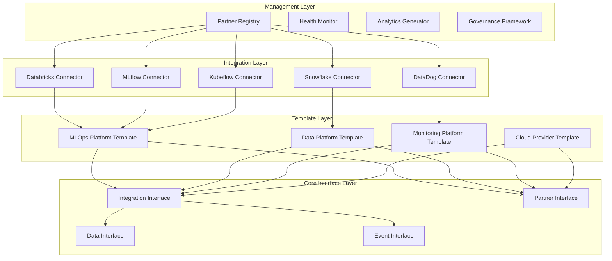

# Ecosystem Integration Framework Architecture

## Overview

The Ecosystem Integration Framework is a comprehensive solution for managing strategic partnerships and integrations across the MLOps platform. It provides standardized patterns, tools, and management systems for seamless integration with external platforms and services.

## Core Architecture

### 1. Layered Architecture

```
┌─────────────────────────────────────────────────────────────────┐
│                     Management Layer                            │
├─────────────────────────────────────────────────────────────────┤
│                     Integration Layer                           │
├─────────────────────────────────────────────────────────────────┤
│                     Template Layer                              │
├─────────────────────────────────────────────────────────────────┤
│                     Core Interface Layer                        │
└─────────────────────────────────────────────────────────────────┘
```

#### Core Interface Layer
- **IntegrationInterface**: Base contract for all platform integrations
- **PartnerInterface**: Contract for partner relationship management
- **DataConnectorInterface**: Contract for data exchange operations
- **EventInterface**: Contract for event-driven integration

#### Template Layer
- **MLOpsPlatformTemplate**: Template for ML platform integrations
- **DataPlatformTemplate**: Template for data warehouse/lake integrations
- **MonitoringPlatformTemplate**: Template for observability platforms
- **CloudProviderTemplate**: Template for cloud service integrations

#### Integration Layer
- **Concrete Connectors**: Platform-specific implementations
- **Authentication Framework**: Secure credential management
- **Data Flow Orchestration**: Standardized data exchange
- **Event System**: Real-time synchronization

#### Management Layer
- **PartnerRegistry**: Centralized partner catalog
- **Health Monitoring**: Real-time integration monitoring
- **Analytics Engine**: Usage and performance insights
- **Governance Framework**: Compliance and security oversight

### 2. Component Architecture



## Key Components

### 1. Core Interfaces

#### Integration Interface
```python
class IntegrationInterface(ABC):
    async def connect(self) -> bool
    async def disconnect(self) -> bool
    async def test_connection(self) -> ConnectionHealth
    async def send_data(self, data, destination, format_type, options) -> bool
    async def receive_data(self, source, format_type, options) -> Any
    async def subscribe_to_events(self, event_types, callback) -> str
    async def get_capabilities(self) -> Dict[str, Any]
```

#### Partner Interface
```python
class PartnerInterface(ABC):
    async def onboard(self) -> bool
    async def activate(self) -> bool
    async def collect_metrics(self) -> PartnerMetrics
    async def check_sla_compliance(self) -> Dict[str, bool]
    async def generate_usage_report(self, start_date, end_date) -> Dict[str, Any]
```

### 2. Partner Registry

The PartnerRegistry serves as the central hub for all partner relationships:

```python
class PartnerRegistry:
    async def register_partner(self, name, partner, integration, tier) -> str
    async def check_health(self, partner_name) -> ConnectionHealth
    async def find_partners_by_capability(self, capability) -> List[str]
    async def generate_usage_report(self, start_date, end_date) -> Dict[str, Any]
    async def get_expiring_contracts(self, days_threshold) -> List[Dict]
```

### 3. Concrete Integrations

#### Databricks Integration
- **Purpose**: Unified analytics platform integration
- **Capabilities**: ML training, experiment tracking, data processing
- **Features**: MLflow integration, DBFS storage, cluster management

#### Snowflake Integration
- **Purpose**: Cloud data warehouse integration
- **Capabilities**: Data storage, analytics, feature engineering
- **Features**: SQL execution, data loading, warehouse management

#### MLflow Integration
- **Purpose**: ML lifecycle management
- **Capabilities**: Experiment tracking, model registry, deployment
- **Features**: Run management, artifact storage, model versioning

### 4. Templates

#### MLOps Platform Template
Provides standardized patterns for ML platforms:
- Experiment management
- Run tracking
- Model registry
- Deployment workflows

#### Data Platform Template
Provides standardized patterns for data platforms:
- Schema management
- Data validation
- Batch/streaming operations
- Query execution

## Design Patterns

### 1. Abstract Factory Pattern
Templates serve as abstract factories for creating platform-specific integrations.

### 2. Observer Pattern
Health monitoring and event systems use observer pattern for real-time notifications.

### 3. Strategy Pattern
Authentication methods and data formats use strategy pattern for flexibility.

### 4. Command Pattern
Integration operations are encapsulated as commands for execution and monitoring.

### 5. Adapter Pattern
Connectors adapt external platform APIs to internal interfaces.

## Security Architecture

### 1. Authentication Framework
- **Multi-method Support**: API keys, OAuth2, certificates, service accounts
- **Credential Encryption**: All secrets encrypted at rest
- **Rotation Support**: Automated credential rotation capabilities

### 2. Authorization Model
- **Role-based Access**: Fine-grained permission control
- **Partner Isolation**: Tenant-specific access controls
- **Audit Logging**: Complete operation audit trail

### 3. Data Protection
- **Encryption in Transit**: TLS 1.3 for all communications
- **Encryption at Rest**: AES-256 for stored credentials and metadata
- **Data Masking**: PII protection in logs and metrics

## Scalability Architecture

### 1. Horizontal Scaling
- **Stateless Design**: All components designed for horizontal scaling
- **Load Balancing**: Built-in load balancing for high availability
- **Auto-scaling**: Dynamic scaling based on load

### 2. Performance Optimization
- **Connection Pooling**: Efficient connection management
- **Caching**: Multi-level caching for performance
- **Batch Operations**: Optimized bulk operations

### 3. Resource Management
- **Rate Limiting**: Configurable rate limits per partner
- **Circuit Breakers**: Automatic fault isolation
- **Bulkhead Pattern**: Resource isolation between partners

## Monitoring and Observability

### 1. Health Monitoring
```python
# Real-time health checks
health = await registry.check_health("databricks-prod")
health_summary = await registry.get_health_summary()
```

### 2. Metrics Collection
```python
# Comprehensive metrics
metrics = await registry.collect_all_metrics()
usage_report = await registry.generate_usage_report(start_date, end_date)
```

### 3. Event-Driven Monitoring
```python
# Real-time event processing
def on_health_change(partner_name, health):
    if health == ConnectionHealth.UNHEALTHY:
        send_alert(f"Partner {partner_name} is unhealthy")

registry.add_health_callback(on_health_change)
```

## Data Flow Architecture

### 1. Data Exchange Patterns
- **Batch Synchronization**: Scheduled bulk transfers
- **Real-time Streaming**: Event-driven data sync
- **Delta Synchronization**: Incremental updates only
- **Bi-directional Sync**: Two-way data exchange

### 2. Data Validation
- **Schema Validation**: Automatic schema checking
- **Data Quality**: Built-in quality checks
- **Format Conversion**: Automatic format handling

### 3. Data Lineage
- **Automatic Tracking**: Built-in lineage tracking
- **Metadata Management**: Rich metadata support
- **Audit Trail**: Complete data movement audit

## Deployment Architecture

### 1. Container-based Deployment
```dockerfile
# Multi-stage container builds
FROM python:3.11-slim as base
COPY requirements.txt .
RUN pip install -r requirements.txt

FROM base as production
COPY src/ ./src/
CMD ["python", "-m", "ecosystem.server"]
```

### 2. Kubernetes Integration
```yaml
apiVersion: apps/v1
kind: Deployment
metadata:
  name: ecosystem-registry
spec:
  replicas: 3
  selector:
    matchLabels:
      app: ecosystem-registry
  template:
    spec:
      containers:
      - name: registry
        image: ecosystem:latest
        ports:
        - containerPort: 8000
```

### 3. Configuration Management
- **Environment-based Config**: Separate configs per environment
- **Secret Management**: Integration with Kubernetes secrets
- **Dynamic Configuration**: Runtime configuration updates

## Extension Points

### 1. Custom Connectors
```python
class CustomIntegration(IntegrationInterface):
    async def _validate_platform_config(self, config) -> bool:
        # Custom validation logic
        pass
    
    async def connect(self) -> bool:
        # Custom connection logic
        pass
```

### 2. Custom Templates
```python
class CustomTemplate(IntegrationInterface):
    @abstractmethod
    async def custom_operation(self, params) -> Any:
        # Template-specific operations
        pass
```

### 3. Plugin System
- **Dynamic Loading**: Runtime plugin discovery
- **Interface Compliance**: Automatic interface validation
- **Dependency Management**: Plugin dependency resolution

## Quality Assurance

### 1. Testing Strategy
- **Unit Tests**: Comprehensive unit test coverage
- **Integration Tests**: End-to-end integration testing
- **Performance Tests**: Load and stress testing
- **Security Tests**: Vulnerability and penetration testing

### 2. Code Quality
- **Static Analysis**: Automated code quality checks
- **Type Safety**: Full type annotations with mypy
- **Documentation**: Comprehensive API documentation
- **Code Reviews**: Mandatory peer reviews

### 3. Continuous Integration
```yaml
# GitHub Actions workflow
name: CI/CD Pipeline
on: [push, pull_request]
jobs:
  test:
    runs-on: ubuntu-latest
    steps:
    - uses: actions/checkout@v2
    - name: Run tests
      run: pytest tests/ --cov=src/
    - name: Security scan
      run: bandit -r src/
```

## Future Roadmap

### Phase 1: Foundation (Completed)
- ✅ Core interfaces and contracts
- ✅ Partner registry and management
- ✅ Basic connectors (Databricks, Snowflake)
- ✅ Health monitoring system

### Phase 2: Expansion (Next 3 months)
- 🚧 Additional connectors (AWS, Azure, GCP)
- 🚧 Advanced analytics and reporting
- 🚧 Machine learning for predictive monitoring
- 🚧 GraphQL API for partner management

### Phase 3: Intelligence (Next 6 months)
- 🔮 AI-powered partner recommendations
- 🔮 Automated contract negotiation
- 🔮 Predictive cost optimization
- 🔮 Self-healing integrations

### Phase 4: Ecosystem (Next 12 months)
- 🔮 Partner marketplace
- 🔮 Community-driven connectors
- 🔮 Multi-tenant partner sharing
- 🔮 Global partner network

## Conclusion

The Ecosystem Integration Framework provides a robust, scalable, and secure foundation for managing strategic partnerships in the MLOps platform. Its layered architecture, comprehensive feature set, and extensible design make it suitable for enterprise-scale deployments while maintaining simplicity for developers.

The framework's emphasis on standardization, monitoring, and governance ensures that partnerships can be managed effectively while maintaining high levels of security and compliance. Its modular design allows for easy extension and customization to meet specific organizational needs.