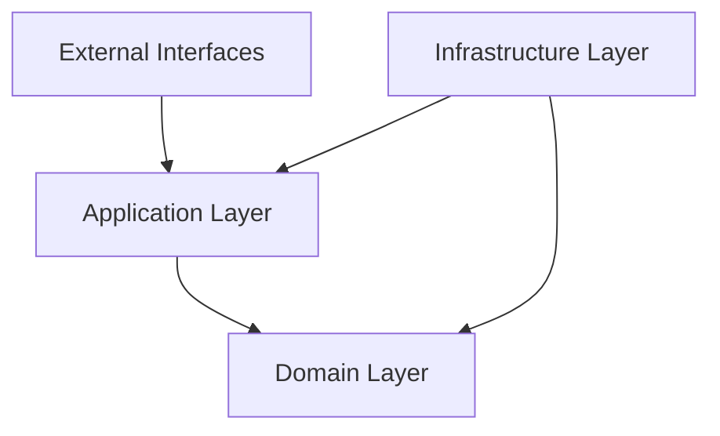

# Core Package Architecture

## Overview

The Core package implements the heart of the Pynomaly platform using Clean Architecture principles. It contains pure business logic with no external dependencies, making it highly testable and maintainable.

## Architecture Principles

### 1. Clean Architecture

The package follows Uncle Bob's Clean Architecture with clear separation of concerns:

```
┌─────────────────────────────────────────────────────────────┐
│                    External Interfaces                      │
│  ┌─────────────┐  ┌─────────────┐  ┌─────────────────────┐ │
│  │     CLI     │  │     API     │  │        Web UI       │ │
│  └─────────────┘  └─────────────┘  └─────────────────────┘ │
└─────────────────────────────────────────────────────────────┘
┌─────────────────────────────────────────────────────────────┐
│                    Application Layer                        │
│  ┌─────────────┐  ┌─────────────┐  ┌─────────────────────┐ │
│  │ Use Cases   │  │  Services   │  │        DTOs         │ │
│  └─────────────┘  └─────────────┘  └─────────────────────┘ │
└─────────────────────────────────────────────────────────────┘
┌─────────────────────────────────────────────────────────────┐
│                     Domain Layer                            │
│  ┌─────────────┐  ┌─────────────┐  ┌─────────────────────┐ │
│  │  Entities   │  │   Services  │  │   Value Objects     │ │
│  └─────────────┘  └─────────────┘  └─────────────────────┘ │
└─────────────────────────────────────────────────────────────┘
┌─────────────────────────────────────────────────────────────┐
│                  Infrastructure Layer                       │
│  ┌─────────────┐  ┌─────────────┐  ┌─────────────────────┐ │
│  │ Repositories│  │   Adapters  │  │   External APIs     │ │
│  └─────────────┘  └─────────────┘  └─────────────────────┘ │
└─────────────────────────────────────────────────────────────┘
```

### 2. Dependency Inversion

Dependencies point inward toward the domain layer:



### 3. Domain-Driven Design

The domain model reflects the real-world problem of anomaly detection:

```
Anomaly Detection Domain
├── Entities (things with identity)
│   ├── Dataset
│   ├── Detector
│   ├── Anomaly
│   └── DetectionResult
├── Value Objects (things without identity)
│   ├── AnomalyScore
│   ├── ContaminationRate
│   ├── ConfidenceInterval
│   └── PerformanceMetrics
└── Domain Services (business logic)
    ├── AnomalyScorer
    ├── StatisticalAnalyzer
    └── DetectionOrchestrator
```

## Package Structure

### Directory Layout

```
core/
├── core/                           # Main package source
│   ├── domain/                     # Domain layer (pure business logic)
│   │   ├── entities/              # Core business objects
│   │   │   ├── dataset.py         # Dataset entity
│   │   │   ├── detector.py        # Detector entity
│   │   │   ├── anomaly.py         # Anomaly entity
│   │   │   └── detection_result.py# Detection result entity
│   │   ├── value_objects/         # Immutable value objects
│   │   │   ├── anomaly_score.py   # Anomaly score value object
│   │   │   ├── contamination_rate.py # Contamination rate
│   │   │   └── performance_metrics.py # Performance metrics
│   │   ├── services/              # Domain services
│   │   │   ├── anomaly_scorer.py  # Anomaly scoring service
│   │   │   ├── statistical_analyzer.py # Statistical analysis
│   │   │   └── detection_validator.py # Detection validation
│   │   ├── events/                # Domain events
│   │   │   ├── detection_completed.py # Detection completed event
│   │   │   └── anomaly_detected.py    # Anomaly detected event
│   │   └── exceptions/            # Domain-specific exceptions
│   │       ├── domain_error.py    # Base domain exception
│   │       ├── dataset_error.py   # Dataset-related errors
│   │       └── detection_error.py # Detection-related errors
│   ├── application/               # Application layer
│   │   ├── use_cases/            # Business use cases
│   │   │   ├── detect_anomalies.py # Anomaly detection use case
│   │   │   ├── train_detector.py   # Detector training use case
│   │   │   └── evaluate_model.py   # Model evaluation use case
│   │   ├── services/             # Application services
│   │   │   ├── detection_orchestrator.py # Detection orchestration
│   │   │   └── preprocessing_service.py   # Data preprocessing
│   │   └── dto/                  # Data transfer objects
│   │       ├── detection_request.py # Detection request DTO
│   │       ├── detection_response.py # Detection response DTO
│   │       └── training_request.py  # Training request DTO
│   └── shared/                   # Shared utilities
│       ├── types.py             # Type definitions
│       ├── exceptions.py        # Base exceptions
│       ├── logging.py          # Logging utilities
│       ├── validation.py       # Validation utilities
│       └── container.py        # Dependency injection container
├── tests/                       # Package tests
│   ├── unit/                   # Unit tests
│   │   ├── domain/             # Domain layer tests
│   │   ├── application/        # Application layer tests
│   │   └── shared/             # Shared utilities tests
│   ├── integration/            # Integration tests
│   └── fixtures/               # Test fixtures and data
└── docs/                       # Package documentation
    ├── API.md                  # API reference
    ├── architecture.md         # This file
    └── examples/               # Usage examples
```

## Domain Layer

### Entities

Entities have identity and lifecycle, representing core business concepts.

#### Dataset Entity

```python
class Dataset:
    """Represents data for anomaly detection operations."""
    
    def __init__(self, name: str, data: DataArray, metadata: MetadataDict):
        self._id = DatasetId(name)
        self._data = data
        self._metadata = metadata
        self._created_at = Timestamp.now()
        self._version = Version.initial()
    
    @property
    def id(self) -> DatasetId:
        return self._id
    
    @property
    def size(self) -> int:
        return len(self._data)
    
    def add_sample(self, sample: DataArray) -> None:
        """Add new sample to dataset."""
        self._data = np.append(self._data, sample, axis=0)
        self._version = self._version.increment()
    
    def validate(self) -> ValidationResult:
        """Validate dataset structure and content."""
        return DatasetValidator().validate(self)
```

#### Detector Entity

```python
class Detector:
    """Configuration and state for anomaly detection algorithms."""
    
    def __init__(self, name: str, algorithm: str, contamination_rate: ContaminationRate):
        self._id = DetectorId(name)
        self._algorithm = algorithm
        self._contamination_rate = contamination_rate
        self._state = DetectorState.CREATED
        self._model = None
        self._training_history = []
    
    def fit(self, dataset: Dataset) -> None:
        """Fit detector to dataset."""
        if self._state == DetectorState.FITTING:
            raise DetectionError("Detector is already fitting")
        
        self._state = DetectorState.FITTING
        try:
            self._model = self._create_model()
            self._model.fit(dataset.data)
            self._state = DetectorState.FITTED
            self._training_history.append(TrainingRecord(dataset.id, Timestamp.now()))
        except Exception as e:
            self._state = DetectorState.ERROR
            raise DetectionError(f"Failed to fit detector: {e}")
    
    def predict(self, dataset: Dataset) -> DetectionResult:
        """Predict anomalies in dataset."""
        if self._state != DetectorState.FITTED:
            raise DetectionError("Detector must be fitted before prediction")
        
        predictions = self._model.predict(dataset.data)
        scores = self._model.decision_function(dataset.data)
        
        anomalies = self._create_anomalies(dataset, predictions, scores)
        return DetectionResult(dataset.id, self._id, anomalies)
```

### Value Objects

Value objects are immutable and represent concepts without identity.

#### AnomalyScore Value Object

```python
class AnomalyScore:
    """Immutable anomaly score value object."""
    
    def __init__(self, value: float):
        if not 0.0 <= value <= 1.0:
            raise ValueError("Anomaly score must be between 0.0 and 1.0")
        self._value = value
    
    @property
    def value(self) -> float:
        return self._value
    
    @property
    def severity(self) -> str:
        """Get severity level based on score."""
        if self._value >= 0.9:
            return "critical"
        elif self._value >= 0.7:
            return "high"
        elif self._value >= 0.5:
            return "medium"
        else:
            return "low"
    
    def __eq__(self, other: object) -> bool:
        return isinstance(other, AnomalyScore) and self._value == other._value
    
    def __hash__(self) -> int:
        return hash(self._value)
```

#### ContaminationRate Value Object

```python
class ContaminationRate:
    """Expected proportion of anomalies in dataset."""
    
    def __init__(self, value: float):
        if not 0.0 < value < 1.0:
            raise ValueError("Contamination rate must be between 0.0 and 1.0")
        self._value = value
    
    @property
    def value(self) -> float:
        return self._value
    
    @property
    def percentage(self) -> float:
        return self._value * 100
    
    def to_sample_count(self, total_samples: int) -> int:
        """Convert to expected number of anomalies."""
        return int(total_samples * self._value)
```

### Domain Services

Domain services contain business logic that doesn't belong to a specific entity.

#### AnomalyScorer Service

```python
class AnomalyScorer:
    """Service for calculating and normalizing anomaly scores."""
    
    def calculate_scores(self, data: DataArray, detector: Detector) -> ScoreArray:
        """Calculate anomaly scores for data."""
        if not detector.is_fitted:
            raise DetectionError("Detector must be fitted to calculate scores")
        
        raw_scores = detector.model.decision_function(data)
        normalized_scores = self._normalize_scores(raw_scores)
        return normalized_scores
    
    def _normalize_scores(self, scores: ScoreArray) -> ScoreArray:
        """Normalize scores to [0, 1] range."""
        min_score = np.min(scores)
        max_score = np.max(scores)
        return (scores - min_score) / (max_score - min_score)
    
    def threshold_predictions(self, scores: ScoreArray, threshold: float) -> PredictionArray:
        """Convert scores to binary predictions."""
        return (scores >= threshold).astype(int)
```

#### StatisticalAnalyzer Service

```python
class StatisticalAnalyzer:
    """Service for statistical analysis of datasets and results."""
    
    def analyze_dataset(self, dataset: Dataset) -> DatasetStatistics:
        """Analyze dataset statistical properties."""
        data = dataset.data
        
        return DatasetStatistics(
            sample_count=len(data),
            feature_count=data.shape[1],
            mean=np.mean(data, axis=0),
            std=np.std(data, axis=0),
            min_values=np.min(data, axis=0),
            max_values=np.max(data, axis=0),
            correlation_matrix=np.corrcoef(data.T)
        )
    
    def detect_outliers(self, data: DataArray, method: str = "iqr") -> OutlierAnalysis:
        """Detect statistical outliers in data."""
        if method == "iqr":
            return self._detect_iqr_outliers(data)
        elif method == "zscore":
            return self._detect_zscore_outliers(data)
        else:
            raise ValueError(f"Unknown outlier detection method: {method}")
    
    def _detect_iqr_outliers(self, data: DataArray) -> OutlierAnalysis:
        """Detect outliers using IQR method."""
        Q1 = np.percentile(data, 25, axis=0)
        Q3 = np.percentile(data, 75, axis=0)
        IQR = Q3 - Q1
        
        lower_bound = Q1 - 1.5 * IQR
        upper_bound = Q3 + 1.5 * IQR
        
        outliers = np.any((data < lower_bound) | (data > upper_bound), axis=1)
        return OutlierAnalysis(outliers, lower_bound, upper_bound)
```

### Domain Events

Domain events represent important business occurrences.

#### DetectionCompletedEvent

```python
class DetectionCompletedEvent:
    """Event raised when anomaly detection is completed."""
    
    def __init__(self, dataset_id: DatasetId, detector_id: DetectorId, 
                 result: DetectionResult, timestamp: Timestamp):
        self.dataset_id = dataset_id
        self.detector_id = detector_id
        self.result = result
        self.timestamp = timestamp
    
    def to_dict(self) -> Dict[str, Any]:
        return {
            "event_type": "detection_completed",
            "dataset_id": str(self.dataset_id),
            "detector_id": str(self.detector_id),
            "anomaly_count": len(self.result.anomalies),
            "timestamp": self.timestamp.isoformat()
        }
```

## Application Layer

### Use Cases

Use cases orchestrate business workflows and coordinate domain objects.

#### DetectAnomaliesUseCase

```python
class DetectAnomaliesUseCase:
    """Use case for detecting anomalies in datasets."""
    
    def __init__(self, 
                 dataset_repository: DatasetRepository,
                 detector_repository: DetectorRepository,
                 event_publisher: EventPublisher):
        self._dataset_repository = dataset_repository
        self._detector_repository = detector_repository
        self._event_publisher = event_publisher
    
    def execute(self, request: DetectionRequest) -> DetectionResponse:
        """Execute anomaly detection use case."""
        # Load dataset
        dataset = self._dataset_repository.get_by_id(request.dataset_id)
        if not dataset:
            raise DatasetNotFoundError(request.dataset_id)
        
        # Load detector
        detector = self._detector_repository.get_by_id(request.detector_id)
        if not detector:
            raise DetectorNotFoundError(request.detector_id)
        
        # Validate inputs
        validation_result = self._validate_inputs(dataset, detector)
        if not validation_result.is_valid:
            raise ValidationError(validation_result.errors)
        
        # Perform detection
        result = detector.predict(dataset)
        
        # Publish event
        event = DetectionCompletedEvent(
            dataset.id, detector.id, result, Timestamp.now()
        )
        self._event_publisher.publish(event)
        
        return DetectionResponse(
            result_id=result.id,
            anomaly_count=len(result.anomalies),
            anomaly_rate=result.anomaly_rate,
            processing_time=result.processing_time
        )
    
    def _validate_inputs(self, dataset: Dataset, detector: Detector) -> ValidationResult:
        """Validate inputs for detection."""
        errors = []
        
        # Validate dataset
        dataset_validation = dataset.validate()
        if not dataset_validation.is_valid:
            errors.extend(dataset_validation.errors)
        
        # Validate detector
        if not detector.is_fitted:
            errors.append("Detector must be fitted before detection")
        
        # Validate compatibility
        if detector.feature_count and detector.feature_count != dataset.feature_count:
            errors.append(f"Feature count mismatch: expected {detector.feature_count}, got {dataset.feature_count}")
        
        return ValidationResult(is_valid=len(errors) == 0, errors=errors)
```

### Application Services

Application services coordinate complex operations across multiple domain objects.

#### DetectionOrchestrator

```python
class DetectionOrchestrator:
    """Service for orchestrating complex detection workflows."""
    
    def __init__(self, 
                 preprocessing_service: PreprocessingService,
                 anomaly_scorer: AnomalyScorer,
                 statistical_analyzer: StatisticalAnalyzer):
        self._preprocessing_service = preprocessing_service
        self._anomaly_scorer = anomaly_scorer
        self._statistical_analyzer = statistical_analyzer
    
    def run_detection_pipeline(self, 
                             dataset: Dataset, 
                             detector: Detector,
                             preprocessing_steps: List[PreprocessingStep] = None) -> DetectionResult:
        """Run complete detection pipeline."""
        # Preprocess data
        if preprocessing_steps:
            processed_dataset = self._preprocessing_service.process(dataset, preprocessing_steps)
        else:
            processed_dataset = dataset
        
        # Analyze dataset
        statistics = self._statistical_analyzer.analyze_dataset(processed_dataset)
        
        # Fit detector if needed
        if not detector.is_fitted:
            detector.fit(processed_dataset)
        
        # Perform detection
        result = detector.predict(processed_dataset)
        
        # Enhance result with statistics
        result.add_statistics(statistics)
        
        return result
    
    def batch_detection(self, 
                       datasets: List[Dataset], 
                       detector: Detector,
                       parallel: bool = True) -> List[DetectionResult]:
        """Run detection on multiple datasets."""
        if parallel:
            return self._parallel_detection(datasets, detector)
        else:
            return [detector.predict(dataset) for dataset in datasets]
    
    def _parallel_detection(self, datasets: List[Dataset], detector: Detector) -> List[DetectionResult]:
        """Run detection in parallel using thread pool."""
        from concurrent.futures import ThreadPoolExecutor
        
        with ThreadPoolExecutor(max_workers=4) as executor:
            futures = [executor.submit(detector.predict, dataset) for dataset in datasets]
            results = [future.result() for future in futures]
        
        return results
```

## Shared Layer

### Type System

The package uses a comprehensive type system for clarity and safety.

```python
# Type definitions
from typing import Union, List, Dict, Optional, Any
import numpy as np
import pandas as pd

# Basic types
DataArray = Union[np.ndarray, pd.DataFrame, List[List[float]]]
ScoreArray = np.ndarray
PredictionArray = np.ndarray
FeatureArray = np.ndarray
MetadataDict = Dict[str, Any]
ParameterDict = Dict[str, Any]

# Entity IDs
class DatasetId:
    def __init__(self, value: str):
        self._value = value
    
    def __str__(self) -> str:
        return self._value
    
    def __eq__(self, other: object) -> bool:
        return isinstance(other, DatasetId) and self._value == other._value
    
    def __hash__(self) -> int:
        return hash(self._value)

class DetectorId:
    def __init__(self, value: str):
        self._value = value
    
    def __str__(self) -> str:
        return self._value

# Value object types
class Timestamp:
    def __init__(self, value: datetime):
        self._value = value
    
    @classmethod
    def now(cls) -> 'Timestamp':
        return cls(datetime.now())
    
    def isoformat(self) -> str:
        return self._value.isoformat()

class Version:
    def __init__(self, major: int, minor: int, patch: int):
        self.major = major
        self.minor = minor
        self.patch = patch
    
    @classmethod
    def initial(cls) -> 'Version':
        return cls(1, 0, 0)
    
    def increment(self) -> 'Version':
        return Version(self.major, self.minor, self.patch + 1)
    
    def __str__(self) -> str:
        return f"{self.major}.{self.minor}.{self.patch}"
```

### Exception Hierarchy

```python
class DomainError(Exception):
    """Base exception for domain-related errors."""
    pass

class InvalidDatasetError(DomainError):
    """Raised when dataset is invalid."""
    pass

class EmptyDatasetError(InvalidDatasetError):
    """Raised when dataset is empty."""
    pass

class DetectionError(DomainError):
    """Raised when detection fails."""
    pass

class ModelNotFittedError(DetectionError):
    """Raised when model is not fitted."""
    pass

class ConfigurationError(DomainError):
    """Raised when configuration is invalid."""
    pass

class ValidationError(DomainError):
    """Raised when validation fails."""
    def __init__(self, errors: List[str]):
        self.errors = errors
        super().__init__(f"Validation failed: {', '.join(errors)}")
```

### Dependency Injection

The package uses dependency injection for testability and flexibility.

```python
from dependency_injector import containers, providers
from dependency_injector.wiring import inject, Provide

class CoreContainer(containers.DeclarativeContainer):
    """Dependency injection container for core package."""
    
    # Configuration
    config = providers.Configuration()
    
    # Repositories (interfaces)
    dataset_repository = providers.Factory(DatasetRepository)
    detector_repository = providers.Factory(DetectorRepository)
    
    # Domain services
    anomaly_scorer = providers.Factory(AnomalyScorer)
    statistical_analyzer = providers.Factory(StatisticalAnalyzer)
    
    # Application services
    preprocessing_service = providers.Factory(PreprocessingService)
    detection_orchestrator = providers.Factory(
        DetectionOrchestrator,
        preprocessing_service=preprocessing_service,
        anomaly_scorer=anomaly_scorer,
        statistical_analyzer=statistical_analyzer
    )
    
    # Use cases
    detect_anomalies_use_case = providers.Factory(
        DetectAnomaliesUseCase,
        dataset_repository=dataset_repository,
        detector_repository=detector_repository,
        event_publisher=providers.Factory(EventPublisher)
    )

# Usage with injection
@inject
def create_detection_service(
    orchestrator: DetectionOrchestrator = Provide[CoreContainer.detection_orchestrator]
) -> DetectionService:
    return DetectionService(orchestrator)
```

## Design Patterns

### 1. Repository Pattern

```python
from abc import ABC, abstractmethod

class DatasetRepository(ABC):
    """Abstract repository for dataset persistence."""
    
    @abstractmethod
    def get_by_id(self, dataset_id: DatasetId) -> Optional[Dataset]:
        pass
    
    @abstractmethod
    def save(self, dataset: Dataset) -> None:
        pass
    
    @abstractmethod
    def delete(self, dataset_id: DatasetId) -> None:
        pass
    
    @abstractmethod
    def list_all(self) -> List[Dataset]:
        pass
```

### 2. Factory Pattern

```python
class DetectorFactory:
    """Factory for creating detector instances."""
    
    @staticmethod
    def create_detector(algorithm: str, **kwargs) -> Detector:
        if algorithm == "isolation_forest":
            return IsolationForestDetector(**kwargs)
        elif algorithm == "lof":
            return LOFDetector(**kwargs)
        elif algorithm == "one_class_svm":
            return OneClassSVMDetector(**kwargs)
        else:
            raise ValueError(f"Unknown algorithm: {algorithm}")
```

### 3. Strategy Pattern

```python
class PreprocessingStrategy(ABC):
    """Abstract strategy for data preprocessing."""
    
    @abstractmethod
    def process(self, data: DataArray) -> DataArray:
        pass

class StandardScalingStrategy(PreprocessingStrategy):
    def process(self, data: DataArray) -> DataArray:
        return (data - np.mean(data)) / np.std(data)

class MinMaxScalingStrategy(PreprocessingStrategy):
    def process(self, data: DataArray) -> DataArray:
        return (data - np.min(data)) / (np.max(data) - np.min(data))
```

### 4. Observer Pattern

```python
class EventPublisher:
    """Publisher for domain events."""
    
    def __init__(self):
        self._observers = []
    
    def subscribe(self, observer):
        self._observers.append(observer)
    
    def unsubscribe(self, observer):
        self._observers.remove(observer)
    
    def publish(self, event):
        for observer in self._observers:
            observer.handle(event)

class DetectionCompletedObserver:
    """Observer for detection completed events."""
    
    def handle(self, event: DetectionCompletedEvent):
        if event.result.anomaly_count > 0:
            print(f"Anomalies detected: {event.result.anomaly_count}")
```

## Testing Architecture

### Unit Testing

```python
import pytest
from unittest.mock import Mock
from pynomaly.core.domain.entities import Dataset, Detector
from pynomaly.core.domain.value_objects import ContaminationRate

class TestDetector:
    def test_detector_creation(self):
        """Test detector creation with valid parameters."""
        detector = Detector(
            name="test_detector",
            algorithm="isolation_forest",
            contamination_rate=ContaminationRate(0.1)
        )
        
        assert detector.name == "test_detector"
        assert detector.algorithm == "isolation_forest"
        assert detector.contamination_rate.value == 0.1
        assert not detector.is_fitted
    
    def test_detector_fitting(self):
        """Test detector fitting process."""
        detector = Detector(
            name="test_detector",
            algorithm="isolation_forest",
            contamination_rate=ContaminationRate(0.1)
        )
        
        dataset = Dataset.from_array("test_data", np.random.randn(100, 5))
        detector.fit(dataset)
        
        assert detector.is_fitted
        assert len(detector.training_history) == 1
    
    def test_detector_prediction(self):
        """Test detector prediction."""
        detector = Detector(
            name="test_detector",
            algorithm="isolation_forest",
            contamination_rate=ContaminationRate(0.1)
        )
        
        train_data = Dataset.from_array("train_data", np.random.randn(100, 5))
        test_data = Dataset.from_array("test_data", np.random.randn(50, 5))
        
        detector.fit(train_data)
        result = detector.predict(test_data)
        
        assert isinstance(result, DetectionResult)
        assert result.dataset_id == test_data.id
        assert result.detector_id == detector.id
```

### Integration Testing

```python
class TestDetectionWorkflow:
    def test_complete_detection_workflow(self):
        """Test complete detection workflow."""
        # Create components
        dataset = Dataset.from_array("test_data", np.random.randn(100, 5))
        detector = Detector(
            name="test_detector",
            algorithm="isolation_forest",
            contamination_rate=ContaminationRate(0.1)
        )
        
        # Create use case
        use_case = DetectAnomaliesUseCase(
            dataset_repository=Mock(),
            detector_repository=Mock(),
            event_publisher=Mock()
        )
        
        # Execute workflow
        detector.fit(dataset)
        result = detector.predict(dataset)
        
        # Verify result
        assert isinstance(result, DetectionResult)
        assert len(result.anomalies) > 0
```

## Performance Considerations

### Memory Management

```python
class MemoryEfficientDataset:
    """Memory-efficient dataset implementation."""
    
    def __init__(self, data_source: str):
        self._data_source = data_source
        self._cache = {}
        self._cache_size = 1000
    
    def get_batch(self, start: int, end: int) -> DataArray:
        """Get data batch with caching."""
        cache_key = f"{start}_{end}"
        
        if cache_key in self._cache:
            return self._cache[cache_key]
        
        # Load batch from source
        batch = self._load_batch(start, end)
        
        # Cache if space available
        if len(self._cache) < self._cache_size:
            self._cache[cache_key] = batch
        
        return batch
    
    def _load_batch(self, start: int, end: int) -> DataArray:
        """Load batch from data source."""
        # Implementation depends on data source
        pass
```

### Lazy Evaluation

```python
class LazyDetectionResult:
    """Lazy evaluation of detection results."""
    
    def __init__(self, detector: Detector, dataset: Dataset):
        self._detector = detector
        self._dataset = dataset
        self._anomalies = None
        self._statistics = None
    
    @property
    def anomalies(self) -> List[Anomaly]:
        if self._anomalies is None:
            self._anomalies = self._compute_anomalies()
        return self._anomalies
    
    @property
    def statistics(self) -> DetectionStatistics:
        if self._statistics is None:
            self._statistics = self._compute_statistics()
        return self._statistics
    
    def _compute_anomalies(self) -> List[Anomaly]:
        """Compute anomalies on demand."""
        # Implementation
        pass
```

## Extension Points

### Custom Algorithms

```python
class CustomDetector(Detector):
    """Custom detector implementation."""
    
    def __init__(self, name: str, custom_params: Dict[str, Any]):
        super().__init__(name, "custom", ContaminationRate(0.1))
        self._custom_params = custom_params
    
    def _create_model(self):
        """Create custom model instance."""
        return CustomModel(**self._custom_params)
    
    def _fit_model(self, data: DataArray):
        """Custom fitting logic."""
        # Implementation
        pass
```

### Custom Preprocessing

```python
class CustomPreprocessingStep(PreprocessingStep):
    """Custom preprocessing step."""
    
    def process(self, data: DataArray) -> DataArray:
        """Custom preprocessing logic."""
        # Implementation
        return processed_data
```

## Future Enhancements

### Planned Features

1. **Streaming Support**: Real-time anomaly detection
2. **Distributed Processing**: Multi-node processing
3. **Model Persistence**: Save/load trained models
4. **Explainability**: Built-in explanation generation
5. **Auto-tuning**: Automatic hyperparameter optimization

### Architecture Evolution

1. **Microservices**: Split into smaller services
2. **Event Sourcing**: Full event-driven architecture
3. **CQRS**: Command Query Responsibility Segregation
4. **GraphQL**: Flexible query interface

This architecture provides a solid foundation for anomaly detection while maintaining clean separation of concerns and high testability.