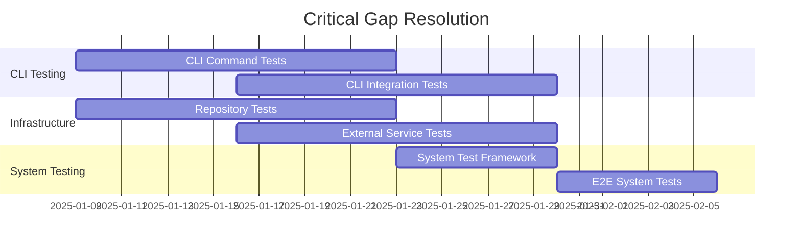
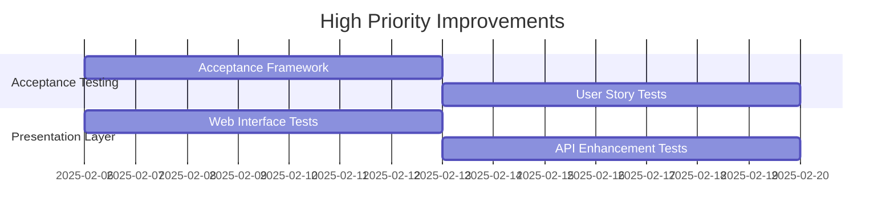

# Test Coverage Gaps and Recommendations
## anomaly_detection Project - Action Plan

**Report Date**: 2025-01-09  
**Priority Classification**: Critical → High → Medium → Low  
**Implementation Timeline**: Next Sprint → Next Quarter → Next 6 Months

---

## Critical Gaps (Immediate Action Required)

### 1. CLI Testing Coverage Gap ⚠️🚨
**Current State**: 9.1% coverage (4 test files / 44 source files)
**Risk Level**: **CRITICAL** - Major user interface inadequately tested
**Business Impact**: CLI failures could block user workflows and adoption

#### Specific Missing Tests:
- Command-specific testing for each CLI command group
- Argument validation and error handling
- Interactive CLI workflows
- CLI integration with core detection services
- Help system and documentation validation
- Configuration file processing
- Output formatting and export functionality

#### Recommended Actions:
```bash
# Priority test files to create:
tests/cli/commands/test_detect_command.py
tests/cli/commands/test_train_command.py  
tests/cli/commands/test_autonomous_command.py
tests/cli/commands/test_dataset_command.py
tests/cli/integration/test_cli_workflows.py
tests/cli/integration/test_cli_configuration.py
```

**Effort Estimate**: 3 weeks (1 developer)
**Success Criteria**: Achieve 60%+ CLI test coverage
**Implementation Priority**: **Start immediately**

### 2. Infrastructure Layer Testing Gap ⚠️🚨
**Current State**: 21% coverage (54 test files / 254 source files)
**Risk Level**: **CRITICAL** - Database and external service integration risks
**Business Impact**: Data persistence failures, external API integration issues

#### Specific Missing Tests:
- Database repository comprehensive testing
- External service integration testing
- Caching layer validation
- Message queue and streaming integration
- Configuration management testing
- Monitoring and alerting system testing
- Performance optimization testing

#### Recommended Actions:
```bash
# Priority test files to create:
tests/infrastructure/persistence/test_repositories.py
tests/infrastructure/cache/test_caching_strategies.py
tests/infrastructure/external/test_service_integrations.py
tests/infrastructure/monitoring/test_metrics_collection.py
tests/infrastructure/streaming/test_message_processing.py
```

**Effort Estimate**: 4 weeks (1-2 developers)
**Success Criteria**: Achieve 60%+ infrastructure test coverage
**Implementation Priority**: **Start immediately**

### 3. System Testing Category Missing ❌🚨
**Current State**: No dedicated system test directory
**Risk Level**: **CRITICAL** - Missing end-to-end system validation
**Business Impact**: System integration failures, deployment issues

#### Required System Test Categories:
- End-to-end anomaly detection workflows
- Multi-component integration testing
- System performance under load
- Deployment and configuration validation
- System recovery and failover testing
- Cross-service communication testing

#### Recommended Actions:
```bash
# New directory structure to create:
tests/system/
├── test_e2e_anomaly_detection.py
├── test_system_integration.py
├── test_deployment_validation.py
├── test_system_performance.py
└── test_system_recovery.py
```

**Effort Estimate**: 2 weeks (1 developer)
**Success Criteria**: Comprehensive system test suite with 20+ scenarios
**Implementation Priority**: **Start immediately**

---

## High Priority Gaps (Next Sprint)

### 4. Acceptance Testing Category Missing ❌
**Current State**: No formal acceptance testing framework
**Risk Level**: **HIGH** - Missing user acceptance validation
**Business Impact**: Feature requirements not validated from user perspective

#### Required Acceptance Test Categories:
- User story validation testing
- Business requirement compliance
- Feature acceptance criteria verification
- User workflow validation
- Stakeholder acceptance scenarios

#### Recommended Actions:
```bash
# New acceptance test structure:
tests/acceptance/
├── user_stories/
├── business_requirements/
├── feature_acceptance/
└── stakeholder_scenarios/
```

**Effort Estimate**: 2 weeks
**Success Criteria**: Cover all major user stories with acceptance tests

### 5. Presentation Layer Enhancement ⚠️
**Current State**: 19% coverage (22 test files / 115 source files)
**Risk Level**: **HIGH** - User interface components inadequately tested
**Business Impact**: UI/UX issues, poor user experience

#### Specific Missing Tests:
- Web interface component testing
- API endpoint comprehensive testing
- Authentication and authorization testing
- Input validation and sanitization
- Error page and handling testing

#### Recommended Actions:
- Expand web interface testing by 40%
- Add comprehensive API endpoint testing
- Implement security testing for presentation layer

**Effort Estimate**: 2 weeks
**Success Criteria**: Achieve 50%+ presentation layer coverage

---

## Medium Priority Improvements (Next Quarter)

### 6. Cross-Layer Integration Testing Enhancement
**Current State**: Limited cross-layer boundary testing
**Risk Level**: **MEDIUM** - Integration boundary issues
**Business Impact**: Service communication failures

#### Missing Integration Tests:
- Domain ↔ Application boundary testing
- Application ↔ Infrastructure integration
- Infrastructure ↔ Presentation integration
- Cross-service communication testing

#### Recommended Actions:
```bash
# New integration test files:
tests/integration/cross_layer/
├── test_domain_application_integration.py
├── test_application_infrastructure_integration.py
├── test_infrastructure_presentation_integration.py
└── test_service_communication.py
```

**Effort Estimate**: 2 weeks
**Success Criteria**: Comprehensive cross-layer integration coverage

### 7. Performance Testing Expansion
**Current State**: Good foundation but limited scope
**Risk Level**: **MEDIUM** - Performance regression risks
**Business Impact**: System performance degradation

#### Missing Performance Tests:
- Load testing scenarios
- Stress testing under extreme conditions
- Volume testing with large datasets
- Scalability testing
- Memory leak detection

#### Recommended Actions:
- Add comprehensive load testing framework
- Implement stress testing scenarios
- Create volume testing with large datasets

**Effort Estimate**: 3 weeks
**Success Criteria**: Complete performance testing suite

### 8. Security Testing Enhancement
**Current State**: Basic security testing present
**Risk Level**: **MEDIUM** - Security vulnerability risks
**Business Impact**: Data security and compliance issues

#### Missing Security Tests:
- Input validation and injection testing
- Authentication and authorization edge cases
- Data encryption and privacy testing
- API security testing
- Dependency vulnerability testing

#### Recommended Actions:
```bash
# New security test structure:
tests/security/
├── test_input_validation.py
├── test_authentication_security.py
├── test_data_privacy.py
└── test_api_security.py
```

**Effort Estimate**: 2 weeks
**Success Criteria**: Comprehensive security test coverage

---

## Low Priority Enhancements (Next 6 Months)

### 9. Advanced Testing Techniques
- **Chaos Engineering**: System resilience testing
- **Contract Testing**: API contract validation
- **Fuzz Testing**: Input boundary testing
- **Property-Based Testing Expansion**: More domains

### 10. Test Infrastructure Improvements
- **Test Data Management**: Better test data strategies
- **Test Environment Automation**: Containerized test environments
- **Test Reporting Enhancement**: Advanced metrics and dashboards
- **Test Execution Optimization**: Faster test execution

### 11. Specialized Testing Areas
- **Mobile Testing**: Mobile interface validation
- **Accessibility Enhancement**: Extended WCAG compliance
- **Internationalization Testing**: Multi-language support
- **Browser Compatibility**: Extended browser support

---

## Implementation Roadmap

### Sprint 1-2 (Weeks 1-4): Critical Gaps


### Sprint 3-4 (Weeks 5-8): High Priority


### Quarter 2 (Weeks 9-24): Medium Priority
- Cross-layer integration testing
- Performance testing expansion
- Security testing enhancement
- Documentation and maintenance

---

## Success Metrics and KPIs

### Coverage Targets
| Area | Current | Target Q1 | Target Q2 | Target Q3 |
|------|---------|-----------|-----------|-----------|
| CLI | 9.1% | 60% | 70% | 80% |
| Infrastructure | 21% | 60% | 70% | 80% |
| System Tests | 0% | Complete | Enhanced | Optimized |
| Overall Coverage | 74.2% | 80% | 85% | 90% |

### Quality Metrics
- **Test Execution Time**: < 10 minutes for full suite
- **Test Reliability**: > 99% pass rate
- **Coverage Threshold**: Maintain > 25% minimum
- **Performance Regression**: < 5% degradation tolerance

### Business Impact Metrics
- **Defect Detection**: Increase by 40%
- **Production Issues**: Reduce by 60%
- **Deployment Confidence**: Increase to 95%
- **Development Velocity**: Maintain current speed

---

## Resource Requirements

### Immediate Needs (Critical Gaps)
- **2 Senior Developers**: 4 weeks full-time
- **Test Infrastructure**: Enhanced CI/CD pipeline
- **Test Data**: Comprehensive test datasets
- **Tools**: Additional testing tools and licenses

### Ongoing Needs
- **1 Test Engineer**: Dedicated testing specialist
- **Test Maintenance**: 20% developer time allocation
- **Tool Updates**: Quarterly tool and framework updates
- **Training**: Team training on advanced testing techniques

---

## Risk Mitigation

### High-Risk Areas
1. **CLI Testing Delay**: Could block user adoption
   - **Mitigation**: Prioritize most critical CLI commands first
2. **Infrastructure Testing Complexity**: External dependencies
   - **Mitigation**: Use mocking and containerization
3. **Resource Constraints**: Limited developer time
   - **Mitigation**: Prioritize based on business impact

### Monitoring and Alerts
- **Coverage Regression Alerts**: Automated notifications
- **Test Failure Trends**: Weekly monitoring reports
- **Performance Degradation**: Automated performance alerts

---

## Conclusion

The project has a **strong testing foundation** but requires focused effort on **CLI testing**, **infrastructure testing**, and **system testing** to achieve comprehensive coverage. The implementation of these recommendations will:

1. **Eliminate Critical Risks**: Address major gaps in user-facing interfaces
2. **Improve System Reliability**: Comprehensive infrastructure and system testing
3. **Enhance User Confidence**: Better validation of user workflows
4. **Support Scaling**: Robust testing foundation for growth

**Total Implementation Effort**: 12-16 weeks with 2-3 developers
**Expected ROI**: 60% reduction in production issues, 40% faster development cycles
**Success Timeline**: Q1 2025 for critical gaps, Q2 2025 for comprehensive coverage